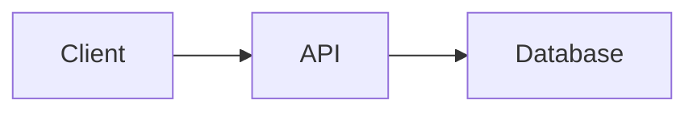

# swe-study-guide Topic Authoring

Use this skill when the goal is to populate a single topic chapter under `content/<NN>_<Technology>/<NN>_<Topic_Name>/` with study material — typically a section pulled from the technology's `research/concepts.md` (produced by `swe-study-guide-curriculum-research`).

The skill produces two artifacts:

1. `concepts.md` — a structured set of concept cards in `## Heading` + body format, where each entry has a scannable title, a paragraph-or-two body, and practical examples when they materially improve understanding.
2. `notes.md` — a narrative companion with a title, key-points list, and a small runnable example.

Both files are rendered by the local study site (`serve.py` + `site/app.js`). The concepts file drives an interactive card grid with expandable detail panels; the notes file is rendered as a single Markdown document.

Read first:
- `AGENTS.md`
- `docs/CONTENT_AUTHORING.md` — the canonical human-facing description of the file formats, rendering pipeline, and quality bar
- The technology's `content/<NN>_<Technology>/research/concepts.md` if it exists — the source material to distill
- A neighbor topic's `concepts.md` and `notes.md` (e.g. [content/01_FastAPI/03_Framework_Foundations/](../../content/01_FastAPI/03_Framework_Foundations/)) as a reference for tone and depth

Default stance:
- Act like a senior engineer writing the reference they wish they had when first learning the topic.
- Optimize for a learner who will scan many cards quickly and only expand the ones they don't already know.
- Each card body should be readable in about a minute; if it isn't, split the card or move the long-form content to `notes.md`.
- Prefer practical teaching over abstract summary. For applied topics, assume the first pass should already include concrete examples, request/response samples, small code snippets, or tiny interface examples where they help.

## Use this skill for

- Creating a brand-new topic chapter from a section in `research/concepts.md`.
- Converting an existing topic's legacy bullet-format `concepts.md` into the structured `## Heading` + body format.
- Expanding an under-detailed topic by adding more concepts or filling out empty bodies.
- Authoring the matching `notes.md` for a new topic.

## Workflow

### Phase 1 — Pick the section and confirm the slot

1. Identify the source section in `content/<NN>_<Technology>/research/concepts.md` (or the user-provided list of concepts).
2. Decide the topic title. Use the source section heading unless the user requested a different name. The title becomes the directory name with underscores in place of spaces.
3. Pick the next available `<NN>_` numeric prefix under the technology folder. Do **not** renumber existing topics without explicit approval.
4. Confirm the full path looks right: `content/<NN>_<Technology>/<NN>_<Topic_Name>/`.

### Phase 2 — Author `concepts.md` (structured format)

Use the H2 + body format. Skeleton:

```markdown
## <Concept Title>

<Paragraph 1: what it is. Use plain language and define jargon on first use.>

<Optional Paragraph 2: why it matters / how it shows up in code / common gotcha / version-specific note.>

```<language>
# Optional short code example
```
```

When a visual explanation is genuinely clearer than prose, a concept card may also include a small Mermaid block:

```markdown

```

Per-concept rules:

- **Title scans.** A reader skimming the grid must understand the concept from the title alone. Use backticks for code-like names (e.g. `BaseSettings`, `FastAPI()` instance).
- **Body covers what and why.** A definition without motivation is fragile; motivation without a definition is vague. Cover both, briefly.
- **Examples where they ground the concept.** A short example beats more prose. For applied backend topics, prefer including a tiny code, HTTP, JSON, shell, or interface example in most cards. Skip examples only when the concept is genuinely clearer without one.
- **Choose the example format deliberately.** Use `http` for requests, `json` for payloads, `python` for implementation ideas, `bash` for operational commands, and `text` for tiny interface or file-structure examples.
- **Use Mermaid sparingly.** Add a Mermaid block only when flow, layering, or state transitions are much easier to understand visually. Aim for a handful per topic at most, not one in every card.
- **Contrast where helpful.** Name the alternative briefly: Uvicorn vs Hypercorn, Pydantic v1 vs v2, ASGI vs WSGI.
- **Stop when enough.** Aim for one short paragraph plus optionally a second short paragraph plus optionally one code block. If you're reaching for a third paragraph, split the concept or move the rest to `notes.md`.

What to **exclude** at the concept level:

- Setup logistics (installing Python, choosing an IDE, virtualenvs) — those are accessory, not transferable concepts.
- Course branding (instructor names, project names from research, lecture timestamps).
- Long tutorials. The detail panel is a reference card, not a chapter of a book.
- Decorative examples that do not teach anything. Every example should clarify the concept, not merely make the card longer.
- Diagrams that restate obvious prose. If the learner gets the point faster from two sentences, do not add Mermaid.

Order the concepts deliberately. Typical orderings that work:

- **Layered:** primitives first, then how they compose (e.g. ASGI → `FastAPI` instance → Uvicorn → Starlette → Pydantic → OpenAPI → docs → type hints).
- **Workflow:** in the order a user encounters them when building something.

Don't alphabetize unless there's no better order.

### First-pass practical quality bar

By the end of the first draft, the topic should already feel usable for study, not like an outline waiting for later enrichment. For practical topics, that usually means:

- at least one concrete example in most concept cards
- interface-level examples such as HTTP requests, JSON responses, headers, or CLI commands where relevant
- only a small number of Mermaid diagrams, reserved for flows, architecture, or lifecycle explanations
- examples short enough to scan in under 20 seconds

If the topic feels abstract after drafting, add examples before considering the pass complete.

### Phase 3 — Author `notes.md`

Convention:

```markdown
# <Topic Title>

One-paragraph framing of the topic.

## Key Points

- **Concept A** — short explanation, often a more compact version of the concept card body.
- **Concept B** — short explanation.

## Example

```<language>
# A small runnable example that exercises the topic.
```

Optional trailing paragraph tying the example back to the key points.
```

Rules:

- The key-points list should cover roughly the same set of concepts as the `concepts.md` cards, but as one-liners — not duplicated paragraphs.
- The example should be runnable as-is and exercise as many of the concepts as a small example reasonably can. Ten to fifteen lines is plenty.
- If the topic is purely conceptual and no example fits, skip the Example section rather than fabricating one.
- Do not rely on `notes.md` to carry all practical value. The concept cards themselves should already include the most helpful small examples.

### Phase 4 — Verify rendering

If the local server is reachable (typically `http://127.0.0.1:8080`):

1. `curl -s http://127.0.0.1:8080/api/content | python3 -m json.tool` — confirm the new topic shows up in the index with the right title and `hasConcepts: true`.
2. `curl -s http://127.0.0.1:8080/content/<NN>_<Technology>/<NN>_<Topic_Name>/concepts.md | head` — confirm the file is being served.
3. If the user is at the browser, ask them to hard-reload and confirm the cards render with title-only and expand into the detail panel on click.
4. If the topic includes Mermaid, confirm the diagrams render instead of remaining as fenced code blocks.

If the server isn't running, start it with `python serve.py --port 8080` (it now uses `ThreadingHTTPServer`, so multiple connections don't stall it).

### Phase 5 — Commit

Documentation-only changes can be pushed directly to `main` per `AGENTS.md` when the user has authorized it for this session. Otherwise, follow the standard branch + PR delivery.

Commit message:

```
docs: add <Topic Title> <Technology> topic

Create content/<NN>_<Technology>/<NN>_<Topic_Name>/ with concepts.md
(structured H2 + body format) and notes.md, covering <N> concepts:
<short comma-separated list of titles>.
```

## Quality rules

- **No fabricated facts.** If you don't know something for sure, either look it up or leave it out. The concept reference is only as useful as it is trustworthy.
- **No course-specific scaffolding.** Project names ("Books project", "Todo app") and instructor names belong in `research/`, not in topic chapters.
- **No filler.** "It's important to understand…" is filler; "X exists because Y" is content.
- **Prefer specific over general.** "Pydantic v2 is a Rust-backed rewrite with breaking changes from v1" beats "Pydantic has multiple versions."
- **Code that runs.** Examples should be syntactically valid, importable, and exercise the concept they sit under.
- **Examples that teach.** Prefer tiny realistic examples over placeholder code. A real `GET /orders?status=paid` request teaches more than `print("hello")`.
- **Diagrams with a job.** Mermaid should earn its keep by clarifying a workflow, dependency chain, or request lifecycle that would otherwise be harder to scan.

## Guardrails

- Never renumber existing topic directories without explicit user approval.
- Never edit `serve.py` or `site/app.js`/`site/style.css` as part of topic authoring; those are site code, not content. If the rendering needs changing, that's a separate change and a separate PR.
- Never delete a legacy-format `concepts.md` and replace it without showing the user the diff first; some topics may be intentionally placeholder content.
- Don't author against research that doesn't exist. If `research/concepts.md` is missing or thin for the technology, run `swe-study-guide-curriculum-research` first (or ask the user to).
- Don't over-author. Aim for 6–12 concepts per topic. More than that and the card grid becomes a wall; fewer than that and the topic is probably better merged with a neighbor.

## Output expectations

- A new `content/<NN>_<Technology>/<NN>_<Topic_Name>/concepts.md` in structured H2 + body format with 6–12 well-titled, well-bodied concept entries and practical examples in most cards.
- A matching `content/<NN>_<Technology>/<NN>_<Topic_Name>/notes.md` with title, key-points list, and one runnable example.
- A `docs:` commit pushed (or a PR opened) per the project's delivery convention.
- A short user-facing summary listing the new file paths, the concept titles created, and a one-line note on rendering verification (or a request to the user to reload the site).
