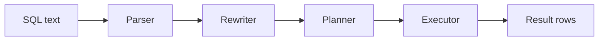

## Query processing pipeline

Every SQL statement passes through four stages: parser → rewriter → planner/optimizer → executor. The planner is where performance decisions happen — it evaluates possible execution strategies and picks the one with the lowest estimated cost.



The parser validates syntax and produces a parse tree. The rewriter applies rules (e.g., view expansion). The planner estimates costs for different execution plans and picks the cheapest. The executor runs the chosen plan and streams results.

## EXPLAIN

Shows the planned execution strategy without running the query. Displays the plan tree with node types, estimated costs, and expected row counts.

```sql
EXPLAIN SELECT * FROM orders WHERE customer_id = 42;
```

```text
Index Scan using idx_orders_customer on orders  (cost=0.43..8.45 rows=5 width=64)
  Index Cond: (customer_id = 42)
```

Read the output bottom-up: child nodes feed into parent nodes. The `cost` has two parts: startup cost (before the first row) and total cost (for all rows). `rows` is the planner's estimate of output rows. `width` is the estimated average row size in bytes.

## EXPLAIN ANALYZE

Actually runs the query and reports real execution times and row counts alongside the planner's estimates. Essential for diagnosing performance problems.

```sql
EXPLAIN ANALYZE SELECT * FROM orders WHERE customer_id = 42;
```

```text
Index Scan using idx_orders_customer on orders
    (cost=0.43..8.45 rows=5 width=64)
    (actual time=0.025..0.031 rows=7 loops=1)
  Index Cond: (customer_id = 42)
Planning Time: 0.12 ms
Execution Time: 0.05 ms
```

Compare `rows=5` (estimated) with `rows=7` (actual). Large discrepancies indicate stale statistics — run `ANALYZE` on the table. Add `BUFFERS` to see I/O: `EXPLAIN (ANALYZE, BUFFERS) SELECT ...` shows shared buffer hits vs disk reads.

## Scan nodes

The leaf nodes of a plan tree — how Postgres accesses table data. Understanding which scan type appears tells you whether your indexes are being used.

| Scan type | How it works | When the planner chooses it |
|-----------|-------------|---------------------------|
| Sequential Scan | Reads every page of the table in order | Low selectivity or small table |
| Index Scan | Traverses index, then fetches each heap tuple | High selectivity, few rows |
| Index Only Scan | Answers from the index alone (no heap fetch) | All needed columns are in the index |
| Bitmap Index Scan | Builds a bitmap of matching pages, then fetches | Medium selectivity (too many for index scan, too few for seq scan) |

```sql
-- Force Postgres to show you what it picks
EXPLAIN SELECT id FROM orders WHERE customer_id = 42;
-- Likely: Index Only Scan (id is in the PK index, customer_id in its index)

EXPLAIN SELECT * FROM orders WHERE status = 'pending';
-- Likely: Sequential Scan (low selectivity if most orders are pending)
```

## Cost model (startup cost vs total cost)

Costs are in arbitrary units based on `seq_page_cost` (default 1.0) and `random_page_cost` (default 4.0). They represent estimated I/O and CPU work, not wall-clock time.

```text
Sort  (cost=150.20..152.70 rows=1000 width=32)
  ->  Seq Scan  (cost=0.00..35.00 rows=1000 width=32)
```

The Sort node has startup cost 150.20 (it must read and sort all input before emitting the first row) and total cost 152.70. The Seq Scan feeds into the Sort — its total cost (35.00) is part of the Sort's startup cost.

For `LIMIT` queries, the planner prefers plans with low startup cost (like an index scan that produces sorted output) over plans with lower total cost but high startup cost (like a sequential scan + sort).

## Join strategies

The planner picks between three join algorithms based on input sizes, available indexes, and sort order.

| Strategy | Mechanism | Best when |
|----------|-----------|-----------|
| Nested Loop | For each outer row, scan inner side | Small outer set, indexed inner |
| Hash Join | Build hash table from inner, probe with outer | Equality joins, larger sets, no useful index |
| Merge Join | Walk two pre-sorted inputs in parallel | Both sides already sorted (index or prior sort) |

```sql
EXPLAIN ANALYZE
SELECT o.id, c.name
FROM orders o
JOIN customers c ON c.id = o.customer_id
WHERE o.created_at > '2024-01-01';
```

```text
Hash Join  (cost=12.50..85.30 rows=500 width=36)
  Hash Cond: (o.customer_id = c.id)
  ->  Index Scan using idx_orders_date on orders o  (rows=500)
  ->  Hash  (rows=100)
        ->  Seq Scan on customers c  (rows=100)
```

The planner built a hash table from the smaller `customers` table, then probed it for each matching order. This is typical for joins between a large filtered table and a small dimension table.

## Row estimates and statistics

The planner relies on `pg_statistic` (exposed through `pg_stats`) to estimate how many rows each operation will produce. Bad statistics lead to bad plans.

```sql
-- View statistics for a column
SELECT tablename, attname, n_distinct, most_common_vals, histogram_bounds
FROM pg_stats
WHERE tablename = 'orders' AND attname = 'status';

-- Update statistics after large data changes
ANALYZE orders;

-- For better stats on correlated columns (PG 14+)
CREATE STATISTICS orders_cust_status (dependencies)
    ON customer_id, status FROM orders;
ANALYZE orders;
```

Autovacuum runs ANALYZE periodically, but after bulk loads or large deletes you should run it manually. The `default_statistics_target` (default 100) controls how many histogram buckets are collected — increase it for columns with many distinct values that produce bad estimates.
