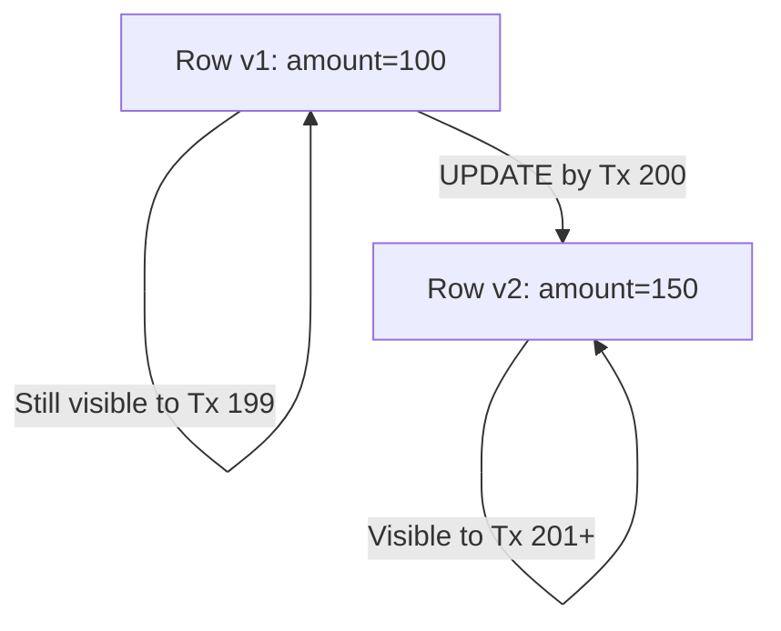

## ACID properties

The four guarantees that make relational databases reliable for concurrent, failure-prone workloads.

| Property | Guarantee | Mechanism in Postgres |
|----------|-----------|----------------------|
| **Atomicity** | All changes in a transaction succeed or none do | WAL + rollback |
| **Consistency** | Constraints hold after every transaction | CHECK, FK, UNIQUE enforcement |
| **Isolation** | Concurrent transactions don't see each other's uncommitted work | MVCC + isolation levels |
| **Durability** | Committed data survives crashes | WAL flushed to disk before commit acknowledgment |

Without ACID, concurrent access to shared data quickly leads to lost updates, phantom reads, and corrupt state. Postgres provides ACID by default — every single statement runs in an implicit transaction with Read Committed isolation.

## BEGIN, COMMIT, ROLLBACK

Explicit transaction control. Without BEGIN, each statement runs in its own implicit single-statement transaction.

```sql
BEGIN;
  UPDATE accounts SET balance = balance - 100 WHERE id = 1;
  UPDATE accounts SET balance = balance + 100 WHERE id = 2;
COMMIT;

-- If anything goes wrong, roll back both changes
BEGIN;
  INSERT INTO orders (customer_id, total) VALUES (1, 250.00);
  INSERT INTO line_items (order_id, product_id) VALUES (currval('orders_id_seq'), 99);
  -- Oops, product 99 doesn't exist — FK violation
ROLLBACK;  -- neither the order nor the line item is persisted
```

`SAVEPOINT` allows partial rollback within a transaction:

```sql
BEGIN;
  INSERT INTO logs (msg) VALUES ('starting');
  SAVEPOINT sp1;
  INSERT INTO risky_table (data) VALUES ('might fail');
  -- If the above errors:
  ROLLBACK TO sp1;
  INSERT INTO logs (msg) VALUES ('risky insert skipped');
COMMIT;
```

## Transaction isolation levels

Control how much one transaction sees of another's uncommitted or recently-committed work. Stricter levels prevent more anomalies but reduce concurrency.

| Level | Dirty read | Non-repeatable read | Phantom read | Serialization anomaly |
|-------|-----------|--------------------|--------------|-----------------------|
| Read Uncommitted* | No | Possible | Possible | Possible |
| **Read Committed** (default) | No | Possible | Possible | Possible |
| Repeatable Read | No | No | No** | Possible |
| Serializable | No | No | No | No |

*Postgres treats Read Uncommitted as Read Committed (never exposes dirty reads).
**Postgres's Repeatable Read also prevents phantoms, unlike the SQL standard minimum.

```sql
-- Set isolation for a single transaction
BEGIN ISOLATION LEVEL SERIALIZABLE;
  SELECT sum(balance) FROM accounts;
  -- Guaranteed to see a consistent snapshot, even if
  -- other transactions commit during this one
COMMIT;
```

Use Read Committed (the default) for most work. Reach for Serializable when correctness depends on multiple reads seeing a consistent snapshot and you're willing to handle serialization failures (retry the transaction).

## MVCC (Multi-Version Concurrency Control)

Postgres keeps old row versions so readers never block writers and writers never block readers. Each transaction sees a snapshot — a frozen view of all committed data as of a specific point in time.



Each row has hidden system columns: `xmin` (transaction that created this version) and `xmax` (transaction that deleted/superseded it). A row version is visible to your transaction if:
- `xmin` is committed and occurred before your snapshot
- `xmax` is either empty or not yet committed from your perspective

The trade-off: old row versions accumulate as "dead tuples" until VACUUM reclaims them. High-update tables without adequate vacuuming suffer from table bloat.

## Row-level locking

SELECT FOR UPDATE locks selected rows to prevent concurrent modification. Necessary for read-then-write patterns where you need to guarantee no one else changes the rows between your read and your write.

```sql
-- Pessimistic locking: grab the row before modifying
BEGIN;
  SELECT balance FROM accounts WHERE id = 1 FOR UPDATE;
  -- Row is now locked — other transactions block here if they try FOR UPDATE
  UPDATE accounts SET balance = balance - 100 WHERE id = 1;
COMMIT;
```

Lock strength levels:

| Clause | Blocks |
|--------|--------|
| `FOR UPDATE` | Other FOR UPDATE, UPDATE, DELETE |
| `FOR NO KEY UPDATE` | Other FOR UPDATE, but not FOR KEY SHARE |
| `FOR SHARE` | Other FOR UPDATE, FOR NO KEY UPDATE |
| `FOR KEY SHARE` | Only FOR UPDATE |

Use `NOWAIT` to fail immediately instead of waiting: `SELECT ... FOR UPDATE NOWAIT`. Use `SKIP LOCKED` to skip already-locked rows (useful for job queues).

## Deadlocks

Occur when two transactions each hold a lock the other needs. Postgres detects deadlocks automatically (within ~1 second by default) and aborts one transaction to break the cycle.

```sql
-- Transaction A                    -- Transaction B
BEGIN;                              BEGIN;
UPDATE accounts SET ... WHERE id=1; UPDATE accounts SET ... WHERE id=2;
-- holds lock on row 1              -- holds lock on row 2
UPDATE accounts SET ... WHERE id=2; UPDATE accounts SET ... WHERE id=1;
-- waits for B's lock on row 2      -- waits for A's lock on row 1
-- DEADLOCK DETECTED                -- one of these is aborted
```

Prevention strategies:
- Acquire locks in a consistent order (always lock lower IDs first)
- Keep transactions short to reduce the window for conflicts
- Use advisory locks for application-level coordination
- Set `lock_timeout` to fail fast rather than wait indefinitely

## Optimistic vs pessimistic concurrency

Two approaches to handling concurrent modifications to the same data.

**Pessimistic** — lock rows before reading them, preventing conflicts upfront. Simple but reduces concurrency under high contention.

```sql
-- Pessimistic: FOR UPDATE blocks other writers
BEGIN;
  SELECT * FROM inventory WHERE product_id = 1 FOR UPDATE;
  UPDATE inventory SET quantity = quantity - 1 WHERE product_id = 1;
COMMIT;
```

**Optimistic** — read without locking, check at write time whether the data changed. Higher throughput when conflicts are rare; requires retry logic when they occur.

```sql
-- Optimistic: version column detects conflicts
UPDATE inventory
SET quantity = quantity - 1, version = version + 1
WHERE product_id = 1 AND version = 5;
-- If 0 rows affected, someone else modified the row — retry
```

Use pessimistic locking when conflicts are frequent (seat reservations, account balances). Use optimistic control when conflicts are rare and you want maximum read throughput (user profile edits, document metadata).
