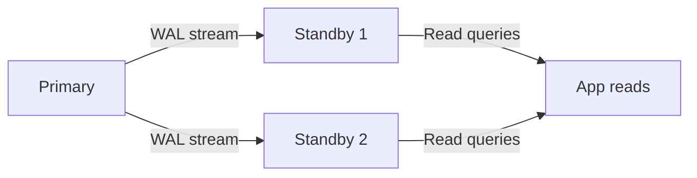

## Streaming replication

The primary server sends WAL (Write-Ahead Log) records to standby servers in near-real-time. Standbys apply these records to maintain an exact physical copy of the primary.



Setup requires configuring `wal_level = replica` on the primary, creating a replication slot, and running `pg_basebackup` to bootstrap the standby. Once connected, the standby continuously receives and applies WAL, staying seconds (or less) behind the primary.

## Synchronous vs asynchronous replication

Controls whether the primary waits for standby confirmation before acknowledging a commit to the client.

| Mode | Commit latency | Data loss risk | Use case |
|------|---------------|---------------|----------|
| Asynchronous (default) | Lowest | Small window of unconfirmed WAL | Most applications |
| Synchronous | Higher (network round-trip) | Zero (committed = replicated) | Financial, regulated systems |

```sql
-- On the primary: require at least one sync standby
ALTER SYSTEM SET synchronous_standby_names = 'FIRST 1 (standby1, standby2)';
SELECT pg_reload_conf();
```

With synchronous replication, a commit blocks until at least one standby confirms it received and wrote the WAL. If all sync standbys go down, writes stall on the primary — a trade-off of durability for availability.

## WAL (Write-Ahead Log)

Every data change is written to the WAL before being applied to data files. This provides crash recovery (replay WAL from last checkpoint) and is the foundation for both replication and point-in-time recovery.

```text
Write path:
1. Transaction modifies rows in shared buffers (memory)
2. WAL records describing the changes are written to WAL files (disk)
3. On COMMIT, WAL is flushed to disk (fsync) → client gets OK
4. Background writer eventually flushes dirty buffers to data files
```

If Postgres crashes after step 3 but before step 4, it replays the WAL on startup to recover committed changes. WAL files are also shipped to standbys for replication and archived for PITR.

## Hot standby

A replica that accepts read-only queries while simultaneously replaying WAL from the primary. This enables read scaling without changing application code (just point reads at the standby's connection string).

```sql
-- On the standby (check mode)
SELECT pg_is_in_recovery();  -- true = this is a standby

-- Query the standby like a normal database
SELECT count(*) FROM orders WHERE created_at > '2024-01-01';
-- Works, but may be slightly behind the primary
```

Hot standbys have replication lag — the delay between a change on the primary and its visibility on the standby. Monitor with `pg_stat_replication` on the primary or `pg_last_wal_replay_lsn()` on the standby.

## Logical replication

Publishes changes at the row level (INSERT/UPDATE/DELETE) rather than physical WAL blocks. This enables selective table replication, cross-version replication, and data integration patterns.

```sql
-- On the publisher (primary)
CREATE PUBLICATION orders_pub FOR TABLE orders, customers;

-- On the subscriber (another Postgres instance, possibly different version)
CREATE SUBSCRIPTION orders_sub
    CONNECTION 'host=primary dbname=app'
    PUBLICATION orders_pub;
```

Differences from streaming replication:

| Aspect | Streaming (physical) | Logical |
|--------|---------------------|---------|
| Granularity | Entire cluster | Selected tables |
| Schema changes | Automatically replicated | Must be applied manually |
| Subscriber writability | Read-only | Read-write |
| Cross-version | No | Yes |
| Use cases | HA failover, read replicas | Data integration, zero-downtime migrations |

## Failover and promotion

When the primary fails, a standby is promoted to become the new primary. The process involves detecting the failure, promoting the standby, and redirecting connections.

```bash
# Promote a standby to primary
pg_ctl promote -D /var/lib/postgresql/data

# Or via SQL (PG 12+)
SELECT pg_promote();
```

Manual failover is error-prone. Production systems use automated failover tools:

- **Patroni** — leader election via distributed consensus (etcd/ZooKeeper/Consul). The industry standard for self-managed HA.
- **pg_auto_failover** — simpler, built by Citus. Uses a monitor node for coordination.
- **Cloud-managed** — AWS RDS, Cloud SQL, Azure Database handle failover transparently.

After promotion, remaining standbys must be reconfigured to follow the new primary. Patroni handles this automatically; manual setups require `pg_rewind` or re-bootstrapping.
