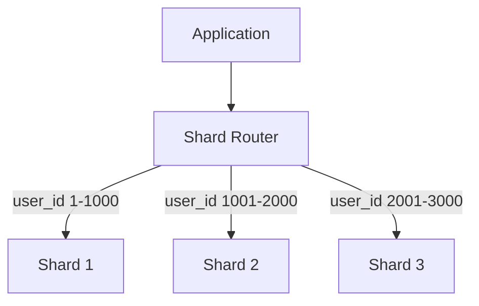

## Horizontal sharding

Distributing rows across multiple independent database instances by a shard key. Each shard holds a subset of the data and handles a fraction of the total write and read load.



The shard key determines which shard holds a given row. Choosing a good shard key is the most important decision: it must distribute data evenly and align with query patterns so most queries hit a single shard.

## Shard key selection

The shard key determines data distribution and query routing. A bad choice leads to hot shards, excessive cross-shard queries, or data skew.

Good shard key properties:
- **High cardinality** — many distinct values for even distribution
- **Query-aligned** — most queries include the shard key in WHERE, so they route to one shard
- **Stable** — rarely changes (moving data between shards is expensive)

```text
Good: user_id (high cardinality, most queries are per-user)
Bad:  country (few distinct values, US shard gets 80% of traffic)
Bad:  created_at (recent shard gets all writes — hot shard)
```

Composite shard keys (e.g., `tenant_id, user_id`) work for multi-tenant systems where all queries naturally include the tenant.

## Consistent hashing

A hashing strategy that minimizes data movement when shards are added or removed. Instead of `hash(key) % N` (which reshuffles everything when N changes), consistent hashing maps both keys and shards onto a ring.

```text
Standard modulo: adding 1 shard reshuffles ~100% of keys
Consistent hash: adding 1 shard moves only ~1/N of keys

Ring:     0 ─── Shard A ─── Shard B ─── Shard C ─── 0
Key hash: lands between B and C → assigned to C
Add Shard D between B and C → only keys between B and D move
```

Most sharding frameworks (Citus, Vitess, application-level libraries) implement some form of consistent hashing or hash range partitioning to enable shard rebalancing without full data redistribution.

## When to shard (and when not to)

Sharding adds enormous complexity. It's a last resort after vertical scaling, read replicas, partitioning, and query optimization have been exhausted.

**Shard when:**
- A single Postgres instance cannot handle the write volume
- Storage exceeds what a single machine can hold (many TB)
- You need geographic data locality (shard per region)

**Don't shard when:**
- Read scaling is the bottleneck (use read replicas instead)
- A single large table is the problem (use partitioning)
- You have fewer than ~500M rows (single Postgres handles this easily)
- Queries frequently need data from multiple shards (cross-shard joins are expensive)

Complexity you take on: cross-shard queries, distributed transactions (or giving up on them), shard rebalancing, operational overhead per shard, and application-level routing logic.

## Citus and Foreign Data Wrappers

Tools that bring sharding capabilities to Postgres without fully custom infrastructure.

**Citus** — a Postgres extension that adds transparent distributed query execution. Tables are declared as distributed (sharded) or reference (replicated to all nodes). The coordinator rewrites queries and routes them to workers.

```sql
-- Citus: distribute a table across workers
SELECT create_distributed_table('orders', 'customer_id');

-- Queries that include the shard key are routed to one shard
SELECT * FROM orders WHERE customer_id = 42;

-- Cross-shard queries work but are slower (need coordination)
SELECT customer_id, sum(total) FROM orders GROUP BY customer_id;
```

**Foreign Data Wrappers (FDW)** — query remote Postgres instances as if they were local tables. Lower-level than Citus: you manage routing manually, but it's built into core Postgres.

```sql
CREATE EXTENSION postgres_fdw;
CREATE SERVER shard2 FOREIGN DATA WRAPPER postgres_fdw
    OPTIONS (host 'shard2.internal', dbname 'app');
CREATE FOREIGN TABLE orders_shard2 (LIKE orders)
    SERVER shard2;
```

FDW gives you federated queries but lacks automatic routing, distributed transactions, and rebalancing. Citus adds those on top.
