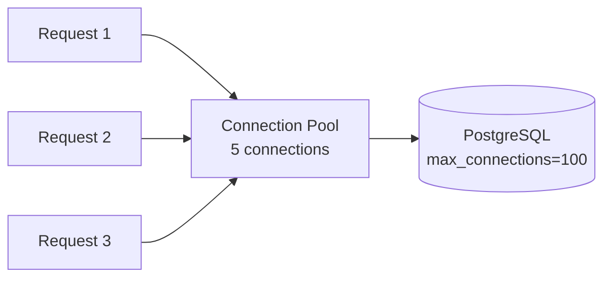

## Connection pooling

Reuses database connections across application requests instead of opening a new connection per request. Each Postgres connection consumes ~5-10 MB of memory and a backend process, so uncontrolled connection creation quickly exhausts server resources.



Without pooling, 100 concurrent requests open 100 connections. With a pool of 10, those 100 requests share 10 connections — requests that can't get a connection wait briefly in a queue.

## PgBouncer

A lightweight external connection pooler that sits between your application and Postgres. Handles thousands of client connections with a small number of actual database connections.

```ini
# pgbouncer.ini
[databases]
mydb = host=127.0.0.1 port=5432 dbname=mydb

[pgbouncer]
listen_port = 6432
pool_mode = transaction
max_client_conn = 1000
default_pool_size = 20
```

Three pooling modes:

| Mode | Connection returned to pool | Trade-off |
|------|---------------------------|-----------|
| **Session** | When client disconnects | Safest; no connection reuse between clients |
| **Transaction** | After each COMMIT/ROLLBACK | Best balance; most common in production |
| **Statement** | After each statement | Highest reuse; breaks multi-statement transactions |

Transaction mode is the standard choice. Session-level features (prepared statements, temp tables, SET commands) don't work in transaction mode because each statement may use a different backend connection.

## Connection pool sizing

Too few connections starve the application; too many overwhelm Postgres with context switching, lock contention, and memory pressure.

```text
Optimal pool size ≈ (CPU cores × 2) + effective_disk_spindles

Example: 4-core server with SSD
  pool_size = (4 × 2) + 1 = 9
  Round up to ~10-20 for headroom
```

Counter-intuitive: adding more connections past the optimal point usually makes performance *worse*, not better. A 96-core server needs ~200 connections, not 2000. The database does more useful work with fewer connections and less contention.

```sql
-- Check current connection usage
SELECT count(*) AS total,
       count(*) FILTER (WHERE state = 'active') AS active,
       count(*) FILTER (WHERE state = 'idle') AS idle,
       count(*) FILTER (WHERE state = 'idle in transaction') AS idle_in_tx
FROM pg_stat_activity
WHERE backend_type = 'client backend';
```

"Idle in transaction" connections hold locks and block vacuum. Monitor them and set `idle_in_transaction_session_timeout` to kill long-idle transactions.

## Server-side vs client-side cursors

Control how result sets are transferred from Postgres to the application. The default (client-side) fetches everything at once; server-side cursors stream rows on demand.

```python
# psycopg2: client-side (default) — fetches all rows into memory
cur = conn.cursor()
cur.execute("SELECT * FROM big_table")  # entire result in memory
rows = cur.fetchall()

# psycopg2: server-side cursor — streams rows
cur = conn.cursor(name='big_query')
cur.execute("SELECT * FROM big_table")
while True:
    rows = cur.fetchmany(1000)  # fetch 1000 at a time
    if not rows:
        break
    process(rows)
```

Use server-side cursors for queries that return millions of rows (ETL, exports, reports). The trade-off: server-side cursors hold a transaction open and consume server memory for the cursor state.

```sql
-- SQL-level cursor
BEGIN;
DECLARE export_cursor CURSOR FOR SELECT * FROM events WHERE created_at > '2024-01-01';
FETCH 1000 FROM export_cursor;
-- ... process rows ...
FETCH 1000 FROM export_cursor;
CLOSE export_cursor;
COMMIT;
```
