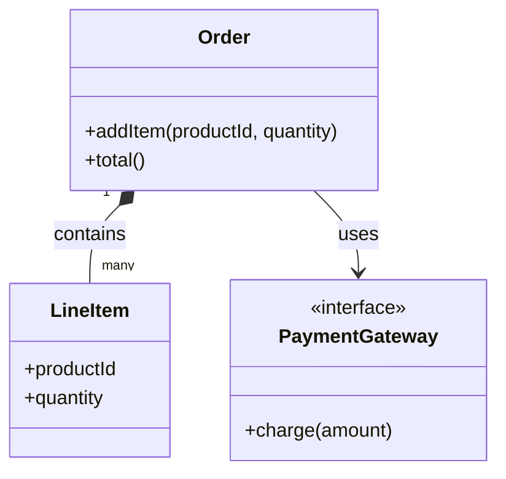
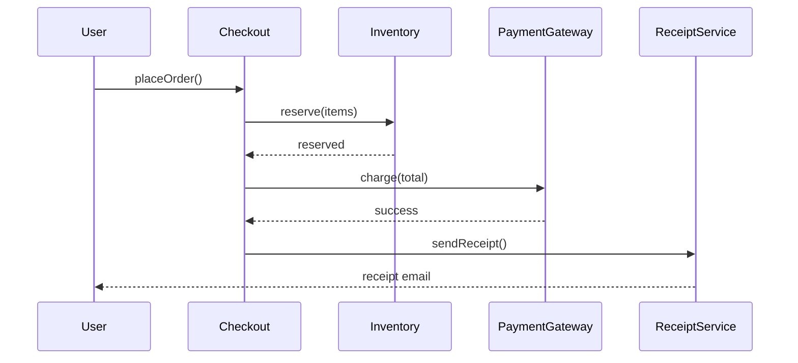
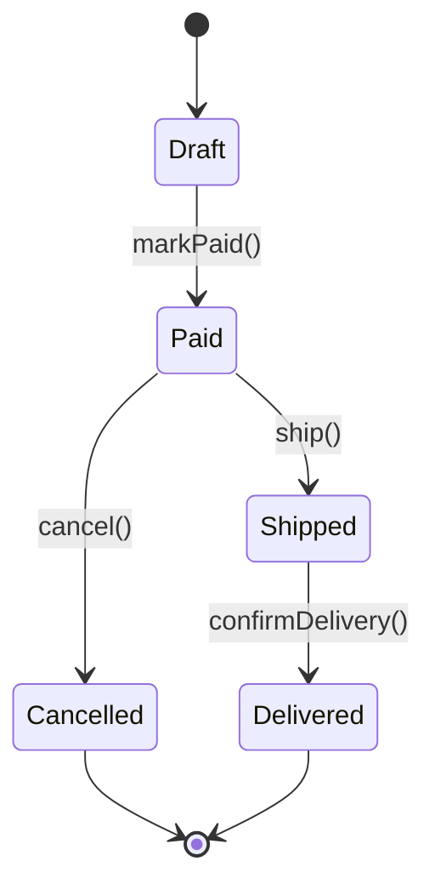

## UML is a thinking tool, not the product

UML is useful when it helps you reason about design before or during code. It is much less useful when it becomes a documentation ritual no one reads.

The value is in making structure and interaction easier to see, not in drawing every box and arrow possible.

## Class diagrams show structure

Class diagrams focus on types, attributes, operations, and relationships. They are useful when you need to see ownership, multiplicity, inheritance, or composition at a glance.

This is often the most recognizable UML artifact in OOP discussions.

This class diagram shows both strong ownership (`Order` contains `LineItem`) and looser collaboration (`Order` uses `PaymentGateway`).

## Sequence diagrams show interaction order

Sequence diagrams emphasize who calls whom, and in what order, during one scenario. They are useful for tracing workflows like checkout, login, approval, or retries.

If class diagrams answer "what exists?", sequence diagrams answer "what happens?"

This sequence diagram highlights collaboration order during checkout, which is something a class diagram cannot show clearly by itself.

## State diagrams show lifecycle

State diagrams are useful when an object has meaningful transitions like `draft -> paid -> shipped` or `pending -> running -> failed -> complete`.

They are especially helpful when invalid transitions are a business risk.

This state diagram makes legal transitions explicit and makes invalid jumps easier to notice before they become bugs.

## Visual models help catch design mistakes early

Sketching a relationship or workflow can quickly expose issues: missing concepts, circular dependencies, ownership confusion, or overloaded classes.

That early feedback is often the main reason to model visually at all.

## Models should stay close to the real design

If a diagram drifts far from the code, it becomes decorative. The best diagrams either guide implementation directly or stay lightweight enough to update when the design changes.

That is why smaller, focused diagrams often outperform giant "system map" posters.

## Not every problem needs a diagram

Some changes are obvious in code and do not need a visual model. Use diagrams when they reduce ambiguity, not because OOP supposedly requires them.

The point is clarity, not ceremony.

## Think in questions, not shapes

When using UML, ask: what owns what, what changes state, what talks to what, and what should be allowed next? Those questions matter more than perfect notation.

Good visual modeling is design thinking with pictures, not compliance with a textbook.
