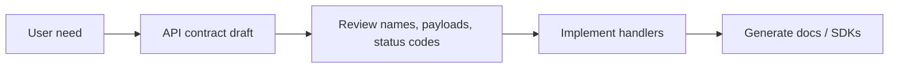

## API as a product surface

An API is a long-lived interface other software depends on, not just a thin layer in front of a database. That means naming, behavior, and compatibility decisions have real downstream cost once clients integrate with them.

Thinking this way changes the bar for "done." A route that works locally is not enough; the contract has to be clear, predictable, and stable enough that another team can build against it without reading your source code.

Example: if mobile clients ship against `POST /orders` returning `{"id": 42, "status": "pending"}`, changing that response to `{"orderId": 42}` is not a refactor. It is a breaking product change.

## Consumer-centered design

Good API design starts from the jobs clients need to do rather than from the tables or services you happen to have internally. Consumers care about completing workflows like "create an order" or "list invoices due this week," not about mirroring your persistence layer.

This is why direct CRUD exposure of every table often produces awkward APIs. Internal models optimize storage and implementation, while public contracts should optimize clarity and usefulness.

```http
# Consumer-centered
POST /orders
GET /orders?status=overdue

# Database-centered
POST /order_rows
GET /billing_records_v2?state_code=3
```

## Design-first vs. code-first

In a design-first workflow, the API contract is reviewed before the implementation exists. Teams write or refine an OpenAPI document, discuss field names and status codes, and only then build the handlers.

Code-first moves faster at the start because the framework can infer a spec from running code, but it is easier for documentation and implementation to drift. The tradeoff is speed of iteration versus upfront contract clarity.



## Public, private, and partner APIs

The audience for an API changes the design pressure. Public APIs need strong ergonomics, stable versioning, and careful backwards-compatibility because many unknown clients will depend on them.

Private APIs can evolve faster, but they still need discipline when multiple internal teams or services depend on them. Partner APIs usually sit in the middle: smaller audience than public, but higher governance than purely internal tooling.

Example:

- Public API: `api.example.com/v1/payments`
- Private API: an internal service route only the checkout backend calls
- Partner API: an order-sync API used by one warehouse vendor

## OpenAPI as a machine-readable contract

OpenAPI turns an API from prose into structured data that tools can validate and render. It captures paths, operations, request bodies, parameters, security schemes, and response schemas in a format both humans and machines can work with.

Once the spec is accurate, it becomes more than documentation. It can drive mock servers, diff checks in CI, client SDK generation, and review conversations before any endpoint code is written.

```yaml
paths:
  /orders:
    post:
      summary: Create order
      responses:
        "201":
          description: Order created
```

## Human-readable API documentation

Interactive docs like Swagger UI and ReDoc make the contract explorable. They show operation summaries, fields, examples, and authentication requirements in a way that shortens the gap between reading and making a correct request.

Good docs are not only generated pages. They also depend on accurate descriptions, meaningful examples, and explicit notes about edge cases such as pagination, rate limits, or idempotency expectations.

Example: a good docs page for `POST /orders` usually includes a sample request body, a sample `201` response, and at least one error case like `409 Conflict`.

## Examples and generated artifacts

Examples make a contract concrete. A developer can understand a field list intellectually, but a sample request and response make the payload shape, defaults, and error semantics obvious.

Because the contract is structured, teams can also generate server stubs, client SDKs, and test scaffolds from it. That is useful only if the specification is treated as a real source of truth rather than stale marketing material.

```json
{
  "customerId": 7,
  "items": [
    {"sku": "BOOK-123", "quantity": 2}
  ]
}
```
