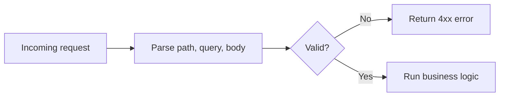

## Input validation at the boundary

Validation belongs at the API boundary, as close to the incoming request as possible. The server should reject malformed, incomplete, or semantically invalid input before it reaches business logic or persistence code.

This keeps failures cheaper and clearer. A client should get a precise field-level error instead of causing a deeper exception that becomes harder to explain and debug.



## Declarative schemas and DTOs

Most frameworks let you declare request schemas as typed objects rather than parsing dictionaries by hand. Whether the tool is Pydantic, Java request DTOs, or another schema layer, the value is the same: explicit contracts, automatic validation, and shared structure across code and docs.

Declarative schemas also make testing easier because there is one obvious place to look for required fields, defaults, and constraints.

```python
from pydantic import BaseModel, Field

class LineItem(BaseModel):
    sku: str
    quantity: int = Field(gt=0)

class CreateOrderRequest(BaseModel):
    customer_id: int
    items: list[LineItem] = Field(min_length=1)
```

```text
What this gives you automatically:
  - customer_id must be an integer (not "seven")
  - items must contain at least one entry
  - quantity must be > 0
  - Missing fields → 422 with field-level errors
  - Shows up in generated OpenAPI docs
```

## Type coercion and strictness

Validation libraries often coerce compatible input such as `"42"` into `42`. That can improve ergonomics, but it can also hide buggy clients when the contract becomes too permissive.

Teams need to decide where convenience ends and ambiguity starts. Strictness is not only a technical choice; it is part of API usability and long-term maintainability.

Example: accepting `"7"` for an integer ID may be fine, but silently accepting `"TRUE"` for a boolean flag can become a source of inconsistent behavior.

## Separating input sources

Bodies, path parameters, query parameters, headers, and cookies all enter the system differently and often carry different meaning. An API should validate each source deliberately instead of flattening everything into a generic bag of strings.

That separation keeps routing, filtering, authentication, and payload validation from bleeding into each other and creating accidental edge cases.

```http
POST /orders/42?dry_run=true
Authorization: Bearer <token>

{"status": "cancelled"}
```

## Consistent success responses

Clients benefit when similar operations return similarly shaped payloads. If one create endpoint returns the full resource, another returns only an ID, and a third returns no body at all, consumers end up writing unnecessary special cases.

Consistency does not mean every endpoint must look identical, but it does mean similar patterns should stay similar unless there is a strong reason not to.

```text
Inconsistent (forces client special-casing):
  POST /orders  → 201 {"id": 42, "status": "created"}
  POST /users   → 200 {"userId": 7}
  POST /tickets → 204 (no body)

Consistent (same pattern for all create endpoints):
  POST /orders  → 201 {"id": 42, "status": "created"}
  POST /users   → 201 {"id": 7, "status": "active"}
  POST /tickets → 201 {"id": 99, "status": "open"}
```

## Useful error payloads

An error response should explain what failed, where it failed, and what class of problem it is. Generic messages like "bad request" force the client to inspect server logs or guess which field caused the issue.

Useful error contracts also help operators and SDK authors. If failures are structured predictably, downstream tooling can surface them clearly instead of treating every error as an opaque string.

```http
POST /users HTTP/1.1
{"email": "not-valid", "age": -5}

HTTP/1.1 422 Unprocessable Entity
{
  "error": "validation_error",
  "details": [
    {"field": "email", "message": "must contain @"},
    {"field": "age", "message": "must be >= 0"}
  ]
}
```

```text
Bad:   {"error": "bad request"}              — what failed?
Bad:   {"error": "Internal Server Error"}    — leaked server detail
Good:  {"error": "validation_error",
        "details": [...per-field errors...]} — actionable for the client
```

## Domain errors vs. transport errors

Not every failure is a raw framework exception. Some are domain rules such as "invoice already paid" or "username already taken," and those should be translated into stable HTTP-level responses like `409 Conflict`.

This translation step is important because clients integrate with the transport contract, not with your internal exception class hierarchy.

Example: a `DuplicateUsernameError` in code should usually become `409 Conflict`, not a generic `500`.
