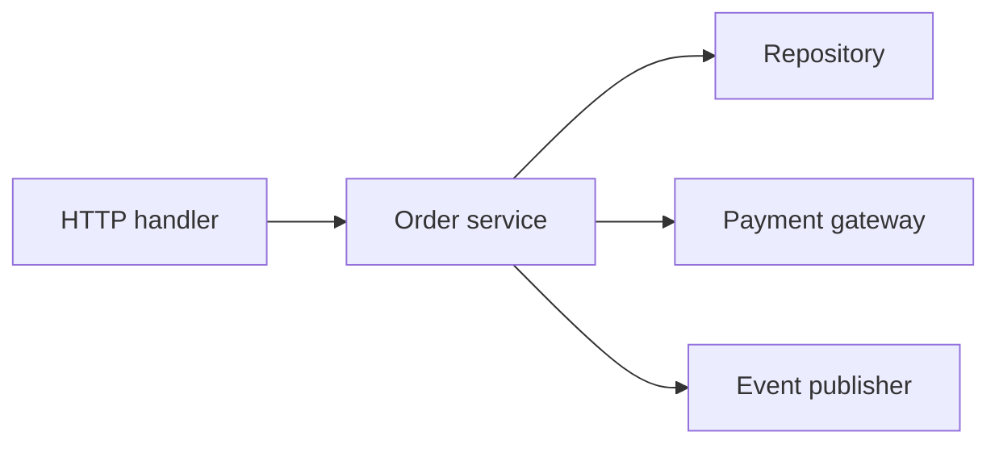
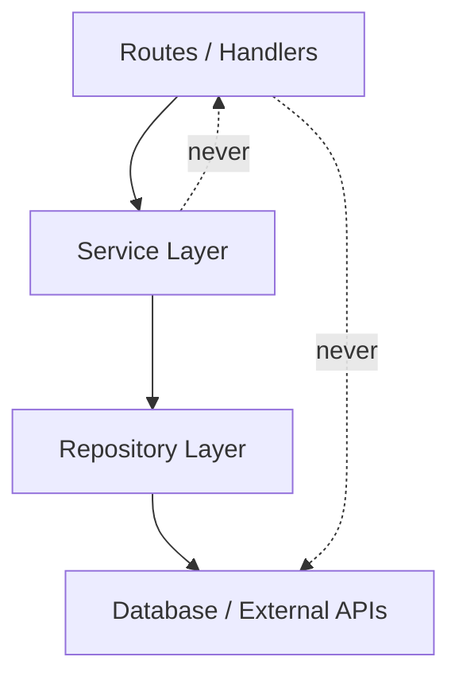

## Transport layer vs. business logic

Route handlers or controllers should translate HTTP concerns such as parameters, headers, and status codes. They should not become the place where all domain rules, persistence orchestration, and side effects accumulate.

Keeping those concerns separate makes the codebase easier to test and change. It also lets the same business rule survive changes in framework or transport.

```python
def create_order_handler(request):
    payload = request.json
    order = order_service.create_order(payload)
    return {"status": 201, "body": order}
```

## Service layer

A service layer groups use-case logic that coordinates multiple lower-level operations. It is useful when the system needs to do more than basic CRUD, such as validating a business rule, saving several records, and emitting an event as one workflow.

Without that layer, handlers often become large and duplicated. With it, the HTTP surface stays thin and the domain behavior gets one clear home.



## Repository or data-access layer

The repository or data-access layer hides the details of talking to the database or another persistence system. Its job is not to be magical; its job is to keep storage-specific code from leaking across the application.

This separation also makes migrations easier. Changing SQL queries, indexes, or even persistence engines should not force route code to be rewritten everywhere.

```python
class OrderRepository:
    def by_id(self, order_id: int) -> dict | None: ...
    def save(self, order: dict) -> dict: ...
```

## Modular routing

As an API grows, keeping every endpoint in one file becomes a maintenance tax. Modular routing groups endpoints by feature or domain so ownership and navigation stay clear.

Frameworks differ in syntax, but the underlying idea is the same: route organization should mirror the mental model of the product, not the order in which handlers happened to be added.

```text
Flat (route-centric):            Modular (domain-centric):
  app/                             app/
    routes.py  ← 80 endpoints       orders/
    models.py  ← 30 models            routes.py
    services.py ← everything           service.py
                                       repository.py
                                     customers/
                                       routes.py
                                       service.py
                                       repository.py
                                     invoices/
                                       routes.py
                                       service.py
                                       repository.py
```

## Request-to-domain mapping

The public shape of a request rarely matches the exact shape the domain model wants. Mapping is the small but important step where transport-level data becomes domain-level intent.

Being explicit about mapping prevents accidental coupling. It also gives one obvious place to handle defaults, normalization, and validation that is more business-specific than raw schema checks.

```python
command = {
    "customer_id": payload["customerId"],
    "line_items": payload["items"],
}
```

## Dependency boundaries

Every layer depends on something beneath it: handlers depend on services, services depend on repositories, repositories depend on storage. Clear dependency direction keeps the system from collapsing into circular imports and incidental coupling.

When those boundaries are weak, small changes fan out unpredictably. When they are explicit, the system remains navigable as it grows.



```text
Allowed:  handler → service → repository → DB
Avoid:    handler → DB directly (skips business rules)
Avoid:    repository → handler (circular dependency)
Avoid:    service → handler (inverts the direction)
```
