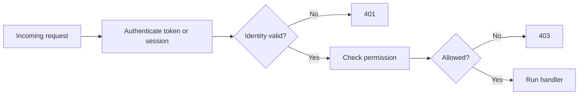

## Authentication vs. authorization

Authentication answers "who is calling?" while authorization answers "what may that caller do?" They are related but distinct, and confusing them leads to both design bugs and security bugs.

An API might successfully authenticate a user and still deny access to a resource. That separation is why `401 Unauthorized` and `403 Forbidden` mean different things in practice.



## Sessions and bearer tokens

Session-based authentication stores state on the server and usually works naturally with browser applications. Bearer-token approaches, often using JWTs or opaque tokens, fit better when many different clients or services need stateless access.

Neither approach is automatically superior. The right choice depends on client type, revocation needs, infrastructure, and how much state you are willing to keep server-side.

```http
Cookie: session_id=abc123
Authorization: Bearer eyJhbGciOi...
```

## JWT basics

A JSON Web Token carries signed claims about the caller, such as identity or role. The signature lets the server verify that the token was issued by a trusted authority and was not tampered with.

JWTs are useful because they are portable and stateless, but they are not magic. Expiration, key rotation, and revocation strategy still need to be designed explicitly.

```json
{
  "sub": "user-7",
  "role": "admin",
  "exp": 1780000000
}
```

## Credential handling and password storage

Passwords should never be stored in plaintext or recoverable form. APIs that manage user credentials should hash passwords with a modern password-hashing algorithm and verify them without ever needing to decrypt them.

Login behavior also needs operational controls such as rate limiting, audit logs, and careful error messaging so the system is not easy to abuse.

Example: store `argon2$...` or `bcrypt$...`, not `"hunter2"`.

## Role-based and resource-level authorization

Roles like `admin` or `editor` are a common first layer of authorization, but many real systems need object-level checks such as "can this user edit this document?" or "does this account own this invoice?"

If the only rule is broad roles, permissions often become too coarse. Good authorization design usually combines high-level roles with resource-specific ownership or policy checks.

```python
allowed = user["role"] == "admin" or order["owner_id"] == user["id"]
```

## Defense in depth for access control

Authorization should be enforced in the backend even if the frontend already hides forbidden buttons or pages. Client-side checks are usability features, not security guarantees.

This matters especially for APIs consumed by many clients. The server is the final authority, so every protected route must validate identity and permission directly.

Example: a hidden "Delete invoice" button in the UI does nothing if `DELETE /invoices/{id}` is still callable without a server-side permission check.
