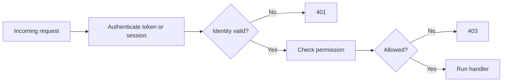
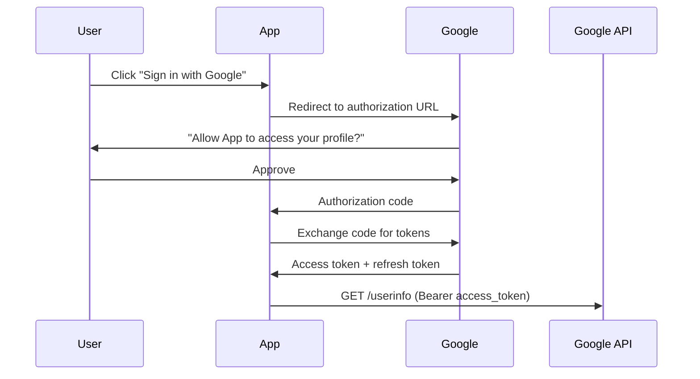

## Authentication vs. authorization

Authentication answers "who is calling?" while authorization answers "what may that caller do?" They are related but distinct, and confusing them leads to both design bugs and security bugs.

An API might successfully authenticate a user and still deny access to a resource. That separation is why `401 Unauthorized` and `403 Forbidden` mean different things in practice.



## Sessions and bearer tokens

Session-based authentication stores state on the server and usually works naturally with browser applications. Bearer-token approaches, often using JWTs or opaque tokens, fit better when many different clients or services need stateless access.

Neither approach is automatically superior. The right choice depends on client type, revocation needs, infrastructure, and how much state you are willing to keep server-side.

```http
Cookie: session_id=abc123
Authorization: Bearer eyJhbGciOi...
```

## JWT basics

A JSON Web Token carries signed claims about the caller, such as identity or role. The signature lets the server verify that the token was issued by a trusted authority and was not tampered with.

JWTs are useful because they are portable and stateless, but they are not magic. Expiration, key rotation, and revocation strategy still need to be designed explicitly.

```text
A JWT has three Base64-encoded parts separated by dots:

  header.payload.signature

Header:    {"alg": "RS256", "typ": "JWT"}
Payload:   {"sub": "user-7", "role": "admin", "exp": 1780000000}
Signature: HMAC or RSA signature of header + payload

The server verifies the signature without hitting a database.
But: if user-7 is banned, the token is still valid until it expires.

Mitigation strategies for revocation:
  - Short-lived tokens (15 min) + refresh tokens
  - Token blocklist in Redis (check on each request)
  - Rotate signing keys to invalidate all tokens at once
```

## Credential handling and password storage

Passwords should never be stored in plaintext or recoverable form. APIs that manage user credentials should hash passwords with a modern password-hashing algorithm and verify them without ever needing to decrypt them.

Login behavior also needs operational controls such as rate limiting, audit logs, and careful error messaging so the system is not easy to abuse.

```text
Registration:
  password = "hunter2"
  stored   = argon2id$v=19$m=65536,t=3,p=4$...hash...

Login:
  1. Client sends email + password
  2. Server fetches stored hash for that email
  3. argon2.verify(password, stored_hash) → True/False
  4. Never compare plaintext. Never decrypt.

Security controls on the login endpoint:
  - Rate limit: max 5 attempts per minute per IP
  - Same error for wrong email and wrong password
    ("Invalid credentials" — don't reveal which was wrong)
  - Log: timestamp, IP, success/failure for audit trail
  - Lock account after N consecutive failures
```

## OAuth2 and token refresh

OAuth2 is the standard protocol for delegated authorization — letting a user grant a third-party app limited access to their data without sharing their password. Most modern APIs that support "Sign in with Google/GitHub" or third-party integrations use OAuth2.



```text
Token lifecycle:
  Access token:   short-lived (15 min–1 hr), sent with every API request.
  Refresh token:  long-lived (days–weeks), used to get a new access token
                  when the current one expires — without re-authenticating.

  Client stores refresh token securely (httpOnly cookie or keychain).
  When access token expires → POST /token { grant_type: refresh_token }
  Server issues a new access token (and optionally rotates the refresh token).
```

## Role-based and resource-level authorization

Roles like `admin` or `editor` are a common first layer of authorization, but many real systems need object-level checks such as "can this user edit this document?" or "does this account own this invoice?"

If the only rule is broad roles, permissions often become too coarse. Good authorization design usually combines high-level roles with resource-specific ownership or policy checks.

```python
allowed = user["role"] == "admin" or order["owner_id"] == user["id"]
```

## Defense in depth for access control

Authorization should be enforced in the backend even if the frontend already hides forbidden buttons or pages. Client-side checks are usability features, not security guarantees.

This matters especially for APIs consumed by many clients. The server is the final authority, so every protected route must validate identity and permission directly.

Example: a hidden "Delete invoice" button in the UI does nothing if `DELETE /invoices/{id}` is still callable without a server-side permission check.
