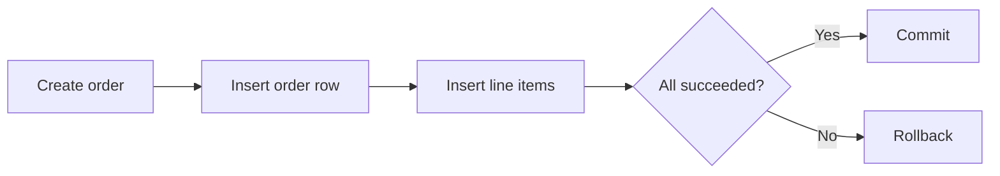

## API model vs. database model

The structure a database wants and the structure an API should expose are related but not identical. Tables, join rows, and indexing choices optimize storage and query behavior, while API payloads optimize clarity and consumer workflows.

Keeping those models distinct protects the public contract from internal refactors. It also makes it easier to evolve storage without forcing clients to relearn the API.

```json
// API response
{
  "id": 42,
  "customer": {"id": 7, "name": "A. Example"}
}
```

```text
Database rows:
orders(id, customer_id)
customers(id, name)
```

## Relational vs. document persistence

Relational systems model structured entities and relationships well, while document stores favor flexible nested data and aggregate-oriented access patterns. Both influence how backend APIs expose resources and how much joining or denormalization is needed.

The important skill is understanding the tradeoff rather than treating either option as universally superior. Persistence decisions affect endpoint behavior, performance, and consistency semantics.

Example: an order with many line items may be joined across tables in Postgres or embedded into one order document in MongoDB.

## Relationships and aggregates

One-to-many and many-to-many relationships appear everywhere in backend systems. The API needs to decide whether related data is embedded, linked, fetched separately, or manipulated through dedicated association endpoints.

These decisions shape both consumer ergonomics and backend complexity. A clean aggregate boundary can simplify transactions and caching, while a bad one creates awkward, leaky workflows.

```http
GET /orders/42
GET /orders/42/items
POST /projects/12/members
```

## Repositories and queries

Persistence code should live in a deliberate layer where queries, transactions, and storage-specific behavior can be tested and tuned. The rest of the application should consume clear methods instead of scattering raw queries everywhere.

That separation makes performance work more tractable. When a query needs indexing or restructuring, there is one coherent place to find and change it.

```python
class OrderRepository:
    def list_for_customer(self, customer_id: int) -> list[dict]: ...
```

## Migrations and schema evolution

Databases change over time, so schema changes should be versioned and repeatable rather than applied ad hoc. Migration tools let teams evolve storage in lockstep with code and with some confidence about rollback or reapplication.

Without migrations, environments drift. The code says one thing, the database shape says another, and debugging becomes half archaeology.

```bash
alembic revision -m "add order status"
alembic upgrade head
```

## Transaction boundaries

Many API workflows need several persistence operations to succeed or fail together. Transaction boundaries define where consistency is enforced and where partial failure becomes visible.

This matters most when business operations span multiple tables or side effects. A backend that cannot say what is atomic is a backend that will surprise both clients and operators.


