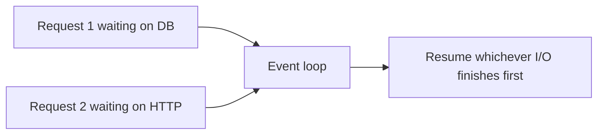

## Synchronous vs. asynchronous work

Synchronous request handling is straightforward: each request blocks until its work is done. Asynchronous handling lets the server pause while waiting for I/O so one worker can progress other requests instead of sitting idle.

This helps most when the bottleneck is network or disk waiting rather than CPU. Async is about efficient waiting, not about making expensive computation magically cheap.

```text
Sync (1 thread, 3 requests, each waits 100ms on DB):

  Thread │ ███░░░░░░░███░░░░░░░███░░░░░░░│  Total: 300ms
         │ req1       req2       req3      │
         ███ = work   ░░░ = waiting on I/O

Async (1 thread, 3 requests, overlapped I/O):

  Thread │ ███░░░░░░░│  Total: ~100ms
         │ ├─req1 wait─┤
         │ ├─req2 wait─┤  (all three wait in parallel)
         │ ├─req3 wait─┤

Async wins when requests spend most of their time waiting.
It does NOT help when the bottleneck is CPU (e.g., image resize).
```

## Event loops and concurrency models

Async backends usually rely on an event loop that schedules many in-flight tasks cooperatively. Other frameworks use threads, processes, or a mix, but the core question is the same: what work can run concurrently and what still blocks the worker?

You need this mental model to reason about latency, throughput, and failure. Without it, performance tuning turns into guesswork.



## Blocking vs. non-blocking dependencies

An async handler only helps if the things it calls are also non-blocking. If the handler awaits a blocking database driver or CPU-heavy function, the concurrency win mostly disappears.

This is why backend performance is a stack property. The framework, database client, HTTP client, and background job model all have to fit together coherently.

Example: an async web handler that calls a blocking image-resize library still stalls useful work on that worker.

## Background jobs

Some work should not happen inline on the request path at all. Email sending, image processing, and expensive downstream coordination often belong in background jobs so the API can acknowledge the request quickly and finish side effects separately.

The design question is not only "can I run this later?" but also "what guarantees do I need?" Fire-and-forget is very different from durable queued execution with retries.

```http
POST /exports
202 Accepted
Location: /exports/abc123
```

## Startup and lifespan concerns

Many backend processes need startup initialization such as creating connection pools, loading configuration, or warming shared clients. They also need clean shutdown so in-flight work and resources are handled predictably.

Treating lifespan explicitly avoids leaking connections and makes deployment behavior easier to reason about.

Example: create the database pool once at startup, not on every request.

## Throughput, latency, and workload shape

Concurrency choices should be informed by workload shape. A service with short I/O-bound requests benefits from different tuning than one dominated by CPU-heavy transformations or long-lived streams.

Understanding the workload keeps teams from cargo-culting async or worker counts without knowing why the change helps.

```text
Workload              Bottleneck    Best model           Example
────────────────────  ──────────    ──────────────────   ──────────────────
Short I/O-bound       Network/DB    Async event loop     JSON CRUD API
CPU-heavy             CPU cores     Multi-process pool   Image resize, ML
Long-lived streams    Connections   Async + WebSockets   Chat, live feeds
Mixed                 Varies        Async + thread pool  API with some CPU
                                    for blocking calls   work

Tuning levers:
  Uvicorn workers     = CPU cores (for process-level parallelism)
  Thread pool size    = for blocking I/O calls in async handlers
  Connection pool     = max concurrent DB connections per worker
  Queue concurrency   = max parallel background jobs
```
