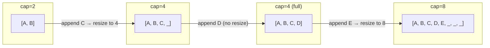
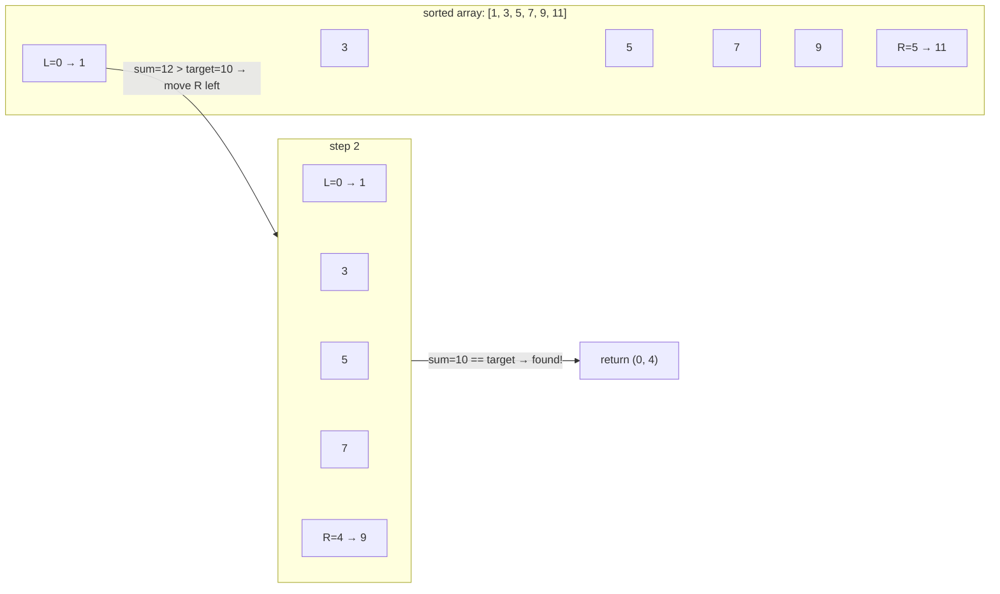
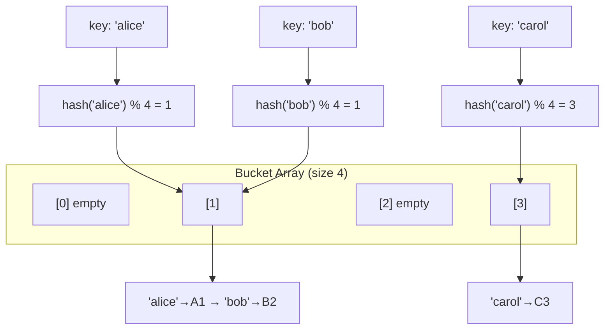

## Fixed-size arrays

A fixed-size array is a contiguous block of memory where every element occupies a known offset from the base address. Because the address of element `i` is just `base + i * element_size`, indexed reads and writes are O(1) with no indirection.

The tradeoff is rigidity. The size must be decided at allocation time, and expanding later means allocating a new block and copying everything. In Python you rarely touch raw fixed-size arrays directly, but the concept matters because every dynamic structure builds on top of this primitive.

```python
import array

# Fixed-size integer array (type code 'i' = signed int)
buf = array.array('i', [0] * 8)
buf[3] = 42          # O(1) indexed write
print(buf[3])        # O(1) indexed read -> 42
# buf[8] = 1         # IndexError: size is fixed at 8
```

## Dynamic arrays and amortized doubling

A dynamic array (Python's `list`, Java's `ArrayList`) wraps a fixed-size array and handles resizing automatically. When an append would exceed the current capacity, it allocates a new array (typically 2x the old size), copies existing elements over, and discards the old storage.

Most appends just write into the next open slot and cost O(1). The occasional resize costs O(N), but because the capacity doubles each time, the resize cost is spread across all the cheap appends that came before it. This gives an amortized O(1) cost per append. The diagram below shows how capacity jumps in powers of two while used size grows linearly.



```python
import sys

items: list[int] = []
prev_size = 0
for i in range(17):
    items.append(i)
    curr_size = sys.getsizeof(items)
    if curr_size != prev_size:
        print(f"len={len(items):2d}  internal_bytes={curr_size}")
        prev_size = curr_size
# Output shows capacity jumps at irregular intervals (CPython over-allocates)
```

## Two-pointer technique

The two-pointer technique places two indices into an array and moves them according to a rule, typically toward each other or at different speeds. On a sorted array, this turns an O(N^2) pair-search into an O(N) scan: start one pointer at the left and one at the right, and advance whichever side needs to change to approach the target.

This pattern appears in pair-sum problems, partitioning, removing duplicates, and container problems. The key insight is that each pointer movement eliminates a class of candidate pairs, so you never need to revisit them.



```python
def two_sum_sorted(nums: list[int], target: int) -> tuple[int, int] | None:
    """Find two indices whose values sum to target in a sorted array."""
    left, right = 0, len(nums) - 1
    while left < right:
        total = nums[left] + nums[right]
        if total == target:
            return (left, right)
        elif total < target:
            left += 1      # need a larger sum
        else:
            right -= 1     # need a smaller sum
    return None

print(two_sum_sorted([1, 3, 5, 7, 9, 11], 10))  # (0, 4) -> 1 + 9
```

## In-place array manipulation

In-place means transforming an array using only O(1) extra memory instead of allocating a second array proportional to the input. Interview problems often require this explicitly ("do it in-place") and it forces you to think carefully about read and write order.

A common pattern is the read-write pointer approach: one index scans forward reading elements, while a second trails behind writing only the elements you want to keep. Removing duplicates from a sorted array, compacting zeros, and partitioning around a pivot all follow this structure.

```python
def remove_duplicates_sorted(nums: list[int]) -> int:
    """Remove duplicates in-place from a sorted list. Return new length."""
    if not nums:
        return 0
    write = 0
    for read in range(1, len(nums)):
        if nums[read] != nums[write]:
            write += 1
            nums[write] = nums[read]
    return write + 1

data = [1, 1, 2, 3, 3, 3, 4]
new_len = remove_duplicates_sorted(data)
print(data[:new_len])  # [1, 2, 3, 4]
```

## Matrix as 2D array

A matrix is an array of arrays where element `(r, c)` lives at row `r`, column `c`. The challenge is not the data structure itself but the coordinate reasoning: rotating 90 degrees means mapping `(r, c)` to `(c, N-1-r)`, zeroing a row or column requires marking before mutating, and spiral traversal needs four boundary variables.

Practice the mechanical transformations until coordinate math feels automatic. Most matrix interview problems are straightforward once you can confidently translate between positions.

```python
def rotate_90_clockwise(matrix: list[list[int]]) -> None:
    """Rotate an NxN matrix 90 degrees clockwise, in-place."""
    n = len(matrix)
    # Step 1: transpose (swap rows and columns)
    for r in range(n):
        for c in range(r + 1, n):
            matrix[r][c], matrix[c][r] = matrix[c][r], matrix[r][c]
    # Step 2: reverse each row
    for row in matrix:
        row.reverse()

m = [[1, 2, 3],
     [4, 5, 6],
     [7, 8, 9]]
rotate_90_clockwise(m)
for row in m:
    print(row)
# [7, 4, 1]
# [8, 5, 2]
# [9, 6, 3]
```

## Strings as character arrays

Most string interview problems are array problems in disguise. Reversing, searching, comparing, and transforming strings use the same index manipulation, sliding windows, and two-pointer techniques as integer arrays.

The practical difference is that strings in Python (and Java) are immutable sequences, so you cannot modify characters in place. When an algorithm requires mutation, convert to a list of characters, do the work, and join back. Recognizing that a "string problem" is really an "array problem" unlocks the full toolkit.

```python
def reverse_words(s: str) -> str:
    """Reverse the order of words in a string."""
    # Treat the string as a sequence of tokens
    words = s.split()
    # Two-pointer swap, same as reversing any array
    left, right = 0, len(words) - 1
    while left < right:
        words[left], words[right] = words[right], words[left]
        left += 1
        right -= 1
    return " ".join(words)

print(reverse_words("the sky is blue"))  # "blue is sky the"
```

## String immutability and the builder pattern

In Python and Java, strings are immutable. Each concatenation with `+` allocates a new string and copies both halves into it. Building a string character-by-character this way costs O(N^2) total work because the growing result is copied every time.

The fix is to collect pieces in a mutable container and join once at the end. In Python, append to a list and call `str.join`. In Java, use `StringBuilder`. This reduces total work to O(N).

```python
# BAD: O(N^2) — each += copies the growing string
def build_slow(n: int) -> str:
    result = ""
    for i in range(n):
        result += str(i) + ","      # new allocation every iteration
    return result

# GOOD: O(N) — list append is amortized O(1), join is O(N)
def build_fast(n: int) -> str:
    parts: list[str] = []
    for i in range(n):
        parts.append(f"{i},")       # no copying of prior parts
    return "".join(parts)

import time
n = 50_000
t0 = time.perf_counter(); build_slow(n); t1 = time.perf_counter()
t2 = time.perf_counter(); build_fast(n); t3 = time.perf_counter()
print(f"slow: {t1-t0:.3f}s  fast: {t3-t2:.5f}s")
```

## Frequency map and character counting

A frequency map counts how many times each element appears. For character problems, the "map" can be a dictionary or a fixed-size array of 26 (or 128 / 256) counters. This technique is the backbone of anagram checks, permutation detection, uniqueness tests, and minimum-window-substring problems.

The pattern is almost always: build frequency counts, then compare or decrement. Two strings are anagrams if and only if they have identical frequency maps.

```python
from collections import Counter

def is_anagram(s: str, t: str) -> bool:
    """Check whether t is an anagram of s."""
    if len(s) != len(t):
        return False
    # Counter builds the frequency map in O(N)
    return Counter(s) == Counter(t)

print(is_anagram("listen", "silent"))  # True
print(is_anagram("hello", "world"))    # False

# Manual version with a plain dict (to understand what Counter does)
def is_anagram_manual(s: str, t: str) -> bool:
    if len(s) != len(t):
        return False
    freq: dict[str, int] = {}
    for ch in s:
        freq[ch] = freq.get(ch, 0) + 1
    for ch in t:
        freq[ch] = freq.get(ch, 0) - 1
        if freq[ch] < 0:
            return False
    return True
```

## Hash table fundamentals

A hash table maps keys to values by computing a hash of the key, reducing it to a bucket index, and storing the key-value pair in that bucket. With a good hash function and enough buckets, lookup, insert, and delete are all O(1) on average.

Python's `dict` is a hash table. Understanding the mechanics matters because it explains why keys must be hashable (immutable), why iteration order tracks insertion order (since Python 3.7), and why worst-case lookup is O(N) if every key collides into the same bucket.



```python
# Python dict IS a hash table
phone_book: dict[str, str] = {}
phone_book["alice"] = "555-0100"    # O(1) insert
phone_book["bob"]   = "555-0200"

print(phone_book["alice"])          # O(1) lookup -> "555-0100"
print("carol" in phone_book)       # O(1) membership test -> False

# Common pattern: group items by key
from collections import defaultdict

words = ["eat", "tea", "tan", "ate", "nat", "bat"]
groups: dict[str, list[str]] = defaultdict(list)
for word in words:
    key = "".join(sorted(word))     # anagram signature
    groups[key].append(word)

for key, group in groups.items():
    print(group)
# ['eat', 'tea', 'ate']
# ['tan', 'nat']
# ['bat']
```

## Hash collisions and resolution strategies

A collision happens when two different keys hash to the same bucket index. Every real hash table must handle this because the key space is larger than the bucket array. The two main strategies are chaining and open addressing.

**Chaining** stores a linked list (or another container) at each bucket. Colliding keys are appended to that list, and lookup walks the list comparing keys. **Open addressing** keeps everything in the main array: on collision, it probes forward (linear probing, quadratic probing, or double hashing) until finding an empty slot. Chaining is simpler to implement; open addressing has better cache locality. Both give O(1) average and O(N) worst case.

```python
class ChainingHashTable:
    """Minimal hash table with separate chaining."""

    def __init__(self, size: int = 8):
        self._buckets: list[list[tuple[str, object]]] = [[] for _ in range(size)]

    def _index(self, key: str) -> int:
        return hash(key) % len(self._buckets)

    def put(self, key: str, value: object) -> None:
        bucket = self._buckets[self._index(key)]
        for i, (k, _) in enumerate(bucket):
            if k == key:
                bucket[i] = (key, value)     # update existing
                return
        bucket.append((key, value))          # new entry in chain

    def get(self, key: str) -> object | None:
        for k, v in self._buckets[self._index(key)]:
            if k == key:
                return v
        return None

ht = ChainingHashTable(size=4)
ht.put("alice", 100)
ht.put("bob", 200)
print(ht.get("alice"))   # 100
print(ht.get("carol"))   # None
```

## Balanced BST as a map alternative

When you need ordered keys, range queries, or a guaranteed O(log N) worst case, a balanced binary search tree (Red-Black tree, AVL tree) replaces or supplements a hash table. Java's `TreeMap` and C++'s `std::map` use this internally. Python's standard library does not ship one, but the `sortedcontainers` package provides `SortedDict`.

The tradeoff is clear: hash tables are faster on average (O(1) vs O(log N)) but offer no ordering. A BST-backed map gives you min, max, floor, ceiling, and range iteration for free.

```python
# Simulating ordered-map behavior with a sorted structure
# In practice, use sortedcontainers.SortedDict for O(log N) operations
from bisect import insort

class OrderedMap:
    """Simplified ordered map using a sorted key list."""

    def __init__(self) -> None:
        self._keys: list[str] = []
        self._data: dict[str, int] = {}

    def put(self, key: str, value: int) -> None:
        if key not in self._data:
            insort(self._keys, key)
        self._data[key] = value

    def range_query(self, lo: str, hi: str) -> list[tuple[str, int]]:
        """Return all entries with lo <= key <= hi in sorted order."""
        return [(k, self._data[k]) for k in self._keys if lo <= k <= hi]

om = OrderedMap()
for name, score in [("dave", 80), ("alice", 95), ("carol", 88), ("bob", 72)]:
    om.put(name, score)

print(om.range_query("b", "c"))
# [('bob', 72), ('carol', 88)]  — ordered iteration between 'b' and 'c'
```
