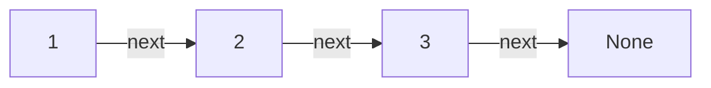
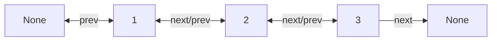
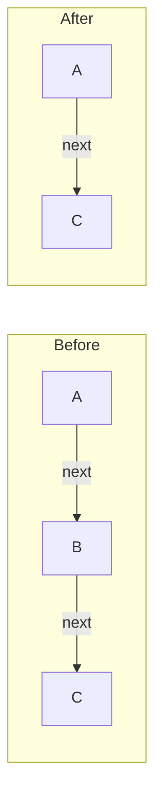
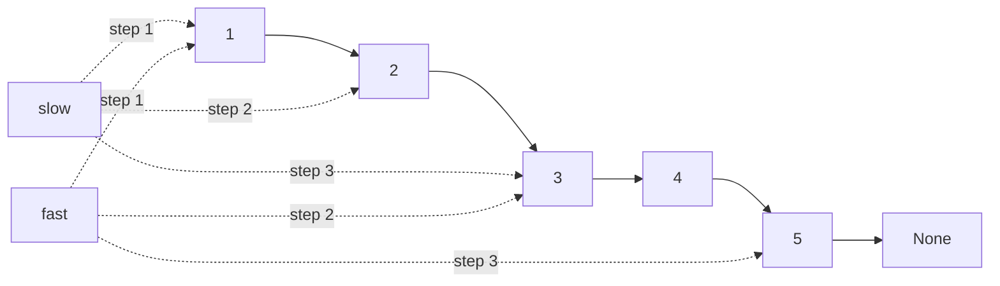
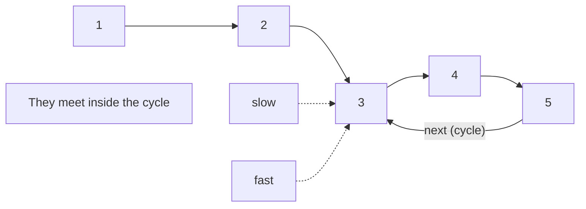

## Singly linked list: nodes chained by next pointers

A singly linked list is a sequence of nodes where each node holds a value and a reference to the next node. The last node points to `None`. Unlike arrays, there is no contiguous block of memory and no indexing. Inserting or removing at the head is O(1), but reaching the kth element requires walking k pointers, making random access O(k).

This structure matters because it is the foundation for stacks, queues, and many interview problems. Understanding how pointers connect nodes is the prerequisite for every other linked list technique.

```python
class Node:
    def __init__(self, data, next=None):
        self.data = data
        self.next = next

# Build: 1 -> 2 -> 3 -> None
head = Node(1, Node(2, Node(3)))
```



## Doubly linked list: bidirectional traversal

A doubly linked list adds a `prev` pointer to each node, so you can walk forward or backward. The main advantage is that given a reference to any node, you can remove it in O(1) without needing to find its predecessor first. This is why LRU caches pair a hash map with a doubly linked list.

The cost is extra memory per node and slightly more complex pointer updates on every insert and delete.

```python
class DNode:
    def __init__(self, data, prev=None, next=None):
        self.data = data
        self.prev = prev
        self.next = next
```



## Head reference vs. wrapper class

The simplest representation of a linked list is a bare `head` variable pointing to the first node. This works, but any operation that changes the head (insert at front, delete the first element) must return the new head or use some other convention to propagate the change.

A wrapper class solves this by holding the head reference inside an object. Callers interact with the list object, and the head can change internally without the caller needing to track it. Most production code and most interview solutions benefit from this pattern.

```python
class LinkedList:
    def __init__(self):
        self.head = None

    def prepend(self, data):
        self.head = Node(data, self.head)

    def __iter__(self):
        cur = self.head
        while cur:
            yield cur.data
            cur = cur.next
```

## Node deletion: pointer surgery around the target

Deleting a node means making the previous node's `next` pointer skip over the target. The key edge case is deleting the head, where there is no previous node and the head reference itself must change. For a doubly linked list, you also update the `next` node's `prev` pointer.

Getting deletion wrong usually means either losing the rest of the list or leaking the node. Drawing the before-and-after pointer diagram on paper is the fastest way to verify correctness.

```python
def delete(self, target_data):
    if self.head and self.head.data == target_data:
        self.head = self.head.next
        return
    cur = self.head
    while cur.next:
        if cur.next.data == target_data:
            cur.next = cur.next.next  # skip the target
            return
        cur = cur.next
```



## Inserting at head, tail, and middle

Insertion at the head is O(1): create a new node pointing to the current head, then update the head. Insertion at the tail is O(N) for a singly linked list because you must walk to the end, unless you maintain a tail pointer. Insertion in the middle requires finding the correct position first, then splicing the new node into the chain.

Each position has a different pointer update pattern. Head insertion changes one pointer. Middle insertion changes two. Keeping a tail pointer makes tail insertion O(1) but adds bookkeeping to every deletion.

```python
def insert_after(self, prev_node, data):
    """Insert a new node after prev_node."""
    new_node = Node(data, prev_node.next)
    prev_node.next = new_node

def append(self, data):
    """Insert at the tail. O(N) without a tail pointer."""
    if not self.head:
        self.head = Node(data)
        return
    cur = self.head
    while cur.next:
        cur = cur.next
    cur.next = Node(data)
```

## Runner (two-pointer) technique

The runner technique uses two pointers that move through the list at different speeds. The canonical use is finding the middle node: the slow pointer advances one step while the fast pointer advances two. When the fast pointer reaches the end, the slow pointer is at the midpoint.

This same idea generalizes to detecting cycles, finding the kth-to-last element, and interleaving list halves. Two-pointer solutions avoid the need for a first pass to count list length.

```python
def find_middle(head):
    slow = fast = head
    while fast and fast.next:
        slow = slow.next
        fast = fast.next.next
    return slow  # middle node

# Example: 1 -> 2 -> 3 -> 4 -> 5
# slow visits: 1, 2, 3
# fast visits: 1, 3, 5
# returns node with data=3
```



## Cycle detection with Floyd's algorithm

Floyd's cycle detection uses the same fast/slow pointer setup. If the list contains a cycle, the fast pointer will eventually lap the slow pointer and they will meet. If there is no cycle, the fast pointer reaches `None`.

To find where the cycle starts, reset one pointer to the head after the meeting point. Then advance both pointers one step at a time. They will meet again at the cycle entrance. This works because of the mathematical relationship between the distances each pointer has traveled.

```python
def detect_cycle(head):
    slow = fast = head
    while fast and fast.next:
        slow = slow.next
        fast = fast.next.next
        if slow is fast:
            # Cycle found. Find the start.
            slow = head
            while slow is not fast:
                slow = slow.next
                fast = fast.next
            return slow  # cycle start node
    return None  # no cycle
```



## Recursive list processing

Many linked list operations have clean recursive formulations. Reversing a list, merging two sorted lists, and checking palindromes all decompose naturally: process the rest of the list, then handle the current node. The base case is usually `None` or a single node.

The tradeoff is stack space. Each recursive call adds a frame, so processing a list of N nodes uses O(N) stack space. Python's default recursion limit (around 1000) makes this a real constraint for long lists. For production code, iterative solutions are usually safer; for interviews, recursive solutions are often cleaner to reason about.

```python
def reverse(head):
    """Reverse a singly linked list recursively."""
    if head is None or head.next is None:
        return head
    new_head = reverse(head.next)
    head.next.next = head
    head.next = None
    return new_head
```

## Arrays vs. linked lists: choosing the right structure

Arrays give you O(1) random access and excellent cache locality because elements sit in contiguous memory. Linked lists give you O(1) insertion and deletion at known positions without shifting elements. Neither is universally better.

Use arrays when you need fast indexed access, binary search, or when the data fits naturally into a fixed-size block. Use linked lists when the dominant operations are insertions and deletions at arbitrary positions, when you cannot predict size in advance, or when you need to splice sequences together without copying. In practice, arrays (and dynamic arrays like Python lists) win most of the time because CPU caches strongly favor contiguous memory access.

| Operation            | Array  | Linked List |
|----------------------|--------|-------------|
| Access by index      | O(1)   | O(N)        |
| Insert/delete at head| O(N)   | O(1)        |
| Insert/delete at end | O(1)*  | O(1)**      |
| Search (unsorted)    | O(N)   | O(N)        |
| Cache performance    | High   | Low         |

\* Amortized for dynamic arrays. \** With a tail pointer.
