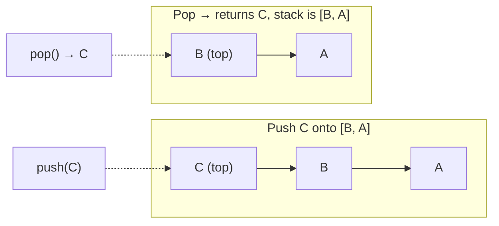
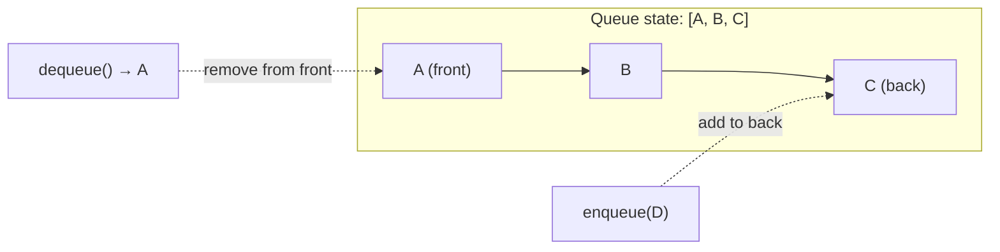
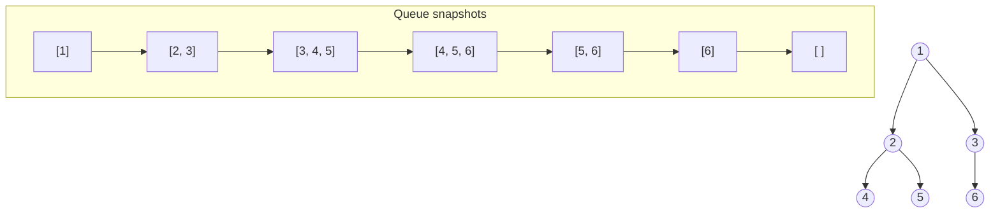
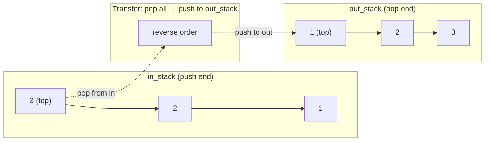

## Stack (LIFO)

A stack enforces last-in, first-out ordering. The four core operations -- `push`, `pop`, `peek`, and `is_empty` -- all run in O(1). Stacks model any situation where you need to reverse order or backtrack: undo history, browser back buttons, call stacks, and expression parsing.

The cleanest implementation uses a singly linked list, adding and removing from the head so every operation stays constant time without worrying about capacity.

```python
class StackNode:
    def __init__(self, val, nxt=None):
        self.val = val
        self.nxt = nxt

class Stack:
    def __init__(self):
        self._top = None

    def push(self, val):
        self._top = StackNode(val, self._top)

    def pop(self):
        if self._top is None:
            raise IndexError("pop from empty stack")
        val = self._top.val
        self._top = self._top.nxt
        return val

    def peek(self):
        if self._top is None:
            raise IndexError("peek at empty stack")
        return self._top.val

    def is_empty(self):
        return self._top is None
```



## Stack implementation with arrays vs. linked lists

An array-backed stack tracks a top-of-stack index and stores elements in a contiguous buffer. It offers better cache locality than a linked list and avoids per-node allocation overhead, but must resize when it runs out of room (amortized O(1) append, same as Python's `list.append`). A linked-list-backed stack never needs resizing and has true worst-case O(1) for push and pop, but each node carries pointer overhead.

```python
# Array-backed stack (Python list as the backing store)
class ArrayStack:
    def __init__(self):
        self._data = []

    def push(self, val):
        self._data.append(val)       # amortized O(1)

    def pop(self):
        if not self._data:
            raise IndexError("pop from empty stack")
        return self._data.pop()      # O(1)

    def peek(self):
        if not self._data:
            raise IndexError("peek at empty stack")
        return self._data[-1]

    def is_empty(self):
        return len(self._data) == 0
```

In Python, `list` is the practical choice for stacks. Use the linked-list version when you need guaranteed O(1) without amortization or when you are building the data structure from scratch in an interview.

## Explicit stack for converting recursion to iteration

Any recursive algorithm can be converted to an iterative one by managing an explicit stack that holds the same state the call stack would. This matters when recursion depth is large enough to blow through Python's default 1000-frame limit or when you need finer control over traversal order.

The pattern: replace each recursive call with a push, and replace the function return with a pop. Here is iterative DFS on a graph.

```python
def dfs_iterative(graph, start):
    visited = set()
    stack = [start]

    while stack:
        node = stack.pop()
        if node in visited:
            continue
        visited.add(node)
        print(node)

        # Push neighbors in reverse so leftmost is processed first
        for neighbor in reversed(graph[node]):
            if neighbor not in visited:
                stack.append(neighbor)

    return visited
```

The explicit stack version mirrors the recursive DFS exactly: each `stack.append` corresponds to a recursive call, and each `stack.pop` corresponds to returning from one.

## Stack for expression evaluation and bracket matching

Stacks are the natural tool for problems where you need to match something opened earlier: parentheses, HTML tags, postfix operators. The core insight is that the most recently opened item must be closed first -- exactly LIFO order.

```python
def is_balanced(expr: str) -> bool:
    """Return True if every bracket in expr is properly matched."""
    pairs = {")": "(", "]": "[", "}": "{"}
    stack = []

    for ch in expr:
        if ch in "([{":
            stack.append(ch)
        elif ch in ")]}":
            if not stack or stack[-1] != pairs[ch]:
                return False
            stack.pop()

    return len(stack) == 0

# Examples
print(is_balanced("({[]})"))   # True
print(is_balanced("([)]"))     # False
print(is_balanced("(("))       # False
```

For postfix (reverse Polish) evaluation, push operands onto the stack; when you hit an operator, pop two operands, apply the operator, and push the result. The final value is the single element left on the stack.

## Min stack

A min stack augments the standard stack so that retrieving the current minimum is O(1) alongside the usual O(1) push and pop. The trick is to store the running minimum at each level: every time you push, record `min(new_val, current_min)`. When you pop, the previous minimum is already stored in the element below.

```python
class MinStack:
    def __init__(self):
        self._data = []  # each entry is (value, current_min)

    def push(self, val):
        current_min = min(val, self._data[-1][1]) if self._data else val
        self._data.append((val, current_min))

    def pop(self):
        if not self._data:
            raise IndexError("pop from empty stack")
        return self._data.pop()[0]

    def peek(self):
        return self._data[-1][0]

    def get_min(self):
        if not self._data:
            raise IndexError("min of empty stack")
        return self._data[-1][1]

# Usage
ms = MinStack()
for v in [5, 3, 7, 2, 8]:
    ms.push(v)
print(ms.get_min())  # 2
ms.pop()             # removes 8
ms.pop()             # removes 2
print(ms.get_min())  # 3
```

An alternative approach uses a parallel stack that only pushes when a new minimum arrives, saving space when values rarely decrease. Both variants preserve O(1) for all operations.

## Queue (FIFO)

A queue enforces first-in, first-out ordering. The four core operations -- `enqueue`, `dequeue`, `peek`, and `is_empty` -- all run in O(1). Queues model any situation where requests must be served in arrival order: task scheduling, message passing, print spooling, and breadth-first search.

A linked-list implementation maintains pointers to both the front (for dequeue) and the back (for enqueue).

```python
class QueueNode:
    def __init__(self, val, nxt=None):
        self.val = val
        self.nxt = nxt

class Queue:
    def __init__(self):
        self._front = None
        self._back = None

    def enqueue(self, val):
        node = QueueNode(val)
        if self._back:
            self._back.nxt = node
        self._back = node
        if self._front is None:
            self._front = node

    def dequeue(self):
        if self._front is None:
            raise IndexError("dequeue from empty queue")
        val = self._front.val
        self._front = self._front.nxt
        if self._front is None:
            self._back = None
        return val

    def peek(self):
        if self._front is None:
            raise IndexError("peek at empty queue")
        return self._front.val

    def is_empty(self):
        return self._front is None
```



## Queue for BFS traversal

Breadth-first search processes nodes level by level, and a queue is what makes that possible. You dequeue the current node, process it, then enqueue all its unvisited neighbors. Because the queue is FIFO, all nodes at distance *d* are processed before any node at distance *d+1*.

```python
from collections import deque

def bfs(graph, start):
    visited = {start}
    queue = deque([start])
    order = []

    while queue:
        node = queue.popleft()       # O(1) with deque
        order.append(node)

        for neighbor in graph[node]:
            if neighbor not in visited:
                visited.add(neighbor)
                queue.append(neighbor)

    return order

# Example tree as adjacency list
tree = {
    1: [2, 3],
    2: [4, 5],
    3: [6],
    4: [], 5: [], 6: [],
}
print(bfs(tree, 1))  # [1, 2, 3, 4, 5, 6]
```



BFS also gives the shortest path in unweighted graphs because it explores nodes in order of their distance from the start.

## Two-stack queue

A queue can be built from two stacks. One stack (`in_stack`) receives all enqueues. When you need to dequeue and the second stack (`out_stack`) is empty, pour everything from `in_stack` into `out_stack`, which reverses the order so the oldest element is on top. Each element is moved at most once, giving amortized O(1) per operation.

```python
class TwoStackQueue:
    def __init__(self):
        self._in_stack = []
        self._out_stack = []

    def enqueue(self, val):
        self._in_stack.append(val)

    def _transfer(self):
        if not self._out_stack:
            while self._in_stack:
                self._out_stack.append(self._in_stack.pop())

    def dequeue(self):
        self._transfer()
        if not self._out_stack:
            raise IndexError("dequeue from empty queue")
        return self._out_stack.pop()

    def peek(self):
        self._transfer()
        if not self._out_stack:
            raise IndexError("peek at empty queue")
        return self._out_stack[-1]
```



This is a classic interview question. The amortized analysis works because each element is pushed and popped from each stack exactly once -- four total operations spread across its lifetime in the queue.

## Deque (double-ended queue)

A deque supports insertion and removal from both ends in O(1). It generalizes both stacks (use one end) and queues (use opposite ends). Python's `collections.deque` is the standard implementation, backed by a doubly linked list of fixed-size blocks.

```python
from collections import deque

d = deque()
d.append(1)        # add to right:  [1]
d.appendleft(0)    # add to left:   [0, 1]
d.append(2)        # add to right:  [0, 1, 2]
d.popleft()        # remove left:   [1, 2] → returns 0
d.pop()            # remove right:  [1]     → returns 2

# Bounded deque: keeps only the last N items
recent = deque(maxlen=3)
for i in range(5):
    recent.append(i)
print(list(recent))  # [2, 3, 4]
```

Use `deque` over `list` whenever you need O(1) operations on both ends. A `list.pop(0)` is O(N) because it shifts every element, while `deque.popleft()` is O(1). The `maxlen` parameter makes `deque` useful for sliding window problems and bounded buffers.

## Priority queue

A priority queue dequeues elements by priority rather than insertion order. The typical backing structure is a binary heap, which provides O(log N) insert and O(log N) extract-min (or max). Python's `heapq` module operates on a plain list as a min-heap, and `queue.PriorityQueue` adds thread safety on top.

```python
import heapq

tasks = []
heapq.heappush(tasks, (2, "low priority"))
heapq.heappush(tasks, (0, "urgent"))
heapq.heappush(tasks, (1, "normal"))

while tasks:
    priority, description = heapq.heappop(tasks)
    print(f"[{priority}] {description}")
# [0] urgent
# [1] normal
# [2] low priority
```

Priority queues appear in Dijkstra's shortest path, Huffman coding, task scheduling, and event-driven simulations. The heap internals are covered in the Heaps topic; the key idea here is that a priority queue is the interface and a heap is the implementation.
