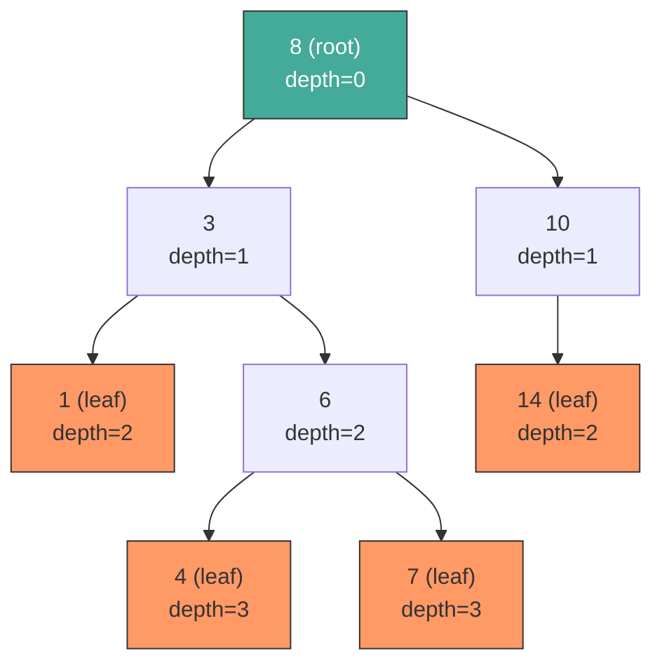
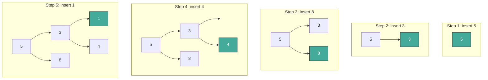
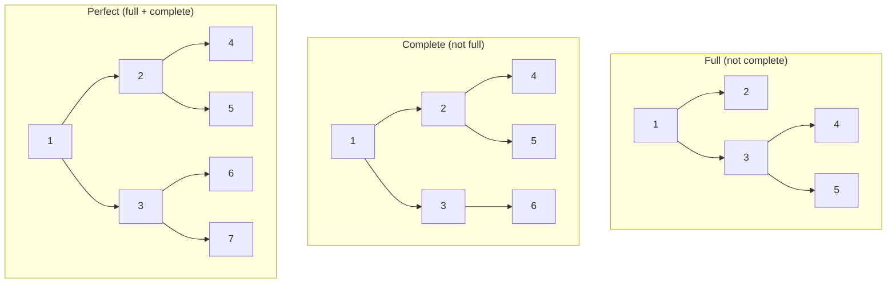
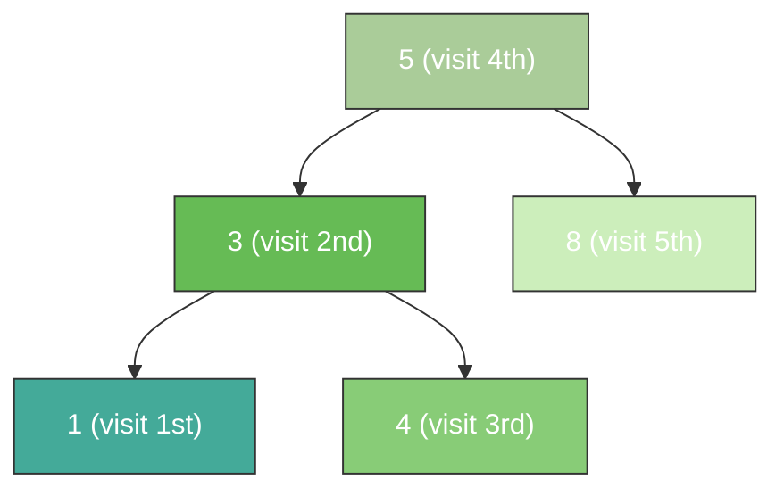
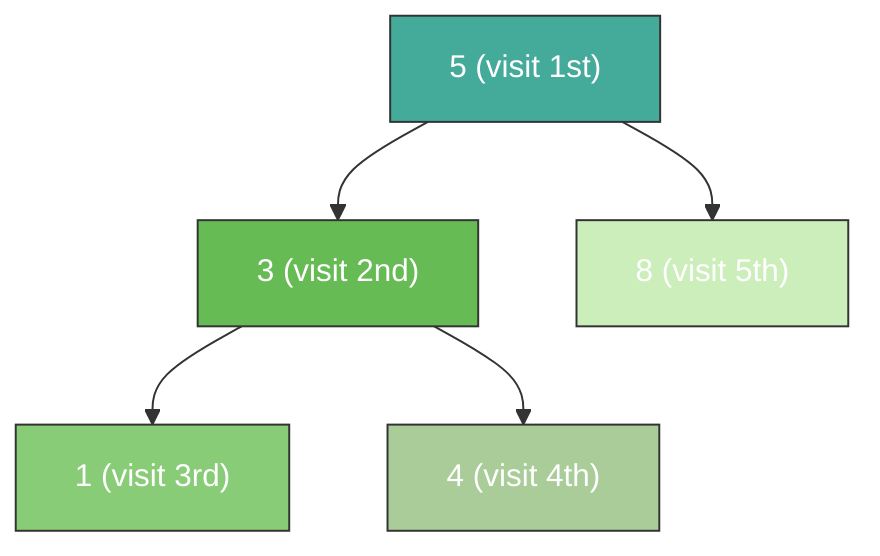
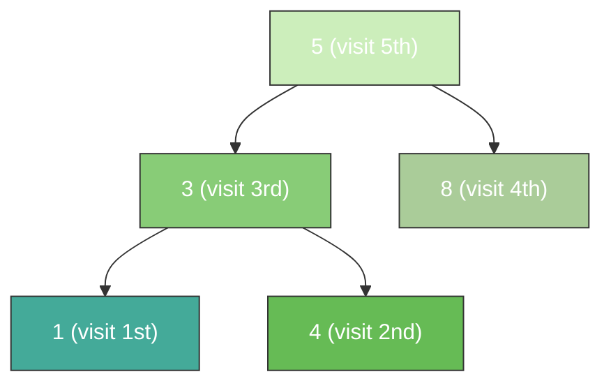

## Tree structure: recursive, acyclic, connected hierarchy

A tree is a connected, acyclic graph with a designated root node. Every node except the root has exactly one parent, and each node can have zero or more children. Nodes with no children are called leaves. The depth of a node is the number of edges from the root to that node. The height of a tree is the number of edges on the longest path from the root to any leaf.

Trees appear everywhere in computing: file systems, the DOM, syntax trees, decision trees, database indexes. The recursive definition -- a tree is a root connected to zero or more subtrees -- maps directly to recursive algorithms, which is why most tree code is naturally recursive.



In the diagram above, the green node is the root and the orange nodes are leaves. The height of this tree is 3 (the longest path from root 8 down to leaf 4 or 7).

## Binary tree: at most two children per node

A binary tree restricts each node to at most two children, conventionally called `left` and `right`. This constraint makes the structure simple enough for efficient algorithms while still being expressive enough for search, sorting, and expression parsing.

The `TreeNode` class is the building block for nearly every tree problem you will encounter in interviews and production code.

```python
class TreeNode:
    def __init__(self, val, left=None, right=None):
        self.val = val
        self.left = left
        self.right = right

# Build a small tree:
#       5
#      / \
#     3   8
#    / \
#   1   4
root = TreeNode(5,
    TreeNode(3, TreeNode(1), TreeNode(4)),
    TreeNode(8))
```

Every node stores a value and two optional child references. When both children are `None`, the node is a leaf. This class (or a minor variant of it) is reused by BSTs, heaps implemented as linked structures, expression trees, and most tree-based interview problems.

## Binary search tree (BST): ordered structure for O(log N) operations

A binary search tree maintains a strict ordering invariant: for every node, all values in the left subtree are less than or equal to the node's value, and all values in the right subtree are greater. This invariant enables binary search on a tree structure, giving O(log N) search, insert, and delete when the tree is balanced.

The search algorithm follows a single path from root to target by comparing at each node and going left or right. Insertion works the same way but places a new leaf at the point where the search would fail.

```python
def bst_search(root: TreeNode, target: int) -> TreeNode | None:
    """Search for target in a BST. O(log N) average, O(N) worst."""
    node = root
    while node:
        if target == node.val:
            return node
        elif target < node.val:
            node = node.left
        else:
            node = node.right
    return None


def bst_insert(root: TreeNode | None, val: int) -> TreeNode:
    """Insert val into a BST and return the root. O(log N) average."""
    if root is None:
        return TreeNode(val)
    if val <= root.val:
        root.left = bst_insert(root.left, val)
    else:
        root.right = bst_insert(root.right, val)
    return root
```

The recursive insert works by finding the correct empty spot and placing the new node there. Each call descends one level, so the depth of the tree determines the cost.



Each green node is the newly inserted value. At every step, the new value walks down the tree comparing at each node until it finds an empty child slot.

## BST deletion: three cases of node removal

Deleting a node from a BST must preserve the ordering invariant. There are three cases depending on how many children the target node has.

**Case 1: leaf node** -- simply remove it. **Case 2: one child** -- replace the node with its only child. **Case 3: two children** -- find the in-order successor (the smallest node in the right subtree), copy its value into the target node, and then delete the successor (which will be case 1 or 2).

```python
def bst_delete(root: TreeNode | None, val: int) -> TreeNode | None:
    """Delete val from a BST and return the new root."""
    if root is None:
        return None
    if val < root.val:
        root.left = bst_delete(root.left, val)
    elif val > root.val:
        root.right = bst_delete(root.right, val)
    else:
        # Found the node to delete
        if root.left is None:          # Case 1 & 2: no left child
            return root.right
        if root.right is None:         # Case 2: no right child
            return root.left
        # Case 3: two children -- find in-order successor
        successor = root.right
        while successor.left:
            successor = successor.left
        root.val = successor.val       # copy successor value
        root.right = bst_delete(root.right, successor.val)  # delete successor
    return root
```

The two-children case is the one interviewers focus on. The in-order successor is the leftmost node in the right subtree -- the smallest value that is still larger than the deleted node. Swapping it in preserves the BST invariant because it is greater than everything in the left subtree and smaller than everything remaining in the right subtree.

## Balanced trees: why height matters for performance

A BST's operations are O(h) where h is the height of the tree. In the best case a tree with N nodes has height log N, but if elements are inserted in sorted order, the tree degenerates into a linked list with height N, making every operation O(N).

Self-balancing trees solve this by automatically restructuring after insertions and deletions to keep the height at O(log N). The two most important variants are:

- **AVL trees** maintain the invariant that for every node, the heights of the left and right subtrees differ by at most 1. After each insert or delete, the tree performs rotations to restore balance. AVL trees are strictly balanced, so lookups are fast, but insertions and deletions require more rotations.

- **Red-Black trees** maintain balance through coloring rules: every node is red or black, the root is black, red nodes cannot have red children, and every path from root to a null leaf contains the same number of black nodes. These rules guarantee the tree height is at most 2 * log(N+1). Red-Black trees are used in Java's `TreeMap`, C++'s `std::map`, and Linux's process scheduler because they offer a good balance between lookup speed and modification cost.

| Property | Unbalanced BST | AVL Tree | Red-Black Tree |
|----------|---------------|----------|----------------|
| Search   | O(N) worst    | O(log N) | O(log N)       |
| Insert   | O(N) worst    | O(log N) | O(log N)       |
| Delete   | O(N) worst    | O(log N) | O(log N)       |
| Balance strictness | None | Strict   | Relaxed        |

## Complete, full, and perfect binary trees

These three terms describe specific structural constraints on binary trees. They come up constantly in heap implementations, tree serialization, and interview questions.

- **Full binary tree**: every node has exactly 0 or 2 children. No node has just one child.
- **Complete binary tree**: every level is fully filled except possibly the last, which is filled left to right. This is the shape a binary heap maintains.
- **Perfect binary tree**: every internal node has exactly 2 children and all leaves are at the same depth. A perfect tree with height h has exactly 2^(h+1) - 1 nodes.



A perfect tree is always both full and complete. A complete tree is the structure you get when you fill positions left-to-right, level by level -- this is exactly how a binary heap is stored in an array, which is why complete trees are important for heap operations.

## In-order traversal: sorted output from a BST

In-order traversal visits the left subtree, then the current node, then the right subtree. When applied to a BST, this produces values in sorted order, which is why it is called "in-order."

This traversal is the foundation for operations like printing a BST's contents in sorted order, converting a BST to a sorted list, and validating that a tree is actually a valid BST.

```python
def inorder(root: TreeNode | None) -> list[int]:
    """In-order traversal: left, node, right. O(N) time and space."""
    if root is None:
        return []
    return inorder(root.left) + [root.val] + inorder(root.right)


# Generator version -- avoids building full list in memory
def inorder_gen(root: TreeNode | None):
    if root:
        yield from inorder_gen(root.left)
        yield root.val
        yield from inorder_gen(root.right)


#       5
#      / \
#     3   8
#    / \
#   1   4
root = TreeNode(5, TreeNode(3, TreeNode(1), TreeNode(4)), TreeNode(8))
print(inorder(root))  # [1, 3, 4, 5, 8]  -- sorted!
```



The numbered visit order shows the pattern: go as far left as possible first, visit the node, then go right.

## Pre-order traversal: visit the root before its children

Pre-order traversal visits the current node first, then the left subtree, then the right subtree. This produces a top-down view of the tree, which makes it natural for operations like serialization (saving a tree to disk), cloning a tree, and building expression prefix notation.

```python
def preorder(root: TreeNode | None) -> list[int]:
    """Pre-order traversal: node, left, right."""
    if root is None:
        return []
    return [root.val] + preorder(root.left) + preorder(root.right)

#       5
#      / \
#     3   8
#    / \
#   1   4
print(preorder(root))  # [5, 3, 1, 4, 8]
```



Pre-order is useful for serialization because the root is output first: when you later reconstruct the tree, you process nodes in exactly the order you need to build top-down.

## Post-order traversal: process children before the parent

Post-order traversal visits the left subtree, then the right subtree, then the current node. This bottom-up order is natural for operations that need to process children before their parent: deleting a tree (free children before the parent), evaluating an expression tree (compute operands before applying the operator), and calculating subtree sizes.

```python
def postorder(root: TreeNode | None) -> list[int]:
    """Post-order traversal: left, right, node."""
    if root is None:
        return []
    return postorder(root.left) + postorder(root.right) + [root.val]

#       5
#      / \
#     3   8
#    / \
#   1   4
print(postorder(root))  # [1, 4, 3, 8, 5]
```



Notice the pattern: leaves are always visited first, and the root is always visited last. This is the opposite of pre-order.

## Level-order traversal (BFS): visit nodes breadth-first

Level-order traversal visits nodes level by level, from left to right, using a queue. This is breadth-first search applied to a tree. Unlike the three depth-first traversals (in-order, pre-order, post-order), BFS explores all nodes at distance d from the root before any node at distance d+1.

Level-order is essential for problems involving levels: finding the maximum value per level, right-side view of a tree, connecting nodes at the same level, and checking whether a tree is complete.

```python
from collections import deque


def level_order(root: TreeNode | None) -> list[list[int]]:
    """BFS level-order traversal. Returns values grouped by level."""
    if root is None:
        return []
    result = []
    queue = deque([root])
    while queue:
        level = []
        for _ in range(len(queue)):   # process entire current level
            node = queue.popleft()
            level.append(node.val)
            if node.left:
                queue.append(node.left)
            if node.right:
                queue.append(node.right)
        result.append(level)
    return result


#       5
#      / \
#     3   8
#    / \
#   1   4
root = TreeNode(5, TreeNode(3, TreeNode(1), TreeNode(4)), TreeNode(8))
print(level_order(root))
# [[5], [3, 8], [1, 4]]
```

The queue-based approach is critical to understand. Each iteration processes one full level: dequeue all nodes at the current depth, enqueue their children. The `for _ in range(len(queue))` pattern is the idiomatic way to process one level at a time.

## Tree height and depth: measuring the shape of a tree

Height and depth are related but measured from opposite ends. The depth of a node is the number of edges from the root down to that node (root has depth 0). The height of a node is the number of edges on the longest downward path from that node to a leaf (leaves have height 0). The height of the tree is the height of the root.

These measurements are fundamental to balance checking, complexity analysis, and many interview questions. An O(log N) guarantee on BST operations is really a guarantee that the tree height stays proportional to log N.

```python
def height(root: TreeNode | None) -> int:
    """Return the height of the tree. O(N) -- must visit every node."""
    if root is None:
        return -1  # convention: empty tree has height -1
    return 1 + max(height(root.left), height(root.right))


def depth(root: TreeNode | None, target: int, d: int = 0) -> int:
    """Return the depth of the node with the given value, or -1 if not found."""
    if root is None:
        return -1
    if root.val == target:
        return d
    left = depth(root.left, target, d + 1)
    if left != -1:
        return left
    return depth(root.right, target, d + 1)


#       5          height=2
#      / \
#     3   8        height=1 (for node 3), height=0 (for node 8)
#    / \
#   1   4          height=0 (leaves)

root = TreeNode(5, TreeNode(3, TreeNode(1), TreeNode(4)), TreeNode(8))
print(height(root))         # 2
print(depth(root, 4))       # 2
print(depth(root, 5))       # 0 (root)
```

The height function is the basis for checking whether a tree is balanced: compute the height of the left and right subtrees and verify they differ by at most 1 at every node. This check runs in O(N) and is a common interview problem.
