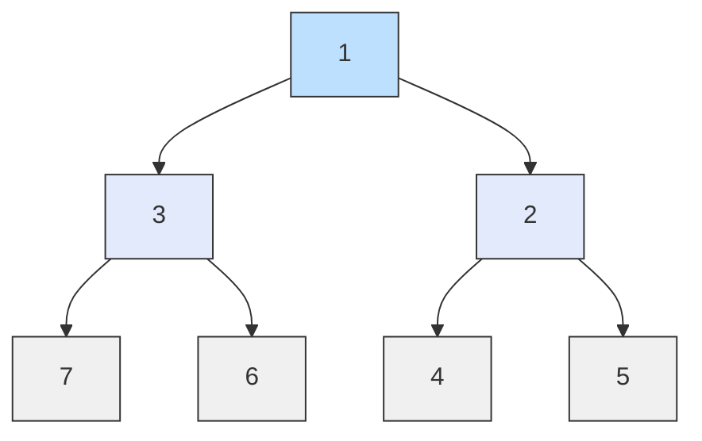
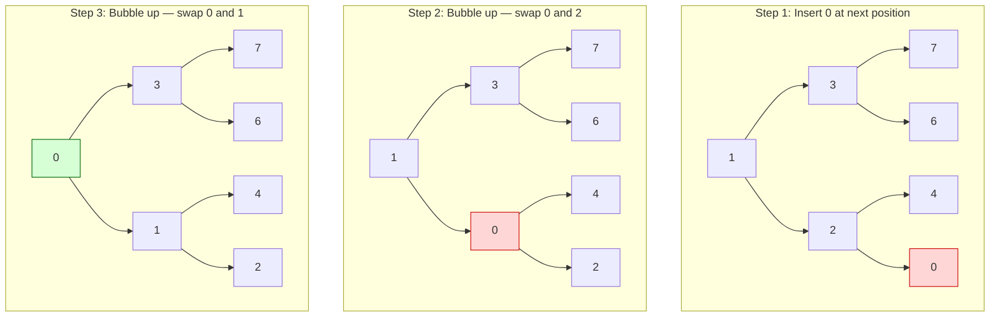
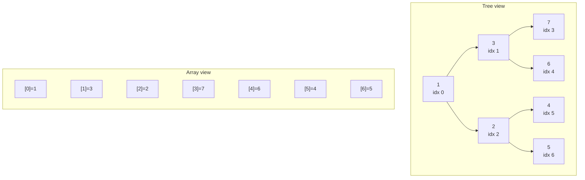
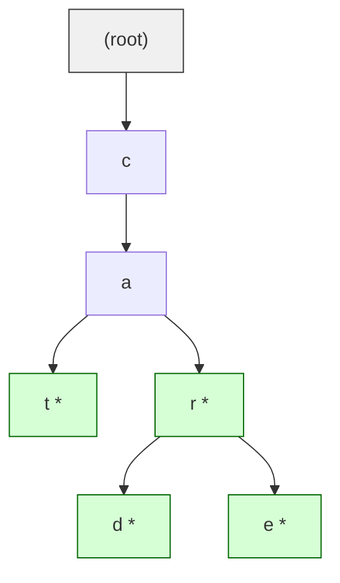

## Binary heap: a complete binary tree with ordered parents

A binary heap is a complete binary tree -- every level is fully filled except possibly the last, which is filled from left to right -- combined with a heap property that constrains every parent-child relationship. The shape property guarantees the tree stays balanced without rotations or rebalancing logic, and the heap property ensures the root always holds the extreme value (minimum or maximum).

This combination makes heaps ideal for priority queues. Insertion and extraction both run in O(log N) because the tree height is always floor(log2 N), and you never need to touch more than one path from root to leaf. Unlike a BST, a heap does not maintain a total ordering of elements -- siblings have no defined relationship -- but it guarantees constant-time access to the extremum.



This min-heap satisfies two invariants: every level is filled left-to-right (shape property), and every parent is less than or equal to both its children (heap property). The root always holds the global minimum.

## Min-heap vs. max-heap: which extremum sits at the root

A min-heap enforces parent <= children, so the smallest element is always at the root. A max-heap enforces parent >= children, so the largest element is at the root. The choice depends on what you need fast access to: the minimum or the maximum.

Python's `heapq` module implements a min-heap. If you need a max-heap, the standard trick is to negate values on insert and negate again on extraction. This is not a hack -- it is the idiomatic Python approach because the standard library chose not to duplicate the entire API for max-heaps.

```python
import heapq

# Min-heap: smallest value comes out first
min_heap = [5, 3, 8, 1, 2]
heapq.heapify(min_heap)
print(heapq.heappop(min_heap))  # 1

# Max-heap via negation: largest value comes out first
max_heap = [-v for v in [5, 3, 8, 1, 2]]
heapq.heapify(max_heap)
print(-heapq.heappop(max_heap))  # 8
```

## Heap insert (bubble up / sift up)

Inserting into a heap has two steps. First, place the new element at the next available position at the bottom level (maintaining the shape property). Second, compare it with its parent and swap upward repeatedly until the heap property is restored or it reaches the root. This upward movement is called bubble up or sift up.

The cost is O(log N) because the element can travel at most from the bottom of the tree to the root, and the tree height is log2 N. In practice, most insertions require far fewer swaps because the new element is unlikely to be the new global extremum.



```python
def heap_insert(heap: list[int], value: int) -> None:
    """Insert value and restore the min-heap property via sift up."""
    heap.append(value)
    i = len(heap) - 1
    while i > 0:
        parent = (i - 1) // 2
        if heap[i] < heap[parent]:
            heap[i], heap[parent] = heap[parent], heap[i]
            i = parent
        else:
            break

h = [1, 3, 2, 7, 6, 4]
heap_insert(h, 0)
print(h)  # [0, 3, 1, 7, 6, 4, 2]
```

## Extract min/max (bubble down / sift down)

Extraction removes the root (the min or max element), replaces it with the last element in the array, and then sifts that element downward by swapping it with the smaller (in a min-heap) of its two children until the heap property is restored.

This is O(log N) for the same reason insertion is: the displaced element travels at most one root-to-leaf path. The key detail is choosing the correct child to swap with. In a min-heap, always swap with the smaller child; otherwise the heap property would be violated for the other child.

```python
def extract_min(heap: list[int]) -> int:
    """Remove and return the minimum element, then restore heap property."""
    if len(heap) == 1:
        return heap.pop()

    root = heap[0]
    heap[0] = heap.pop()  # move last element to root
    i = 0
    n = len(heap)

    while True:
        left = 2 * i + 1
        right = 2 * i + 2
        smallest = i

        if left < n and heap[left] < heap[smallest]:
            smallest = left
        if right < n and heap[right] < heap[smallest]:
            smallest = right
        if smallest == i:
            break

        heap[i], heap[smallest] = heap[smallest], heap[i]
        i = smallest

    return root

h = [1, 3, 2, 7, 6, 4, 5]
print(extract_min(h))  # 1
print(h)               # [2, 3, 4, 7, 6, 5]
```

## Array representation of a heap: no pointers needed

A binary heap is almost always stored as a flat array rather than a tree of linked nodes. The complete-tree shape property guarantees that the mapping from tree positions to array indices is dense with no gaps.

For a node at index `i`: its left child is at `2i + 1`, its right child is at `2i + 2`, and its parent is at `(i - 1) // 2`. This eliminates pointer overhead entirely and gives excellent cache locality because parent-child traversals are simple arithmetic on adjacent memory.



```python
def parent(i: int) -> int:
    return (i - 1) // 2

def left_child(i: int) -> int:
    return 2 * i + 1

def right_child(i: int) -> int:
    return 2 * i + 2

# Example: node at index 1 (value 3)
heap = [1, 3, 2, 7, 6, 4, 5]
i = 1
print(f"Node: {heap[i]}")                        # 3
print(f"Parent: {heap[parent(i)]}")               # 1
print(f"Left child: {heap[left_child(i)]}")       # 7
print(f"Right child: {heap[right_child(i)]}")     # 6
```

## Heapify and building a heap in O(N)

The naive approach to building a heap -- inserting N elements one at a time -- costs O(N log N). But bottom-up heapify achieves O(N) by starting from the last non-leaf node and sifting each node downward. This works because the leaf nodes (roughly half the array) are already trivially valid heaps, and each sift-down operation at height h costs O(h).

The O(N) bound comes from summing the sift-down costs across all levels. Most nodes are near the bottom where h is small, and only one node (the root) has h = log N. The geometric sum works out to O(N). This is one of the few algorithms that is genuinely faster than it looks at first glance.

```python
import heapq

# Bottom-up heapify: O(N)
data = [9, 5, 6, 2, 3, 8, 1, 7, 4]
heapq.heapify(data)
print(data)  # [1, 2, 6, 4, 3, 8, 9, 7, 5]

# Manual bottom-up heapify to see the mechanics
def build_min_heap(arr: list[int]) -> None:
    """Convert arr into a min-heap in place. O(N)."""
    n = len(arr)
    # Start from last non-leaf node, sift each down
    for i in range(n // 2 - 1, -1, -1):
        _sift_down(arr, i, n)

def _sift_down(arr: list[int], i: int, n: int) -> None:
    while True:
        left = 2 * i + 1
        right = 2 * i + 2
        smallest = i
        if left < n and arr[left] < arr[smallest]:
            smallest = left
        if right < n and arr[right] < arr[smallest]:
            smallest = right
        if smallest == i:
            break
        arr[i], arr[smallest] = arr[smallest], arr[i]
        i = smallest

data2 = [9, 5, 6, 2, 3, 8, 1, 7, 4]
build_min_heap(data2)
print(data2)  # [1, 2, 6, 4, 3, 8, 9, 7, 5]
```

## Python's `heapq` module: the standard library priority queue

Python's `heapq` module provides a min-heap implementation that operates directly on a regular list. There is no separate Heap class -- the list itself is the heap, and the module functions maintain the invariant. This design is lightweight but requires discipline: if you modify the list directly without going through `heapq`, the heap property may break.

The core operations are `heappush`, `heappop`, `heapify`, `heappushpop` (push then pop, more efficient than doing both separately), and `heapreplace` (pop then push). The convenience functions `nsmallest` and `nlargest` are useful when you need the top K elements from a collection without sorting the whole thing.

```python
import heapq

# Basic priority queue usage
tasks = []
heapq.heappush(tasks, (3, "low priority"))
heapq.heappush(tasks, (1, "urgent"))
heapq.heappush(tasks, (2, "normal"))

while tasks:
    priority, name = heapq.heappop(tasks)
    print(f"  [{priority}] {name}")
# [1] urgent
# [2] normal
# [3] low priority

# nsmallest / nlargest -- efficient for small K relative to N
scores = [82, 95, 67, 91, 74, 88, 56, 99]
print(heapq.nlargest(3, scores))   # [99, 95, 91]
print(heapq.nsmallest(3, scores))  # [56, 67, 74]

# Merging sorted iterables
a = [1, 4, 7]
b = [2, 5, 8]
c = [3, 6, 9]
print(list(heapq.merge(a, b, c)))  # [1, 2, 3, 4, 5, 6, 7, 8, 9]
```

## Trie (prefix tree): character-by-character string storage

A trie is an N-ary tree where each edge represents a character and each path from the root to a marked terminal node spells out a stored word. Unlike a hash table, a trie shares prefixes: the words "cat", "car", "card", and "care" all share the path c-a, which means the trie stores common prefixes exactly once.

This shared-prefix property makes tries the natural choice for autocomplete, spell checking, IP routing tables, and any problem where you need to find all strings with a given prefix. The trade-off is memory: each node may have up to 26 (or more) child pointers, and sparse tries can waste significant space compared to a flat hash table.



Nodes marked with `*` are terminal nodes indicating a complete word. The path from root to each green node spells: "cat", "car", "card", "care". Notice how "car" is both a complete word and a prefix for "card" and "care".

```python
class TrieNode:
    __slots__ = ("children", "is_end")

    def __init__(self):
        self.children: dict[str, "TrieNode"] = {}
        self.is_end: bool = False

class Trie:
    def __init__(self):
        self.root = TrieNode()

    def insert(self, word: str) -> None:
        node = self.root
        for ch in word:
            if ch not in node.children:
                node.children[ch] = TrieNode()
            node = node.children[ch]
        node.is_end = True

trie = Trie()
for w in ["cat", "car", "card", "care"]:
    trie.insert(w)
```

## Trie insert and search: O(K) regardless of dictionary size

Both insert and search in a trie take O(K) time where K is the length of the word, because you traverse exactly K edges. This is independent of how many words are stored in the trie -- whether the dictionary holds 100 words or 100,000, looking up "card" always follows exactly 4 edges.

Search comes in two flavors: exact match (is "car" a stored word?) and prefix match (does any stored word start with "ca"?). The only difference is whether you check `is_end` at the final node. Prefix matching is what gives tries their real advantage over hash tables.

```python
class TrieNode:
    __slots__ = ("children", "is_end")

    def __init__(self):
        self.children: dict[str, "TrieNode"] = {}
        self.is_end: bool = False

class Trie:
    def __init__(self):
        self.root = TrieNode()

    def insert(self, word: str) -> None:
        node = self.root
        for ch in word:
            if ch not in node.children:
                node.children[ch] = TrieNode()
            node = node.children[ch]
        node.is_end = True

    def search(self, word: str) -> bool:
        """Return True if the exact word exists in the trie."""
        node = self._find_node(word)
        return node is not None and node.is_end

    def starts_with(self, prefix: str) -> bool:
        """Return True if any word in the trie starts with this prefix."""
        return self._find_node(prefix) is not None

    def words_with_prefix(self, prefix: str) -> list[str]:
        """Return all words that start with the given prefix."""
        node = self._find_node(prefix)
        if node is None:
            return []
        results: list[str] = []
        self._collect(node, list(prefix), results)
        return results

    def _find_node(self, prefix: str) -> TrieNode | None:
        node = self.root
        for ch in prefix:
            if ch not in node.children:
                return None
            node = node.children[ch]
        return node

    def _collect(self, node: TrieNode, path: list[str], results: list[str]) -> None:
        if node.is_end:
            results.append("".join(path))
        for ch, child in sorted(node.children.items()):
            path.append(ch)
            self._collect(child, path, results)
            path.pop()

# Usage
trie = Trie()
for word in ["cat", "car", "card", "care", "cart", "do", "dog", "done"]:
    trie.insert(word)

print(trie.search("car"))          # True
print(trie.search("ca"))           # False -- "ca" is a prefix, not a word
print(trie.starts_with("ca"))      # True
print(trie.words_with_prefix("car"))  # ['car', 'card', 'care', 'cart']
print(trie.words_with_prefix("do"))   # ['do', 'dog', 'done']
```

## Trie vs. hash table for string lookups

Hash tables provide O(1) average-case exact-match lookup and are the right default for "is this word in the set?" queries. Tries provide O(K) lookup where K is the word length, which is technically slower for exact match because hash functions also process the full key but with lower constant overhead.

Where tries win decisively is prefix-based operations. Finding all words that start with "auto" in a hash table requires scanning every key. In a trie, you walk 4 edges to the "auto" node and then collect its subtree. This makes tries the foundation of autocomplete systems, T9 predictive text, DNS resolution, and IP routing (CIDR prefix matching). Tries also avoid hash collisions entirely and provide sorted iteration for free.

| Operation | Hash Table | Trie |
|-----------|-----------|------|
| Exact lookup | O(1) avg | O(K) |
| Prefix search | O(N) scan | O(K + matches) |
| Sorted iteration | O(N log N) | O(N) in-order |
| Space overhead | Low (flat) | High (per-node pointers) |
| Collision risk | Yes | None |

```python
# Hash set: fast exact match, useless for prefix queries
word_set = {"cat", "car", "card", "care", "cart"}
print("car" in word_set)  # True -- O(1)

# Finding all words with prefix "car" requires a full scan
prefix = "car"
matches = [w for w in word_set if w.startswith(prefix)]  # O(N)
print(matches)  # ['car', 'card', 'care', 'cart']

# Trie: same prefix query is O(K + matches), not O(N)
# With 1 million words in the set, the hash scan touches all 1M.
# The trie walks 3 edges to "car" and only visits matching subtree.
```
