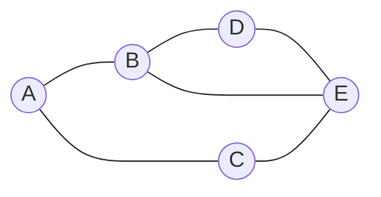
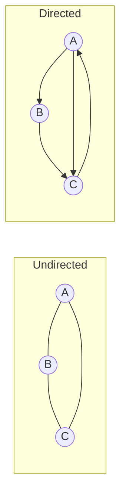
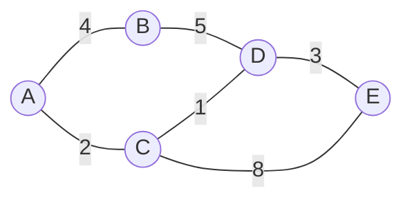
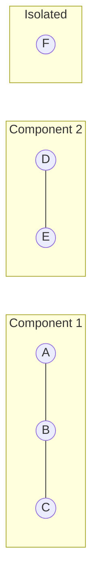
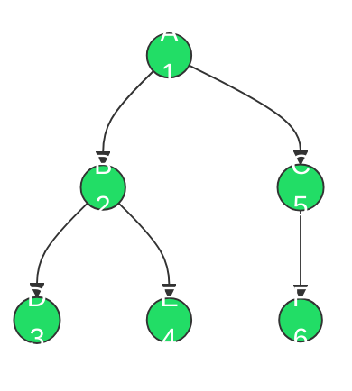
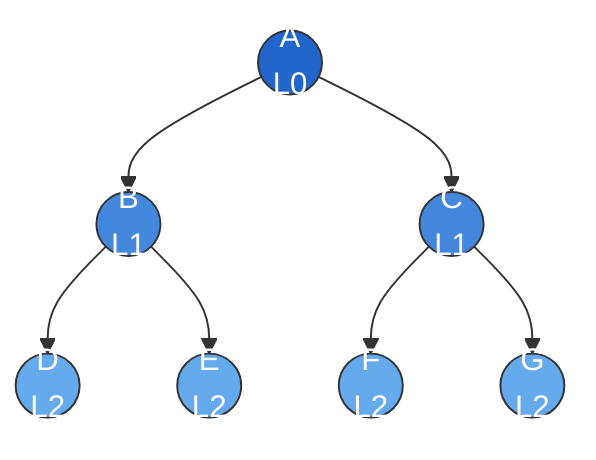
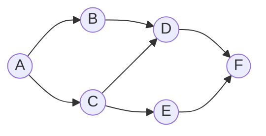

## Graph fundamentals: vertices connected by edges

A graph is a collection of nodes (vertices) connected by edges. Unlike trees, graphs impose no hierarchy: there is no root, edges can form cycles, and the structure can split into disconnected components. Graphs model relationships that trees cannot, such as social networks, road maps, dependency chains, and circuit layouts.

Every graph has two core properties: the set of vertices V and the set of edges E. An edge connects two vertices. The number of edges a vertex participates in is its degree. Graphs are the most general-purpose data structure for representing connections, and trees, linked lists, and even arrays can be viewed as special cases of graphs.



## Directed vs. undirected graphs: one-way or bidirectional edges

In an undirected graph, an edge between A and B means you can traverse in both directions. In a directed graph (digraph), each edge has a direction: an edge from A to B does not imply an edge from B to A. Directed graphs model one-way relationships like "follows" on social media, prerequisite chains, or web page links.

The distinction affects every algorithm you run on the graph. In a directed graph, in-degree and out-degree are tracked separately, reachability is asymmetric, and cycle detection requires different logic.



## Weighted vs. unweighted graphs: edges with cost

In a weighted graph, each edge carries a numeric value representing cost, distance, capacity, or time. In an unweighted graph, all edges are equivalent. The presence of weights changes which algorithms apply: BFS finds shortest paths in unweighted graphs, but you need Dijkstra's or Bellman-Ford when edges have different costs.



Weights are stored alongside edge endpoints. In an adjacency list, each neighbor entry becomes a tuple of (neighbor, weight). In an adjacency matrix, cell values hold the weight instead of a boolean.

## Connected, disconnected, and strongly connected graphs

An undirected graph is connected if there is a path between every pair of vertices. If some vertices are unreachable from others, the graph is disconnected, and each maximal connected subset is a connected component. You can find all components with a single pass of BFS or DFS.

For directed graphs, the analogous concept is strong connectivity: a directed graph is strongly connected if every vertex is reachable from every other vertex following edge directions. A strongly connected component (SCC) is a maximal subgraph with this property. Tarjan's algorithm and Kosaraju's algorithm both find SCCs in O(V + E).



## Cyclic vs. acyclic graphs: DAGs and trees

A cycle is a path that starts and ends at the same vertex. A directed acyclic graph (DAG) has directed edges but no cycles, making it the right structure for dependency resolution, build systems, and task scheduling. Trees are a special case: connected acyclic undirected graphs.

Cycle detection in undirected graphs uses DFS with parent tracking: if you reach a visited node that is not the current node's parent, there is a cycle. In directed graphs, you track nodes currently on the recursion stack: a back edge to a node on the stack means a cycle.

```python
def has_cycle_directed(graph: dict[str, list[str]]) -> bool:
    """Detect cycles in a directed graph using DFS coloring."""
    WHITE, GRAY, BLACK = 0, 1, 2
    color = {v: WHITE for v in graph}

    def dfs(v: str) -> bool:
        color[v] = GRAY  # currently being explored
        for neighbor in graph[v]:
            if color[neighbor] == GRAY:
                return True  # back edge -> cycle
            if color[neighbor] == WHITE and dfs(neighbor):
                return True
        color[v] = BLACK  # fully explored
        return False

    return any(color[v] == WHITE and dfs(v) for v in graph)


# DAG: no cycle
dag = {"A": ["B", "C"], "B": ["D"], "C": ["D"], "D": []}
print(has_cycle_directed(dag))  # False

# Cyclic graph
cyclic = {"A": ["B"], "B": ["C"], "C": ["A"]}
print(has_cycle_directed(cyclic))  # True
```

## Adjacency list representation: space-efficient for sparse graphs

An adjacency list maps each vertex to a list of its neighbors. This is the most common graph representation because most real-world graphs are sparse (E is much less than V^2). Space is O(V + E), and iterating over a vertex's neighbors is proportional to its degree.

The tradeoff is that checking whether a specific edge exists requires scanning the neighbor list, which is O(degree) unless you use sets instead of lists.

```python
from collections import defaultdict


class Graph:
    """Directed graph using an adjacency list."""

    def __init__(self):
        self.adj: dict[str, list[str]] = defaultdict(list)

    def add_edge(self, src: str, dst: str) -> None:
        self.adj[src].append(dst)

    def neighbors(self, vertex: str) -> list[str]:
        return self.adj[vertex]

    def vertices(self) -> set[str]:
        verts = set(self.adj.keys())
        for neighbors in self.adj.values():
            verts.update(neighbors)
        return verts

    def __repr__(self) -> str:
        return "\n".join(f"{v} -> {ns}" for v, ns in self.adj.items())


g = Graph()
g.add_edge("A", "B")
g.add_edge("A", "C")
g.add_edge("B", "D")
g.add_edge("C", "D")
g.add_edge("D", "E")
print(g)
# A -> ['B', 'C']
# B -> ['D']
# C -> ['D']
# D -> ['E']
```

For a weighted graph, store tuples:

```python
class WeightedGraph:
    """Directed weighted graph using an adjacency list."""

    def __init__(self):
        self.adj: dict[str, list[tuple[str, int]]] = defaultdict(list)

    def add_edge(self, src: str, dst: str, weight: int) -> None:
        self.adj[src].append((dst, weight))
```

## Adjacency matrix representation: fast edge lookups for dense graphs

An adjacency matrix is a V x V grid where cell `[i][j]` is 1 (or the edge weight) if an edge exists from vertex i to vertex j, and 0 otherwise. Checking whether an edge exists is O(1), but the space cost is always O(V^2) regardless of how many edges exist.

Use an adjacency matrix when the graph is dense (E is close to V^2), when you need constant-time edge queries, or when running matrix-based algorithms like Floyd-Warshall for all-pairs shortest paths.

```python
class AdjMatrix:
    """Directed graph using an adjacency matrix."""

    def __init__(self, vertices: list[str]):
        self.vertices = vertices
        self.idx = {v: i for i, v in enumerate(vertices)}
        n = len(vertices)
        self.matrix = [[0] * n for _ in range(n)]

    def add_edge(self, src: str, dst: str, weight: int = 1) -> None:
        self.matrix[self.idx[src]][self.idx[dst]] = weight

    def has_edge(self, src: str, dst: str) -> bool:
        return self.matrix[self.idx[src]][self.idx[dst]] != 0

    def print_matrix(self) -> None:
        print("   ", "  ".join(self.vertices))
        for i, row in enumerate(self.matrix):
            print(f"{self.vertices[i]}  {'  '.join(str(x) for x in row)}")


g = AdjMatrix(["A", "B", "C", "D"])
g.add_edge("A", "B")
g.add_edge("A", "C")
g.add_edge("B", "D")
g.add_edge("C", "D")
g.print_matrix()
#     A  B  C  D
# A   0  1  1  0
# B   0  0  0  1
# C   0  0  0  1
# D   0  0  0  0
```

| | Adjacency List | Adjacency Matrix |
|---|---|---|
| Space | O(V + E) | O(V^2) |
| Edge check | O(degree) | O(1) |
| All neighbors | O(degree) | O(V) |
| Best for | Sparse graphs | Dense graphs |

## Depth-first search (DFS): explore deep before backtracking

DFS picks a neighbor and follows it as far as possible before backtracking to explore other branches. It uses either the call stack (recursion) or an explicit stack. DFS is the backbone of cycle detection, topological sort, connected component identification, and path finding.

A visited set is essential to avoid infinite loops in graphs with cycles. Without it, DFS on a cyclic graph will never terminate.



The numbers show DFS visit order: A(1) goes deep through B(2), D(3), E(4) before backtracking to C(5), F(6).

```python
def dfs_recursive(graph: dict[str, list[str]], start: str) -> list[str]:
    """DFS using recursion. Returns nodes in visit order."""
    visited: set[str] = set()
    order: list[str] = []

    def explore(vertex: str) -> None:
        visited.add(vertex)
        order.append(vertex)
        for neighbor in graph[vertex]:
            if neighbor not in visited:
                explore(neighbor)

    explore(start)
    return order


def dfs_iterative(graph: dict[str, list[str]], start: str) -> list[str]:
    """DFS using an explicit stack."""
    visited: set[str] = set()
    order: list[str] = []
    stack = [start]

    while stack:
        vertex = stack.pop()
        if vertex in visited:
            continue
        visited.add(vertex)
        order.append(vertex)
        # Push neighbors in reverse to maintain left-to-right order
        for neighbor in reversed(graph[vertex]):
            if neighbor not in visited:
                stack.append(neighbor)

    return order


graph = {
    "A": ["B", "C"],
    "B": ["D", "E"],
    "C": ["F"],
    "D": [],
    "E": [],
    "F": [],
}
print(dfs_recursive(graph, "A"))  # ['A', 'B', 'D', 'E', 'C', 'F']
print(dfs_iterative(graph, "A"))  # ['A', 'B', 'D', 'E', 'C', 'F']
```

Time complexity: O(V + E). Space complexity: O(V) for the visited set and stack/recursion depth.

## Breadth-first search (BFS): explore level by level

BFS explores all neighbors at the current depth before moving to the next level. It uses a queue (FIFO) and guarantees that the first time it reaches a node is via the shortest path in an unweighted graph. This makes BFS the standard algorithm for shortest-path problems when all edges have equal weight.



BFS visits all of Level 0 (A), then all of Level 1 (B, C), then all of Level 2 (D, E, F, G).

```python
from collections import deque


def bfs(graph: dict[str, list[str]], start: str) -> list[str]:
    """BFS traversal. Returns nodes in visit order."""
    visited: set[str] = {start}
    order: list[str] = []
    queue: deque[str] = deque([start])

    while queue:
        vertex = queue.popleft()
        order.append(vertex)
        for neighbor in graph[vertex]:
            if neighbor not in visited:
                visited.add(neighbor)
                queue.append(neighbor)

    return order


def bfs_shortest_path(
    graph: dict[str, list[str]], start: str, end: str
) -> list[str] | None:
    """Find shortest path in an unweighted graph using BFS."""
    if start == end:
        return [start]

    visited: set[str] = {start}
    queue: deque[tuple[str, list[str]]] = deque([(start, [start])])

    while queue:
        vertex, path = queue.popleft()
        for neighbor in graph[vertex]:
            if neighbor not in visited:
                new_path = path + [neighbor]
                if neighbor == end:
                    return new_path
                visited.add(neighbor)
                queue.append((neighbor, new_path))

    return None  # no path exists


graph = {
    "A": ["B", "C"],
    "B": ["D", "E"],
    "C": ["F", "G"],
    "D": [],
    "E": [],
    "F": [],
    "G": [],
}
print(bfs(graph, "A"))  # ['A', 'B', 'C', 'D', 'E', 'F', 'G']
print(bfs_shortest_path(graph, "A", "F"))  # ['A', 'C', 'F']
```

Time complexity: O(V + E). Space complexity: O(V) for the visited set and queue.

## Bidirectional search: meeting in the middle

Bidirectional search runs two simultaneous BFS traversals, one from the source and one from the destination, and stops when their frontiers intersect. In a graph where each node has k neighbors and the shortest path has length d, standard BFS explores O(k^d) nodes. Bidirectional search explores O(k^(d/2)) from each side, for a total of O(2 * k^(d/2)), which is dramatically faster for large d.

The catch is that bidirectional search requires knowing the destination in advance and being able to traverse edges in reverse (trivial for undirected graphs, but directed graphs need a reverse adjacency list).

```python
from collections import deque


def bidirectional_bfs(
    graph: dict[str, list[str]], start: str, end: str
) -> list[str] | None:
    """Bidirectional BFS for undirected graphs."""
    if start == end:
        return [start]

    # Forward BFS from start
    front_visited: dict[str, str | None] = {start: None}
    front_queue: deque[str] = deque([start])

    # Backward BFS from end
    back_visited: dict[str, str | None] = {end: None}
    back_queue: deque[str] = deque([end])

    while front_queue and back_queue:
        # Expand forward frontier
        vertex = front_queue.popleft()
        for neighbor in graph[vertex]:
            if neighbor not in front_visited:
                front_visited[neighbor] = vertex
                front_queue.append(neighbor)
                if neighbor in back_visited:
                    return _build_path(front_visited, back_visited, neighbor)

        # Expand backward frontier
        vertex = back_queue.popleft()
        for neighbor in graph[vertex]:
            if neighbor not in back_visited:
                back_visited[neighbor] = vertex
                back_queue.append(neighbor)
                if neighbor in front_visited:
                    return _build_path(front_visited, back_visited, neighbor)

    return None


def _build_path(
    front: dict[str, str | None],
    back: dict[str, str | None],
    meeting: str,
) -> list[str]:
    """Reconstruct path from two parent maps meeting at a node."""
    path = []
    node: str | None = meeting
    while node is not None:
        path.append(node)
        node = front[node]
    path.reverse()
    node = back[meeting]
    while node is not None:
        path.append(node)
        node = back[node]
    return path
```

## Topological sort: ordering a DAG by dependencies

A topological sort produces a linear ordering of vertices in a DAG such that for every directed edge (u, v), u appears before v. This is exactly what build systems, package managers, and course prerequisite planners need: process dependencies before the things that depend on them.

Topological sort only works on DAGs. If the graph has a cycle, no valid ordering exists. Kahn's algorithm (BFS-based) detects this naturally: if it processes fewer than V vertices, a cycle is present.



One valid topological order: A, B, C, D, E, F (or A, C, B, E, D, F, among others).

```python
from collections import deque


def topological_sort_kahn(graph: dict[str, list[str]]) -> list[str] | None:
    """Kahn's algorithm (BFS-based topological sort).

    Returns None if the graph has a cycle.
    """
    # Calculate in-degrees
    in_degree: dict[str, int] = {v: 0 for v in graph}
    for v in graph:
        for neighbor in graph[v]:
            in_degree[neighbor] = in_degree.get(neighbor, 0) + 1

    # Start with all zero-in-degree vertices
    queue: deque[str] = deque(v for v in graph if in_degree[v] == 0)
    order: list[str] = []

    while queue:
        vertex = queue.popleft()
        order.append(vertex)
        for neighbor in graph[vertex]:
            in_degree[neighbor] -= 1
            if in_degree[neighbor] == 0:
                queue.append(neighbor)

    if len(order) != len(graph):
        return None  # cycle detected
    return order


def topological_sort_dfs(graph: dict[str, list[str]]) -> list[str]:
    """DFS-based topological sort using post-order reversal."""
    visited: set[str] = set()
    stack: list[str] = []

    def dfs(vertex: str) -> None:
        visited.add(vertex)
        for neighbor in graph[vertex]:
            if neighbor not in visited:
                dfs(neighbor)
        stack.append(vertex)  # post-order: add after all descendants

    for vertex in graph:
        if vertex not in visited:
            dfs(vertex)

    return stack[::-1]  # reverse post-order


dag = {
    "A": ["B", "C"],
    "B": ["D"],
    "C": ["D", "E"],
    "D": ["F"],
    "E": ["F"],
    "F": [],
}
print(topological_sort_kahn(dag))  # ['A', 'B', 'C', 'D', 'E', 'F'] (one valid order)
print(topological_sort_dfs(dag))   # ['A', 'C', 'E', 'B', 'D', 'F'] (another valid order)
```

Time complexity: O(V + E). Both approaches visit every vertex and edge exactly once.

## Dijkstra's algorithm: shortest paths in weighted graphs

Dijkstra's algorithm finds the shortest path from a source vertex to all other vertices in a graph with non-negative edge weights. It works by greedily selecting the unvisited vertex with the smallest known distance, then relaxing its neighbors. A min-heap (priority queue) makes the selection step efficient.

Dijkstra's fails with negative edge weights because it assumes that once a vertex is finalized, no shorter path to it can exist. For graphs with negative weights, use Bellman-Ford instead.

```python
import heapq


def dijkstra(
    graph: dict[str, list[tuple[str, int]]], start: str
) -> tuple[dict[str, int], dict[str, str | None]]:
    """Dijkstra's shortest paths from start.

    Args:
        graph: adjacency list with (neighbor, weight) tuples.
        start: source vertex.

    Returns:
        (distances, predecessors) for path reconstruction.
    """
    dist: dict[str, int] = {start: 0}
    prev: dict[str, str | None] = {start: None}
    heap: list[tuple[int, str]] = [(0, start)]

    while heap:
        d, u = heapq.heappop(heap)
        if d > dist.get(u, float("inf")):
            continue  # stale entry

        for neighbor, weight in graph.get(u, []):
            new_dist = d + weight
            if new_dist < dist.get(neighbor, float("inf")):
                dist[neighbor] = new_dist
                prev[neighbor] = u
                heapq.heappush(heap, (new_dist, neighbor))

    return dist, prev


def reconstruct_path(prev: dict[str, str | None], target: str) -> list[str]:
    """Trace back from target to source using predecessor map."""
    path: list[str] = []
    node: str | None = target
    while node is not None:
        path.append(node)
        node = prev[node]
    return path[::-1]


# Weighted graph
graph = {
    "A": [("B", 4), ("C", 2)],
    "B": [("D", 3), ("E", 1)],
    "C": [("B", 1), ("D", 5)],
    "D": [("E", 2)],
    "E": [],
}
distances, predecessors = dijkstra(graph, "A")
print(distances)     # {'A': 0, 'C': 2, 'B': 3, 'D': 6, 'E': 4}
print(reconstruct_path(predecessors, "E"))  # ['A', 'C', 'B', 'E']
```

Time complexity: O((V + E) log V) with a binary heap. Each vertex is extracted from the heap once, and each edge may trigger one heap insertion.
