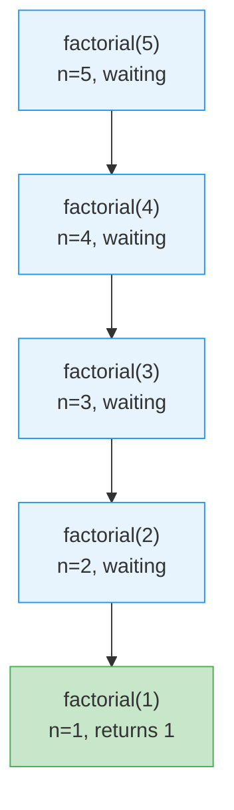
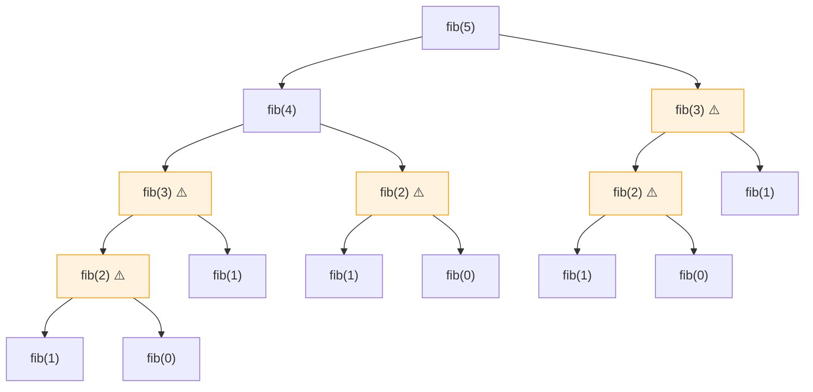
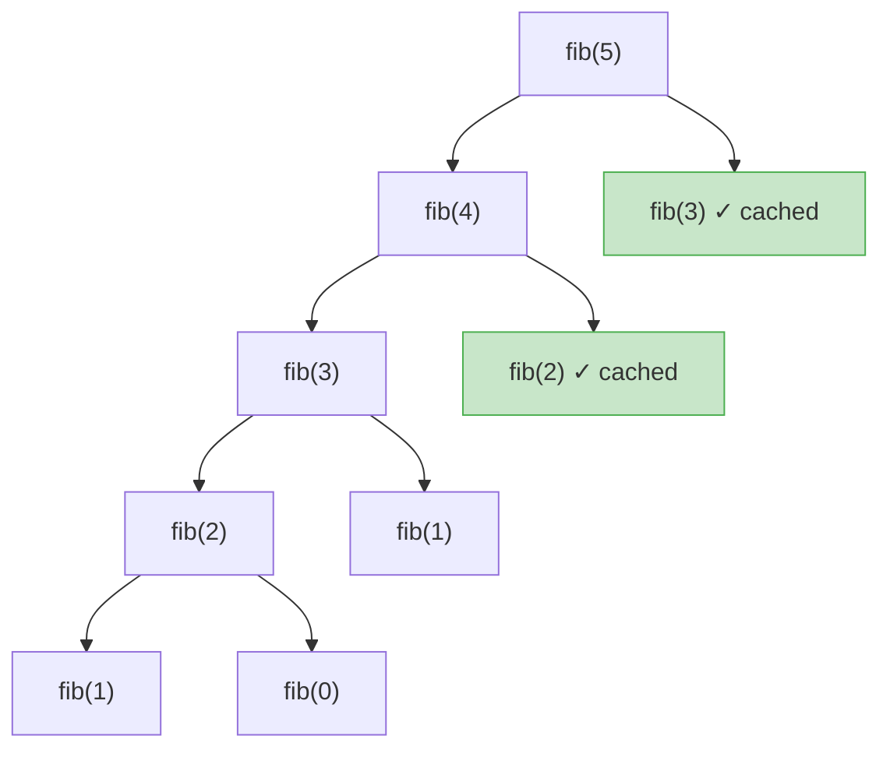
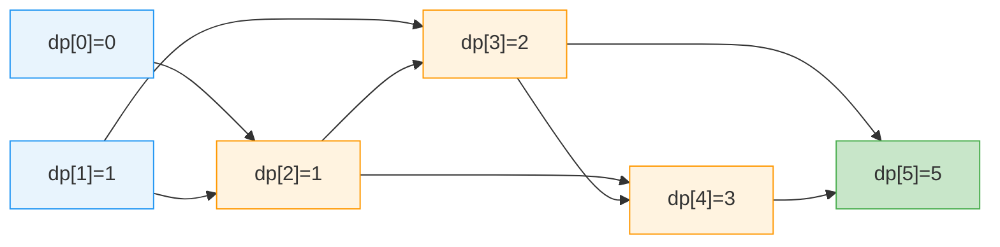
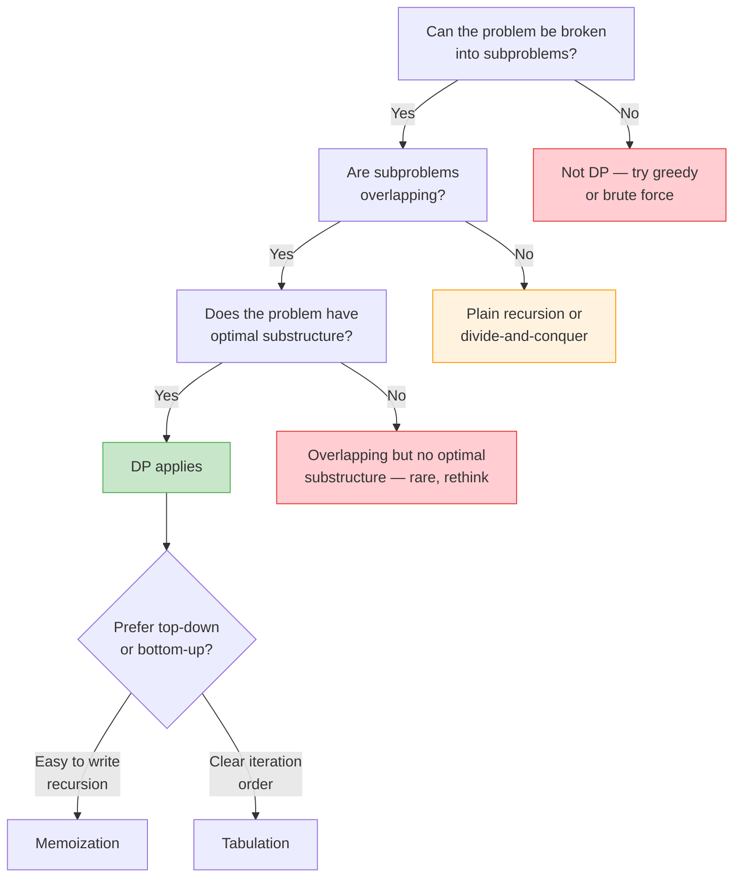

## Recursive decomposition

Recursion solves a problem by breaking it into smaller instances of the same problem. Each call handles one piece and delegates the rest until it reaches a base case that returns directly. This is the "divide and conquer yourself" strategy — the function is both the manager and the worker.

The factorial function is the textbook example because the recursive structure maps directly to the mathematical definition: `n! = n * (n-1)!`.

```python
def factorial(n: int) -> int:
    if n <= 1:          # base case
        return 1
    return n * factorial(n - 1)   # recursive step

print(factorial(5))  # 120
```

Every recursive function has two parts: (1) the base case that stops recursion, and (2) the recursive step that shrinks the problem and calls itself. If you can express a problem as "solve a smaller version of me, then combine," recursion is a natural fit.

## Base case

The base case is the termination condition — the input small enough that the function can return a result without recursing further. Without it, recursion never stops.

If you forget the base case or write one that the input can never reach, every call adds a frame to the stack until the interpreter hits its limit and raises `RecursionError` (Python) or a stack overflow (C/C++). This is the single most common recursion bug.

```python
# Missing base case — this crashes
def bad_countdown(n: int) -> None:
    print(n)
    bad_countdown(n - 1)  # never stops

# Fixed version
def countdown(n: int) -> None:
    if n < 0:
        return
    print(n)
    countdown(n - 1)
```

A good rule of thumb: write the base case first, verify it is reachable for all valid inputs, then write the recursive step.

## Call stack and stack space

Each recursive call pushes a new frame onto the call stack. That frame holds the function's local variables, the return address, and the arguments. The frames accumulate until the base case is reached, then they unwind as each call returns.

This means recursion has O(N) space cost for a linear chain of N calls, even if the algorithm itself has no auxiliary data structure. Deep recursion (N in the tens of thousands) can blow the stack. Python's default recursion limit is 1000.



Each box is one stack frame. All five exist simultaneously at the deepest point. The green frame is the base case where unwinding begins — from that point each frame computes its result and pops off the stack.

## Top-down approach

Top-down recursion starts with the full problem and breaks it into subproblems, trusting that the recursive calls will handle the rest. You think from the answer backward: "if I knew the solution to the smaller pieces, how would I combine them?"

This is the most natural way to think recursively. The Fibonacci sequence is a classic example: `fib(n) = fib(n-1) + fib(n-2)`. You ask for the answer to the big problem and let the recursion figure out the small ones.

```python
def fib_naive(n: int) -> int:
    if n <= 1:
        return n
    return fib_naive(n - 1) + fib_naive(n - 2)
```

The downside of naive top-down recursion is redundant work. Without caching, the same subproblem gets solved many times. That is exactly what memoization fixes.

## Bottom-up approach

Bottom-up means solving the smallest subproblems first and using their results to build up to the full answer. Instead of recursing down and hoping, you iterate forward from known values.

This approach avoids recursion overhead entirely and usually makes the space usage obvious. For Fibonacci, you start from `fib(0)` and `fib(1)` and compute forward.

```python
def fib_bottom_up(n: int) -> int:
    if n <= 1:
        return n
    table = [0] * (n + 1)
    table[1] = 1
    for i in range(2, n + 1):
        table[i] = table[i - 1] + table[i - 2]
    return table[n]
```

Bottom-up is generally preferred in production code because it has no stack overflow risk, the loop overhead is smaller than function call overhead, and the memory access pattern is cache-friendly.

## Half-and-half approach

Some problems split naturally in half rather than peeling off one element at a time. Binary search halves the search space each step. Merge sort splits the array, sorts each half, and merges. This "divide by two" pattern yields O(log N) depth instead of O(N).

The key insight: if the problem halves at each step, the recursion tree is only log(N) levels deep, so even very large inputs stay within stack limits.

```python
def merge_sort(arr: list[int]) -> list[int]:
    if len(arr) <= 1:
        return arr
    mid = len(arr) // 2
    left = merge_sort(arr[:mid])
    right = merge_sort(arr[mid:])
    return merge(left, right)

def merge(left: list[int], right: list[int]) -> list[int]:
    result = []
    i = j = 0
    while i < len(left) and j < len(right):
        if left[i] <= right[j]:
            result.append(left[i]); i += 1
        else:
            result.append(right[j]); j += 1
    result.extend(left[i:])
    result.extend(right[j:])
    return result
```

## Overlapping subproblems

Overlapping subproblems are the signal that a problem is a candidate for dynamic programming. If the naive recursive solution computes the same subproblem more than once, work is being wasted.

Fibonacci is the clearest illustration. Computing `fib(5)` naively calls `fib(3)` twice, `fib(2)` three times, and `fib(1)` five times. The total calls grow exponentially — O(2^N) — because the recursion tree branches and re-explores the same territory.



The orange-highlighted nodes are duplicates — the same subproblem computed multiple times. Eliminating this duplication is the entire point of DP.

## Memoization (top-down DP)

Memoization wraps a recursive function with a cache. Before computing a subproblem, check the cache. If the result is already there, return it immediately. If not, compute it, store it, and return. This keeps the top-down recursive structure but eliminates redundant work.

For Fibonacci, memoization drops the time complexity from O(2^N) to O(N) because each of the N subproblems is computed exactly once. The space is O(N) for the cache plus O(N) for the call stack.

```python
def fib_memo(n: int, cache: dict[int, int] = {}) -> int:
    if n in cache:
        return cache[n]
    if n <= 1:
        return n
    cache[n] = fib_memo(n - 1, cache) + fib_memo(n - 2, cache)
    return cache[n]
```



The green nodes are cache hits — the function returns immediately without recursing further. Entire subtrees that existed in the naive version are pruned away.

## Tabulation (bottom-up DP)

Tabulation solves the same set of subproblems but iteratively, filling a table from the base cases forward. There is no recursion, no call stack overhead, and no risk of stack overflow.

The table index represents the subproblem, and each cell is filled using previously computed cells. The final answer is in the last cell (or wherever the target subproblem maps to).

```python
def fib_tabulation(n: int) -> int:
    if n <= 1:
        return n
    dp = [0] * (n + 1)
    dp[1] = 1
    for i in range(2, n + 1):
        dp[i] = dp[i - 1] + dp[i - 2]
    return dp[n]
```



Blue cells are base cases. Orange cells are computed from earlier cells. The green cell is the final answer. The table fills left to right — no recursion needed.

## Space optimization in DP

When the recurrence only looks back a fixed number of steps, you do not need the entire table. For Fibonacci, each value depends on only the two preceding values, so the O(N) table can be replaced with two variables — O(1) space.

This is a mechanical transformation: identify how many prior values the recurrence references, keep only that many, and rotate them forward on each iteration.

```python
def fib_optimized(n: int) -> int:
    if n <= 1:
        return n
    prev2, prev1 = 0, 1
    for _ in range(2, n + 1):
        prev2, prev1 = prev1, prev2 + prev1
    return prev1

# All four approaches produce the same result:
for fn in [fib_naive, fib_memo, fib_tabulation, fib_optimized]:
    assert fn(10) == 55
```

This pattern applies beyond Fibonacci. Many grid-path and subsequence problems only need the current and previous row, cutting space from O(M*N) to O(N).

## Fibonacci as DP case study

Fibonacci is the canonical DP teaching example because it demonstrates every optimization stage in a problem simple enough to hold in your head.

| Approach | Time | Space | Stack risk |
|---|---|---|---|
| Naive recursion | O(2^N) | O(N) stack | Yes |
| Memoization | O(N) | O(N) cache + stack | Yes |
| Tabulation | O(N) | O(N) table | No |
| Space-optimized | O(N) | O(1) | No |

```python
# All four implementations side by side
def fib_naive(n):
    if n <= 1: return n
    return fib_naive(n-1) + fib_naive(n-2)

def fib_memo(n, cache={}):
    if n in cache: return cache[n]
    if n <= 1: return n
    cache[n] = fib_memo(n-1) + fib_memo(n-2)
    return cache[n]

def fib_tab(n):
    if n <= 1: return n
    dp = [0] * (n+1)
    dp[1] = 1
    for i in range(2, n+1):
        dp[i] = dp[i-1] + dp[i-2]
    return dp[n]

def fib_opt(n):
    if n <= 1: return n
    a, b = 0, 1
    for _ in range(2, n+1):
        a, b = b, a + b
    return b
```

The progression — naive, memoized, tabulated, space-optimized — is a repeatable playbook you can apply to most DP problems. Start with the recursive formulation to get correctness, then optimize.

## Is this a DP problem? (decision framework)

Not every recursive problem benefits from DP. Two properties must both be present: overlapping subproblems (the same inputs are computed more than once) and optimal substructure (the optimal solution to the whole problem is built from optimal solutions to subproblems).



When you see a problem asking for the minimum, maximum, number of ways, or whether something is possible — and the brute force involves exploring overlapping choices — DP is very likely the right tool.

## Common DP patterns

Most DP interview and real-world problems fall into a handful of recurring patterns. Recognizing the pattern lets you reuse the same structural template.

**Staircase / counting ways.** You can climb 1 or 2 steps. How many ways to reach step N? This is Fibonacci in disguise: `ways(n) = ways(n-1) + ways(n-2)`.

**Grid pathfinding.** Count paths from top-left to bottom-right moving only right or down. Each cell's count is the sum of the cell above and the cell to the left.

**Coin change.** Given coin denominations, find the fewest coins to make a target amount. Classic unbounded knapsack variant.

```python
def coin_change(coins: list[int], amount: int) -> int:
    """Return minimum coins needed, or -1 if impossible."""
    dp = [float("inf")] * (amount + 1)
    dp[0] = 0
    for a in range(1, amount + 1):
        for coin in coins:
            if coin <= a and dp[a - coin] + 1 < dp[a]:
                dp[a] = dp[a - coin] + 1
    return dp[amount] if dp[amount] != float("inf") else -1

print(coin_change([1, 5, 10, 25], 37))  # 5 (25+10+1+1)
```

**Longest common subsequence.** Compare two strings character by character. If characters match, extend the subsequence; if not, take the better of skipping one character from either string. The table is 2D, but space can often be reduced to two rows.
