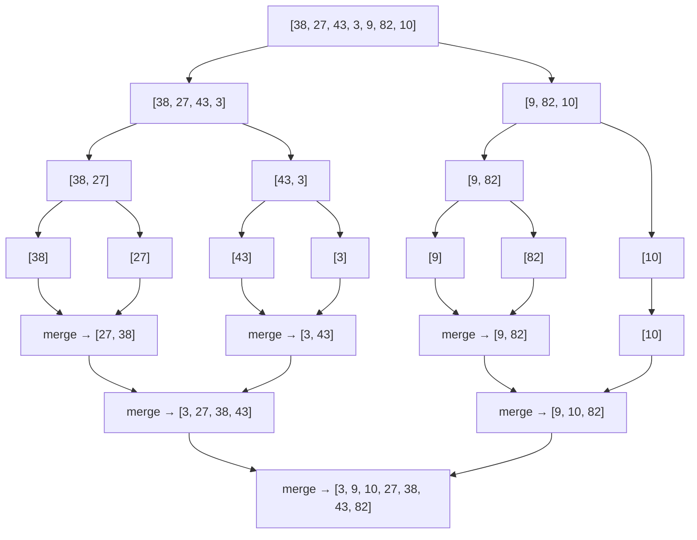
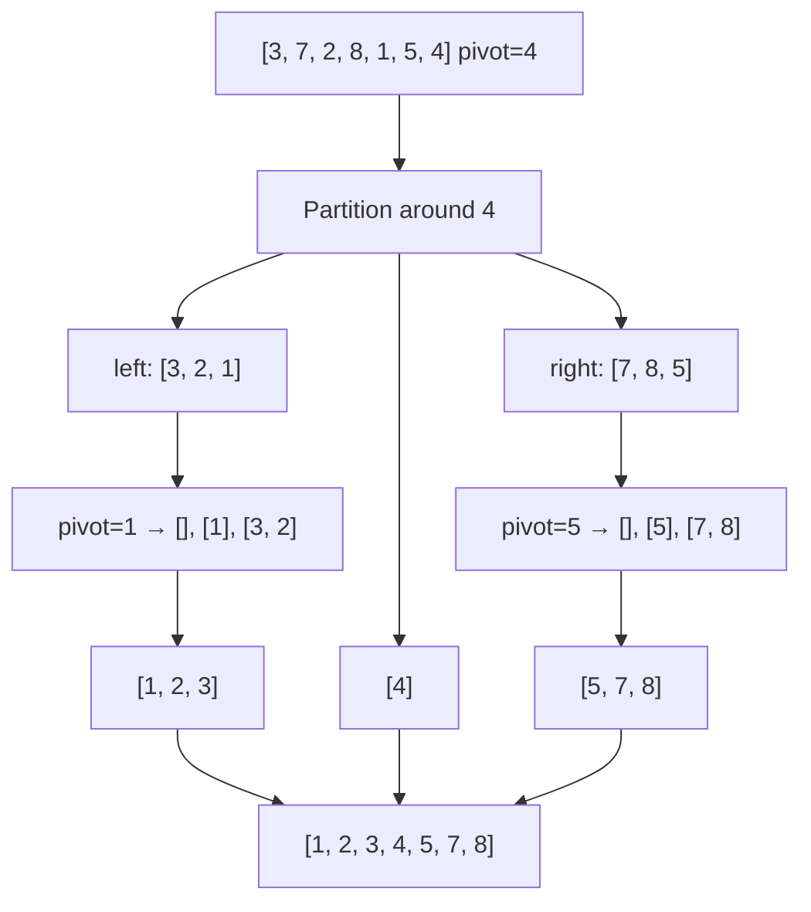
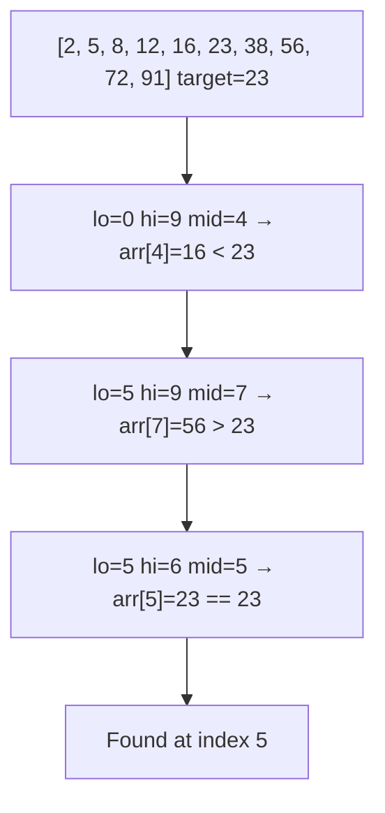

## Bubble sort

Bubble sort walks through the array repeatedly, comparing adjacent elements and swapping them if they are out of order. After each full pass, the largest unsorted element has "bubbled" to its correct position at the end, so the next pass can stop one element earlier. The algorithm terminates when a pass completes with no swaps, meaning the array is sorted.

Time is O(N^2) worst and average, O(N) best (already sorted with the early-exit optimization). Space is O(1). Bubble sort is easy to understand but impractical for anything beyond tiny inputs because even on average it does roughly N^2/2 comparisons and swaps. Its only real value is pedagogical.

```python
def bubble_sort(arr: list[int]) -> None:
    """Sort arr in-place using bubble sort with early-exit optimization."""
    n = len(arr)
    for i in range(n):
        swapped = False
        for j in range(n - 1 - i):
            if arr[j] > arr[j + 1]:
                arr[j], arr[j + 1] = arr[j + 1], arr[j]
                swapped = True
        if not swapped:
            break  # already sorted, no need to continue

data = [5, 3, 8, 1, 2]
bubble_sort(data)
print(data)  # [1, 2, 3, 5, 8]
```

## Selection sort

Selection sort divides the array into a sorted prefix and an unsorted suffix. On each pass, it scans the unsorted portion to find the minimum element, then swaps it into the next position of the sorted prefix. This continues until every element has been placed.

Time is always O(N^2) because the scan through the unsorted portion happens regardless of input order. Space is O(1). The number of swaps is at most O(N), which makes selection sort useful when writes are expensive (like writing to flash memory), but in general its quadratic comparison count makes it uncompetitive.

```python
def selection_sort(arr: list[int]) -> None:
    """Sort arr in-place using selection sort."""
    n = len(arr)
    for i in range(n):
        min_idx = i
        for j in range(i + 1, n):
            if arr[j] < arr[min_idx]:
                min_idx = j
        arr[i], arr[min_idx] = arr[min_idx], arr[i]

data = [29, 10, 14, 37, 13]
selection_sort(data)
print(data)  # [10, 13, 14, 29, 37]
```

## Insertion sort

Insertion sort builds the sorted array one element at a time. For each new element, it shifts larger elements in the sorted prefix one position to the right until it finds the correct insertion point. This is the same motion you use when sorting a hand of playing cards.

Time is O(N^2) worst case (reverse-sorted input), but O(N) best case when the array is already sorted or nearly sorted, because each element triggers at most a few shifts. Space is O(1). This best-case behavior makes insertion sort the algorithm of choice for small arrays and as the base case in hybrid sorts like Timsort (Python's built-in sort).

```python
def insertion_sort(arr: list[int]) -> None:
    """Sort arr in-place using insertion sort."""
    for i in range(1, len(arr)):
        key = arr[i]
        j = i - 1
        while j >= 0 and arr[j] > key:
            arr[j + 1] = arr[j]  # shift right
            j -= 1
        arr[j + 1] = key

data = [5, 2, 4, 6, 1, 3]
insertion_sort(data)
print(data)  # [1, 2, 3, 4, 5, 6]
```

## Merge sort

Merge sort splits the array in half, recursively sorts each half, then merges the two sorted halves back together. The merge step walks two pointers through the sorted halves, always picking the smaller element, producing a fully sorted result in O(N) time per level. With O(log N) levels of recursion, total time is O(N log N) in all cases. The tradeoff is O(N) auxiliary space for the temporary arrays during merging.

Merge sort is the go-to when you need guaranteed O(N log N) performance and stability. It is also the natural choice for sorting linked lists (where the space overhead disappears) and for external sorting of data that does not fit in memory.



```python
def merge_sort(arr: list[int]) -> list[int]:
    """Return a new sorted list using merge sort."""
    if len(arr) <= 1:
        return arr

    mid = len(arr) // 2
    left = merge_sort(arr[:mid])
    right = merge_sort(arr[mid:])
    return _merge(left, right)


def _merge(left: list[int], right: list[int]) -> list[int]:
    """Merge two sorted lists into one sorted list."""
    result: list[int] = []
    i = j = 0
    while i < len(left) and j < len(right):
        if left[i] <= right[j]:   # <= preserves stability
            result.append(left[i])
            i += 1
        else:
            result.append(right[j])
            j += 1
    result.extend(left[i:])
    result.extend(right[j:])
    return result


print(merge_sort([38, 27, 43, 3, 9, 82, 10]))
# [3, 9, 10, 27, 38, 43, 82]
```

## Quick sort

Quick sort picks a pivot element, partitions the array so that all elements less than the pivot come before it and all greater elements come after, then recursively sorts the two partitions. Average time is O(N log N) because each partition roughly halves the problem. Worst case is O(N^2) when the pivot is always the smallest or largest element (e.g., already-sorted input with naive first-element pivot). Randomizing the pivot choice makes the worst case astronomically unlikely in practice.

Space is O(log N) for the recursion stack on average. Quick sort is typically faster than merge sort in practice due to better cache locality and lower constant factors, which is why it is the basis of many standard library sort implementations.



```python
import random


def quicksort(arr: list[int]) -> list[int]:
    """Return a new sorted list using quicksort."""
    if len(arr) <= 1:
        return arr

    pivot = arr[random.randint(0, len(arr) - 1)]
    less = [x for x in arr if x < pivot]
    equal = [x for x in arr if x == pivot]
    greater = [x for x in arr if x > pivot]
    return quicksort(less) + equal + quicksort(greater)


def quicksort_inplace(arr: list[int], lo: int = 0, hi: int | None = None) -> None:
    """Sort arr in-place using Lomuto partition scheme."""
    if hi is None:
        hi = len(arr) - 1
    if lo >= hi:
        return

    pivot_idx = _partition(arr, lo, hi)
    quicksort_inplace(arr, lo, pivot_idx - 1)
    quicksort_inplace(arr, pivot_idx + 1, hi)


def _partition(arr: list[int], lo: int, hi: int) -> int:
    """Lomuto partition: pivot is arr[hi], returns final pivot index."""
    pivot = arr[hi]
    i = lo  # boundary of elements < pivot
    for j in range(lo, hi):
        if arr[j] < pivot:
            arr[i], arr[j] = arr[j], arr[i]
            i += 1
    arr[i], arr[hi] = arr[hi], arr[i]
    return i


data = [3, 7, 2, 8, 1, 5, 4]
quicksort_inplace(data)
print(data)  # [1, 2, 3, 4, 5, 7, 8]
```

## Radix sort

Radix sort avoids comparisons entirely. It sorts integers digit by digit, starting from the least significant digit (LSD) to the most significant. At each digit position, it uses a stable sub-sort (usually counting sort) to group elements by that digit. After processing all k digits, the array is sorted. Time is O(kN) where k is the number of digits and N is the number of elements.

Radix sort is useful when you have a large number of integers with a bounded number of digits. If k is constant or much smaller than log N, radix sort beats comparison-based sorts. It is commonly used for sorting fixed-length strings, IP addresses, and database record IDs. The tradeoff is O(N + b) auxiliary space where b is the base (radix).

```python
def radix_sort(arr: list[int]) -> list[int]:
    """Sort non-negative integers using LSD radix sort (base 10)."""
    if not arr:
        return arr

    max_val = max(arr)
    exp = 1  # current digit position (1s, 10s, 100s, ...)

    while max_val // exp > 0:
        arr = _counting_sort_by_digit(arr, exp)
        exp *= 10

    return arr


def _counting_sort_by_digit(arr: list[int], exp: int) -> list[int]:
    """Stable sort by the digit at position exp."""
    n = len(arr)
    output = [0] * n
    count = [0] * 10  # digits 0-9

    for num in arr:
        digit = (num // exp) % 10
        count[digit] += 1

    # Convert count to cumulative positions
    for i in range(1, 10):
        count[i] += count[i - 1]

    # Build output in reverse to maintain stability
    for i in range(n - 1, -1, -1):
        digit = (arr[i] // exp) % 10
        count[digit] -= 1
        output[count[digit]] = arr[i]

    return output


print(radix_sort([170, 45, 75, 90, 802, 24, 2, 66]))
# [2, 24, 45, 66, 75, 90, 170, 802]
```

## Comparison-based sorting lower bound

No comparison-based sorting algorithm can do better than O(N log N) in the worst case. This is a fundamental theoretical result, not a limitation of any particular algorithm. The proof uses the decision tree model: any comparison-based sort can be modeled as a binary tree where each internal node is a comparison and each leaf is a permutation of the input. Since there are N! possible permutations, the tree needs at least N! leaves. A binary tree with N! leaves has height at least log2(N!) = O(N log N) by Stirling's approximation.

This is why merge sort and heap sort are optimal comparison-based sorts. It also explains why non-comparison sorts like radix sort and counting sort can beat the bound: they exploit structure in the keys (like digit positions or bounded range) rather than relying solely on pairwise comparisons.

## Stability in sorting

A sorting algorithm is stable if it preserves the relative order of elements that compare as equal. For example, if you sort a list of students by grade and two students both have a B, a stable sort keeps them in their original order relative to each other. An unstable sort might swap them.

Stability matters when you sort by multiple keys in sequence. If you first sort by name, then stable-sort by grade, students with the same grade remain alphabetically ordered. Merge sort and insertion sort are stable. Quick sort and selection sort are not stable in their standard implementations. Python's built-in `sorted()` and `list.sort()` use Timsort, which is stable, so multi-key sorting with `key=` functions works correctly.

```python
from operator import itemgetter

students = [
    ("Alice", "B"),
    ("Dave", "A"),
    ("Carol", "B"),
    ("Bob", "A"),
]

# Sort by name first, then stable-sort by grade
by_name = sorted(students, key=itemgetter(0))
by_grade = sorted(by_name, key=itemgetter(1))

print(by_grade)
# [('Bob', 'A'), ('Dave', 'A'), ('Alice', 'B'), ('Carol', 'B')]
# Within each grade, alphabetical order is preserved because sorted() is stable
```

## Binary search

Binary search finds a target value in a sorted array by repeatedly halving the search range. Compare the target with the middle element: if equal, you are done; if less, search the left half; if greater, search the right half. Each step eliminates half the remaining elements, giving O(log N) time and O(1) space.

The iterative implementation is preferred in interviews because it avoids recursion overhead and stack depth concerns. The classic bug is getting the boundary conditions wrong. Use `lo = 0`, `hi = len(arr) - 1`, and the loop condition `lo <= hi`. Update `lo = mid + 1` or `hi = mid - 1` (never just `mid`) to avoid infinite loops.



```python
def binary_search(arr: list[int], target: int) -> int:
    """Return index of target in sorted arr, or -1 if not found."""
    lo, hi = 0, len(arr) - 1
    while lo <= hi:
        mid = lo + (hi - lo) // 2  # avoids overflow in other languages
        if arr[mid] == target:
            return mid
        elif arr[mid] < target:
            lo = mid + 1
        else:
            hi = mid - 1
    return -1


data = [2, 5, 8, 12, 16, 23, 38, 56, 72, 91]
print(binary_search(data, 23))   # 5
print(binary_search(data, 20))   # -1
```

## Binary search variants

The basic binary search finds any occurrence of the target, but many problems require finding the first occurrence, the last occurrence, or the insertion position. These variants adjust what happens when `arr[mid] == target`: instead of returning immediately, you narrow the search range further to find the boundary.

Another common variant is searching in a rotated sorted array, where the array was sorted but then rotated at some pivot point (e.g., `[4, 5, 6, 7, 0, 1, 2]`). The key insight is that at least one half of the array around `mid` is always sorted, so you can determine which half the target falls in.

```python
def find_first(arr: list[int], target: int) -> int:
    """Return index of first occurrence of target, or -1."""
    lo, hi = 0, len(arr) - 1
    result = -1
    while lo <= hi:
        mid = lo + (hi - lo) // 2
        if arr[mid] == target:
            result = mid       # record candidate
            hi = mid - 1       # keep searching left for earlier occurrence
        elif arr[mid] < target:
            lo = mid + 1
        else:
            hi = mid - 1
    return result


def find_last(arr: list[int], target: int) -> int:
    """Return index of last occurrence of target, or -1."""
    lo, hi = 0, len(arr) - 1
    result = -1
    while lo <= hi:
        mid = lo + (hi - lo) // 2
        if arr[mid] == target:
            result = mid       # record candidate
            lo = mid + 1       # keep searching right for later occurrence
        elif arr[mid] < target:
            lo = mid + 1
        else:
            hi = mid - 1
    return result


def search_rotated(arr: list[int], target: int) -> int:
    """Search for target in a rotated sorted array. Return index or -1."""
    lo, hi = 0, len(arr) - 1
    while lo <= hi:
        mid = lo + (hi - lo) // 2
        if arr[mid] == target:
            return mid

        # Determine which half is sorted
        if arr[lo] <= arr[mid]:          # left half is sorted
            if arr[lo] <= target < arr[mid]:
                hi = mid - 1            # target is in the sorted left half
            else:
                lo = mid + 1
        else:                            # right half is sorted
            if arr[mid] < target <= arr[hi]:
                lo = mid + 1            # target is in the sorted right half
            else:
                hi = mid - 1
    return -1


data = [1, 2, 2, 2, 3, 4, 5]
print(find_first(data, 2))   # 1
print(find_last(data, 2))    # 3

rotated = [4, 5, 6, 7, 0, 1, 2]
print(search_rotated(rotated, 0))   # 4
print(search_rotated(rotated, 3))   # -1
```

## Sorting algorithm comparison

Choosing the right sort depends on input size, whether the data is nearly sorted, memory constraints, and whether stability is required. The table below summarizes the algorithms covered in this chapter.

| Algorithm      | Best        | Average     | Worst       | Space  | Stable |
|----------------|-------------|-------------|-------------|--------|--------|
| Bubble sort    | O(N)        | O(N^2)      | O(N^2)      | O(1)   | Yes    |
| Selection sort | O(N^2)      | O(N^2)      | O(N^2)      | O(1)   | No     |
| Insertion sort | O(N)        | O(N^2)      | O(N^2)      | O(1)   | Yes    |
| Merge sort     | O(N log N)  | O(N log N)  | O(N log N)  | O(N)   | Yes    |
| Quick sort     | O(N log N)  | O(N log N)  | O(N^2)      | O(log N) | No   |
| Radix sort     | O(kN)       | O(kN)       | O(kN)       | O(N+b) | Yes    |

In practice: use insertion sort for small arrays (N < ~20), merge sort when stability and guaranteed O(N log N) matter, quicksort for general-purpose in-memory sorting (with randomized pivot), and radix sort when sorting large volumes of fixed-width integers or strings. Python's built-in `sorted()` uses Timsort, a hybrid of merge sort and insertion sort that achieves O(N) on nearly-sorted data and O(N log N) worst case, making it an excellent default choice.
