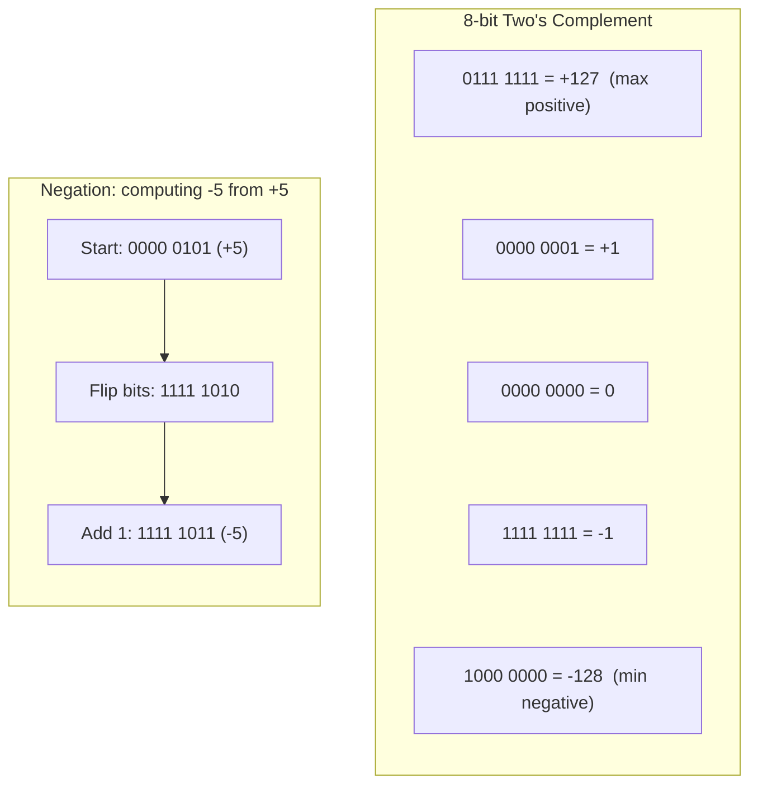
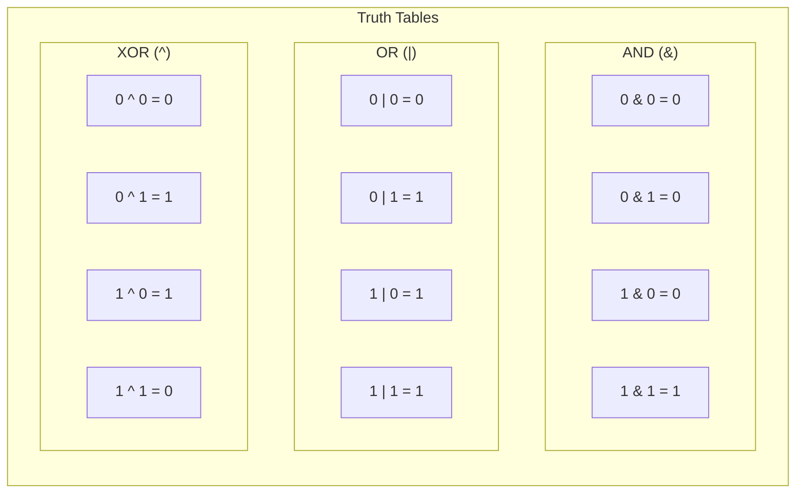
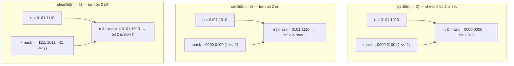

## Binary number representation

Computers store integers as sequences of bits (binary digits), where each bit position represents a power of 2. The rightmost bit (bit 0) is the least significant bit (LSB) and represents 2^0 = 1; each position to the left doubles the value. To convert decimal to binary, repeatedly divide by 2 and collect remainders. To convert back, sum the powers of 2 where each bit is 1.

Understanding binary representation is foundational because every other bit manipulation technique operates directly on this structure. Python integers have arbitrary precision, but hardware and most languages use fixed-width representations (8, 16, 32, or 64 bits).

```python
# Decimal to binary
n = 42
print(bin(n))           # '0b101010'
print(f"{n:08b}")       # '00101010' — 8-bit zero-padded

# Binary to decimal
print(int('101010', 2)) # 42

# Manual conversion: sum powers of 2 where each bit is 1
#   bit positions:  5  4  3  2  1  0
#   bits:           1  0  1  0  1  0
#   values:        32  0  8  0  2  0  → 32 + 8 + 2 = 42

# Show each bit position
def show_bits(n: int, width: int = 8) -> str:
    """Display value with bit position breakdown."""
    bits = f"{n:0{width}b}"
    breakdown = " + ".join(
        f"{1 << (width - 1 - i)}"
        for i, b in enumerate(bits) if b == '1'
    )
    return f"{bits} = {breakdown} = {n}"

print(show_bits(42))    # 00101010 = 32 + 8 + 2 = 42
print(show_bits(255))   # 11111111 = 128 + 64 + 32 + 16 + 8 + 4 + 2 + 1 = 255
```

## Two's complement

Two's complement is the standard way hardware represents signed integers. In an N-bit system, the most significant bit (MSB) carries a negative weight of -2^(N-1) instead of a positive one. For 8 bits, the MSB represents -128. This means the range for an 8-bit signed integer is -128 to +127.

To negate a number in two's complement, flip all bits (bitwise NOT) and add 1. This eliminates the problem of having two representations of zero (which sign-magnitude has) and makes addition/subtraction work identically for signed and unsigned values. Python integers are arbitrary precision, so to simulate fixed-width two's complement, you mask to the desired width.



```python
# Simulating 8-bit two's complement in Python
BITS = 8
MASK = (1 << BITS) - 1    # 0xFF = 255

def to_twos_comp(n: int, bits: int = BITS) -> int:
    """Convert a signed integer to its two's complement bit pattern."""
    if n < 0:
        return (1 << bits) + n      # e.g., -5 → 256 + (-5) = 251 → 11111011
    return n

def from_twos_comp(val: int, bits: int = BITS) -> int:
    """Interpret a bit pattern as a signed two's complement integer."""
    if val & (1 << (bits - 1)):     # MSB is set → negative
        return val - (1 << bits)
    return val

# Negate via NOT + 1
pos_5 = 0b0000_0101                # +5
neg_5 = (~pos_5 + 1) & MASK        # flip, add 1, mask to 8 bits
print(f"+5: {pos_5:08b}")          # 00000101
print(f"-5: {neg_5:08b}")          # 11111011
print(f"interpreted: {from_twos_comp(neg_5)}")  # -5
```

## Bitwise AND, OR, XOR, NOT

The four fundamental bitwise operators compare corresponding bits of two integers and produce a new integer. **AND** (`&`) yields 1 only when both bits are 1 — useful for masking and checking specific bits. **OR** (`|`) yields 1 when either bit is 1 — useful for setting bits. **XOR** (`^`) yields 1 when the bits differ — useful for toggling and finding unique elements. **NOT** (`~`) flips every bit — in Python, `~x` equals `-(x+1)` because of arbitrary-precision integers.

These operators are the building blocks for every bit manipulation technique. Memorize their truth tables and the rest follows naturally.



```python
a = 0b1100   # 12
b = 0b1010   # 10

print(f"AND:  {a & b:04b}")   # 1000  (8)  — both bits set
print(f"OR:   {a | b:04b}")   # 1110  (14) — either bit set
print(f"XOR:  {a ^ b:04b}")   # 0110  (6)  — bits differ
print(f"NOT a: {~a}")         # -13 (Python: -(12+1))

# Practical uses
is_even = lambda n: (n & 1) == 0       # AND with 1 checks LSB
set_flag = lambda flags, f: flags | f   # OR sets a flag
toggle = lambda flags, f: flags ^ f     # XOR toggles a flag
```

## Left shift and right shift

The left shift operator (`<<`) moves all bits to the left by a given count, filling vacated positions with zeros. Each left shift by 1 doubles the value: `x << k` equals `x * 2^k`. This is how you construct bit masks and compute powers of 2 efficiently.

The right shift operator (`>>`) moves bits to the right. **Arithmetic right shift** (Python's `>>`) preserves the sign bit, effectively performing integer division by 2 and rounding toward negative infinity. Some languages also have a **logical right shift** (`>>>` in Java/JavaScript) that fills with zeros regardless of sign. Python does not have `>>>` because its integers are arbitrary precision and always use arithmetic shift.

```python
# Left shift: multiply by powers of 2
print(1 << 0)    # 1    (2^0)
print(1 << 3)    # 8    (2^3)
print(5 << 2)    # 20   (5 * 4)

# Right shift: integer division by powers of 2
print(20 >> 2)   # 5    (20 // 4)
print(7 >> 1)    # 3    (7 // 2, rounds down)

# Arithmetic shift preserves sign in Python
print(-16 >> 2)  # -4   (-16 // 4)

# Common use: create bitmask for position i
def bit_at(i: int) -> int:
    """Return a mask with only bit i set."""
    return 1 << i

for i in range(8):
    print(f"bit {i}: {bit_at(i):08b}")
# bit 0: 00000001
# bit 1: 00000010
# bit 2: 00000100
# ...
# bit 7: 10000000
```

## Bit masks for get, set, and clear

A bit mask is a value with specific bits turned on or off, used in combination with AND, OR, and XOR to read, write, or flip individual bits within a number. These three operations — getBit, setBit, and clearBit — are the fundamental building blocks for any bit manipulation problem.

The pattern is always the same: shift `1` to the target position to create a mask, then apply the appropriate operator. Once these three operations are second nature, you can compose them to solve any bit-level task.



```python
def get_bit(n: int, i: int) -> bool:
    """Return True if bit i is set in n."""
    return (n & (1 << i)) != 0

def set_bit(n: int, i: int) -> int:
    """Return n with bit i set to 1."""
    return n | (1 << i)

def clear_bit(n: int, i: int) -> int:
    """Return n with bit i set to 0."""
    return n & ~(1 << i)

def toggle_bit(n: int, i: int) -> int:
    """Return n with bit i flipped."""
    return n ^ (1 << i)

# Demonstration on n = 0b01011010 (90)
n = 0b01011010
print(f"n       = {n:08b}  ({n})")      # 01011010 (90)
print(f"bit 2   = {get_bit(n, 2)}")      # False (bit 2 is 0)
print(f"bit 4   = {get_bit(n, 4)}")      # True  (bit 4 is 1)

n = set_bit(n, 2)
print(f"set 2   = {n:08b}  ({n})")       # 01011110 (94)

n = clear_bit(n, 4)
print(f"clear 4 = {n:08b}  ({n})")       # 01001110 (78)

n = toggle_bit(n, 0)
print(f"toggle 0= {n:08b}  ({n})")       # 01001111 (79)
```

## Common bit tricks

A handful of bit manipulation patterns appear repeatedly in interviews and systems code. Knowing them by heart lets you recognize and apply them instantly.

`n & (n - 1)` clears the lowest set bit. If the result is zero and `n > 0`, then `n` is a power of two (exactly one bit set). `n & (-n)` isolates the lowest set bit, returning a value with only that bit turned on. `x ^ x = 0` cancels identical values, which is the foundation of XOR-based uniqueness detection. These tricks work because they exploit the binary structure of subtraction and negation in two's complement.

```python
# Clear lowest set bit: n & (n - 1)
n = 0b01011000   # 88
print(f"{n:08b} → {n & (n-1):08b}")   # 01011000 → 01010000

# Power of two check: exactly one bit set
def is_power_of_two(n: int) -> bool:
    """Return True if n is a positive power of 2."""
    return n > 0 and (n & (n - 1)) == 0

print(is_power_of_two(16))   # True  (10000)
print(is_power_of_two(18))   # False (10010)

# Isolate lowest set bit: n & (-n)
n = 0b01011000   # 88
lowest = n & (-n)
print(f"lowest set bit of {n:08b}: {lowest:08b}")  # 00001000

# Check if number is odd or even
is_odd = lambda n: n & 1 == 1
print(is_odd(7))    # True
print(is_odd(8))    # False
```

## XOR properties and applications

XOR has three properties that make it uniquely useful. First, `x ^ 0 = x` (identity). Second, `x ^ x = 0` (self-cancellation). Third, XOR is both commutative and associative, so the order and grouping of operations do not matter. These properties combine to solve problems that look impossible without extra storage.

The classic application is finding the single unique element in an array where every other element appears exactly twice: XOR all elements together, and the duplicates cancel, leaving only the unique one. XOR also enables swapping two variables without a temporary and toggling bits in flag fields.

```python
# Property demonstration
x = 42
print(x ^ 0)    # 42  (identity)
print(x ^ x)    # 0   (self-cancellation)
print(x ^ 0 ^ x)  # 0  (associative: (x ^ 0) ^ x = x ^ x = 0)

# Find the single non-duplicate element
def find_unique(nums: list[int]) -> int:
    """Every element appears twice except one. Find it in O(N) time, O(1) space."""
    result = 0
    for n in nums:
        result ^= n     # duplicates cancel: a ^ a = 0
    return result

print(find_unique([4, 1, 2, 1, 2]))  # 4

# Swap without a temporary variable
a, b = 10, 25
print(f"before: a={a}, b={b}")
a ^= b     # a = a ^ b
b ^= a     # b = b ^ (a ^ b) = a
a ^= b     # a = (a ^ b) ^ a = b
print(f"after:  a={a}, b={b}")   # a=25, b=10

# Find missing number in [0, n]: XOR all indices with all values
def find_missing(nums: list[int]) -> int:
    """Given [0..n] with one missing, find it."""
    n = len(nums)
    xor_all = 0
    for i in range(n + 1):
        xor_all ^= i
    for num in nums:
        xor_all ^= num
    return xor_all

print(find_missing([3, 0, 1]))    # 2
print(find_missing([0, 1, 3, 4])) # 2
```

## Counting set bits (popcount)

Counting the number of set bits (1s) in a binary number is called **popcount** (population count). The naive approach checks each bit position, but Brian Kernighan's algorithm is more elegant: repeatedly clear the lowest set bit with `n &= (n - 1)` and count how many iterations it takes. Each iteration removes exactly one set bit, so the loop runs exactly `k` times where `k` is the number of 1s.

This is O(k) where k is the number of set bits, which is often much better than O(log n) for sparse numbers. Python also provides `bin(n).count('1')` as a convenient alternative, and hardware CPUs have a dedicated POPCNT instruction.

```python
def count_bits_kernighan(n: int) -> int:
    """Count set bits using Brian Kernighan's algorithm.

    Each iteration of n &= (n - 1) clears the lowest set bit.
    The loop runs exactly once per set bit.
    """
    count = 0
    while n:
        n &= (n - 1)    # clear lowest set bit
        count += 1
    return count

# Walk through example: n = 0b10110100 (180)
# Iteration 1: 10110100 & 10110011 = 10110000  (cleared bit 2)
# Iteration 2: 10110000 & 10101111 = 10100000  (cleared bit 4)
# Iteration 3: 10100000 & 10011111 = 10000000  (cleared bit 5)
# Iteration 4: 10000000 & 01111111 = 00000000  (cleared bit 7)
# Result: 4 set bits

for val in [0, 1, 7, 180, 255]:
    print(f"{val:08b} → {count_bits_kernighan(val)} set bits")
# 00000000 → 0 set bits
# 00000001 → 1 set bits
# 00000111 → 3 set bits
# 10110100 → 4 set bits
# 11111111 → 8 set bits

# Python convenience
print(bin(180).count('1'))  # 4
```

## Bit manipulation for interview problems

Interview problems that involve bit manipulation typically test whether you can replace arithmetic or data-structure-based solutions with direct bit operations for better space or time complexity. The most common patterns are power-of-two checks, swapping odd and even bits, and finding missing or unique numbers via XOR.

The key insight is recognizing when a problem has binary structure. If the problem involves sets of small integers, flags, or finding single unique elements, bit manipulation is likely the intended approach.

```python
# 1. Swap odd and even bits
def swap_odd_even_bits(n: int) -> int:
    """Swap all odd-positioned bits with even-positioned bits.

    Even mask: 0xAAAAAAAA = 10101010... (odd bits)
    Odd mask:  0x55555555 = 01010101... (even bits)
    """
    # Extract odd bits, shift right; extract even bits, shift left
    return ((n & 0xAAAAAAAA) >> 1) | ((n & 0x55555555) << 1)

print(f"{0b10110010:08b} → {swap_odd_even_bits(0b10110010):08b}")
# 10110010 → 01110001

# 2. Reverse bits of a 32-bit integer
def reverse_bits(n: int, bits: int = 32) -> int:
    """Reverse the bit order of an integer."""
    result = 0
    for _ in range(bits):
        result = (result << 1) | (n & 1)
        n >>= 1
    return result

print(f"{13:032b}")                  # 00000000000000000000000000001101
print(f"{reverse_bits(13):032b}")    # 10110000000000000000000000000000

# 3. Generate all subsets using bitmask
def subsets_bitmask(items: list[str]) -> list[list[str]]:
    """Generate all subsets by iterating over bitmask 0..2^n-1.

    Each integer represents a subset: bit i indicates whether items[i]
    is included.
    """
    n = len(items)
    result = []
    for mask in range(1 << n):       # 0 to 2^n - 1
        subset = [items[i] for i in range(n) if mask & (1 << i)]
        result.append(subset)
    return result

print(subsets_bitmask(["a", "b", "c"]))
# [[], ['a'], ['b'], ['a', 'b'], ['c'], ['a', 'c'], ['b', 'c'], ['a', 'b', 'c']]
```
