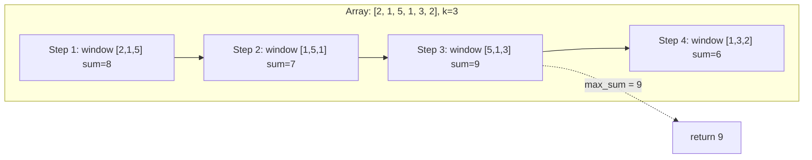
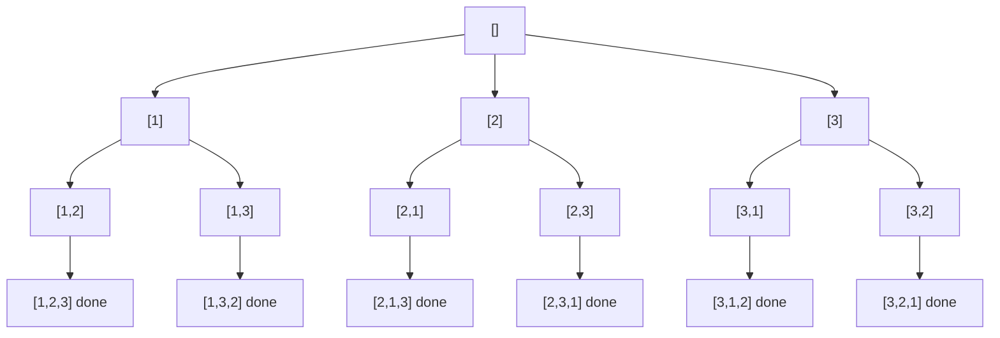
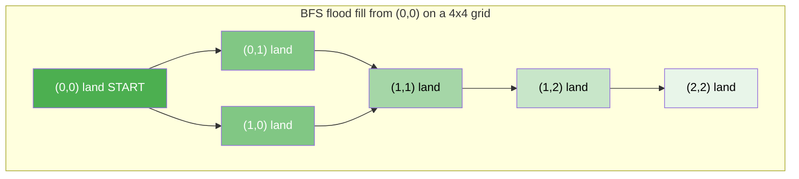
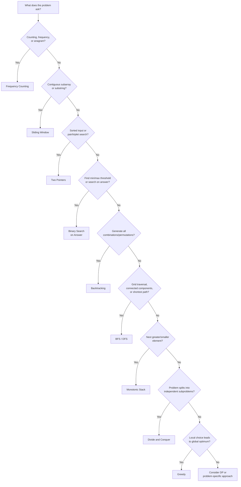

## Frequency counting with hash maps

Frequency counting builds a map from elements to their occurrence counts, then uses those counts to answer questions about duplicates, anagrams, permutations, or majority elements. The pattern is almost always the same: iterate once to build the count, iterate again (or compare counts) to answer the question. Time is O(N), space is O(K) where K is the number of distinct elements.

Recognize this pattern when the problem asks "how many times does X appear," "are these two collections the same up to ordering," or "find the element that appears more/less than some threshold."

```python
from collections import Counter


def is_anagram(s: str, t: str) -> bool:
    """Two strings are anagrams iff they have identical character frequencies."""
    if len(s) != len(t):
        return False
    return Counter(s) == Counter(t)


def first_unique_char(s: str) -> int:
    """Return the index of the first non-repeating character, or -1."""
    freq = Counter(s)
    for i, ch in enumerate(s):
        if freq[ch] == 1:
            return i
    return -1


print(is_anagram("listen", "silent"))   # True
print(is_anagram("hello", "world"))     # False
print(first_unique_char("aabcbd"))      # 3 (character 'c')
```

## Two pointers for linear scans

The two-pointer technique places two indices into a structure and moves them according to a rule -- toward each other, away from each other, or at different speeds. On a sorted array, it reduces an O(N^2) pair search to O(N) by eliminating candidate pairs with each step. The key insight: when the sum is too small, advancing the left pointer is the only way to increase it; when too large, retreating the right pointer is the only way to decrease it.

Use two pointers when the input is sorted (or can be sorted without breaking the answer), when you need to find pairs or subarrays meeting a condition, or when you need to partition or compact elements in place.

```python
def two_sum_sorted(nums: list[int], target: int) -> tuple[int, int] | None:
    """Find two indices whose values sum to target in a sorted array. O(N)."""
    left, right = 0, len(nums) - 1
    while left < right:
        total = nums[left] + nums[right]
        if total == target:
            return (left, right)
        elif total < target:
            left += 1      # need a larger sum
        else:
            right -= 1     # need a smaller sum
    return None


def remove_duplicates(nums: list[int]) -> int:
    """Remove duplicates in-place from a sorted list. Return new length."""
    if not nums:
        return 0
    write = 0
    for read in range(1, len(nums)):
        if nums[read] != nums[write]:
            write += 1
            nums[write] = nums[read]
    return write + 1


print(two_sum_sorted([1, 3, 5, 7, 9, 11], 10))   # (0, 4) -> 1 + 9
data = [1, 1, 2, 3, 3, 4]
n = remove_duplicates(data)
print(data[:n])                                     # [1, 2, 3, 4]
```

## Sliding window over sequences

A sliding window maintains a contiguous sub-range of a sequence and slides it forward one element at a time, adding the new element entering the window and removing the element leaving it. This avoids recomputing the entire sub-range from scratch at each position, turning an O(N*K) brute force into O(N).

Use sliding window when the problem asks for the best (max, min, longest, shortest) contiguous subarray or substring of a given size or satisfying a given constraint. Fixed-size windows slide by exactly one element; variable-size windows expand the right edge until a constraint is violated, then contract the left edge until it is restored.



```python
def max_sum_subarray(nums: list[int], k: int) -> int:
    """Return the maximum sum of any contiguous subarray of size k. O(N)."""
    if len(nums) < k:
        raise ValueError("array shorter than window size")

    # Compute the sum of the first window
    window_sum = sum(nums[:k])
    best = window_sum

    # Slide: add the entering element, subtract the leaving element
    for i in range(k, len(nums)):
        window_sum += nums[i] - nums[i - k]
        best = max(best, window_sum)

    return best


print(max_sum_subarray([2, 1, 5, 1, 3, 2], 3))  # 9 (window [5, 1, 3])
print(max_sum_subarray([4, 2, 1, 7, 8, 1, 2, 8, 1, 0], 3))  # 16 (window [7, 8, 1])
```

## Divide and conquer

Divide and conquer splits a problem into independent subproblems of the same type, solves each recursively, and combines the results. Merge sort, quicksort, and binary search are canonical examples. The time complexity depends on how many subproblems are created and how expensive the combine step is -- the Master Theorem formalizes this.

Recognize divide and conquer when a problem has optimal substructure and the subproblems do not overlap (if they overlap, consider dynamic programming instead). The maximum subarray problem illustrates the pattern: split the array in half, recursively find the best subarray in each half, then check for a subarray that crosses the midpoint.

```python
def max_crossing_sum(nums: list[int], lo: int, mid: int, hi: int) -> int:
    """Find the max subarray sum that crosses the midpoint."""
    # Extend left from mid
    left_best = float("-inf")
    running = 0
    for i in range(mid, lo - 1, -1):
        running += nums[i]
        left_best = max(left_best, running)

    # Extend right from mid+1
    right_best = float("-inf")
    running = 0
    for i in range(mid + 1, hi + 1):
        running += nums[i]
        right_best = max(right_best, running)

    return left_best + right_best


def max_subarray_dc(nums: list[int], lo: int, hi: int) -> int:
    """Maximum subarray sum via divide and conquer. O(N log N)."""
    if lo == hi:
        return nums[lo]
    mid = (lo + hi) // 2
    left = max_subarray_dc(nums, lo, mid)
    right = max_subarray_dc(nums, mid + 1, hi)
    cross = max_crossing_sum(nums, lo, mid, hi)
    return max(left, right, cross)


arr = [-2, 1, -3, 4, -1, 2, 1, -5, 4]
print(max_subarray_dc(arr, 0, len(arr) - 1))  # 6 (subarray [4, -1, 2, 1])

# Compare with Kadane's algorithm (the O(N) greedy/DP approach):
def kadane(nums: list[int]) -> int:
    best = current = nums[0]
    for x in nums[1:]:
        current = max(x, current + x)
        best = max(best, current)
    return best

print(kadane(arr))  # 6 -- same answer, but O(N) instead of O(N log N)
```

## Greedy algorithms

A greedy algorithm makes the locally optimal choice at each step, never reconsidering past decisions. It works when the problem has the greedy-choice property: a locally optimal decision can always be extended to a globally optimal solution. When the property holds, greedy solutions are typically simpler and faster than alternatives.

The classic test case is interval scheduling: to attend the maximum number of non-overlapping meetings, always pick the meeting that ends earliest. This greedy choice is provably optimal. Other greedy problems include Huffman coding, fractional knapsack, and minimum spanning trees (Kruskal's and Prim's).

```python
def max_activities(intervals: list[tuple[int, int]]) -> list[tuple[int, int]]:
    """Select the maximum set of non-overlapping intervals. O(N log N)."""
    # Sort by end time -- the greedy criterion
    sorted_intervals = sorted(intervals, key=lambda x: x[1])

    selected = [sorted_intervals[0]]
    for start, end in sorted_intervals[1:]:
        if start >= selected[-1][1]:   # no overlap with last selected
            selected.append((start, end))

    return selected


meetings = [(0, 6), (1, 4), (3, 5), (5, 7), (3, 9), (5, 9),
            (6, 10), (8, 11), (8, 12), (2, 14), (12, 16)]
result = max_activities(meetings)
print(f"Max non-overlapping: {len(result)} -> {result}")
# Max non-overlapping: 4 -> [(1, 4), (5, 7), (8, 11), (12, 16)]
```

## Backtracking

Backtracking builds a solution incrementally, one decision at a time, and abandons ("prunes") a partial solution as soon as it detects that it cannot possibly lead to a valid complete solution. This is exhaustive search with early termination. The structure is always a recursive function that iterates over choices at the current level, makes a choice, recurses, then undoes the choice before trying the next one.

Use backtracking for constraint-satisfaction and enumeration problems: permutations, combinations, subsets, N-queens, Sudoku solving, and word search on a grid. The decision tree below shows how generating permutations of [1, 2, 3] branches, backtracks, and prunes.



```python
def permutations(nums: list[int]) -> list[list[int]]:
    """Generate all permutations via backtracking."""
    result: list[list[int]] = []

    def backtrack(path: list[int], remaining: set[int]) -> None:
        if not remaining:
            result.append(path[:])    # found a complete permutation
            return
        for num in sorted(remaining):
            path.append(num)          # choose
            backtrack(path, remaining - {num})  # explore
            path.pop()                # un-choose (backtrack)

    backtrack([], set(nums))
    return result


print(permutations([1, 2, 3]))
# [[1,2,3], [1,3,2], [2,1,3], [2,3,1], [3,1,2], [3,2,1]]
```

## BFS and DFS as problem-solving tools

BFS and DFS are not just graph traversal algorithms -- they are general problem-solving frameworks. BFS explores level by level (useful when you need shortest path or level-order processing), while DFS explores as deep as possible before backtracking (useful for connectivity, cycle detection, and exhaustive search). On a 2D grid, treating each cell as a node and adjacent cells as edges turns matrix problems into graph problems.

The island-counting problem is a classic application: scan the grid, and when you find an unvisited land cell, run BFS (or DFS) to mark all connected land cells as visited. Each BFS/DFS invocation discovers one island.



```python
from collections import deque


def count_islands(grid: list[list[str]]) -> int:
    """Count the number of islands in a 2D grid using BFS. O(R*C)."""
    if not grid:
        return 0

    rows, cols = len(grid), len(grid[0])
    visited = [[False] * cols for _ in range(rows)]
    islands = 0

    def bfs(r: int, c: int) -> None:
        queue = deque([(r, c)])
        visited[r][c] = True
        while queue:
            cr, cc = queue.popleft()
            for dr, dc in [(-1, 0), (1, 0), (0, -1), (0, 1)]:
                nr, nc = cr + dr, cc + dc
                if (0 <= nr < rows and 0 <= nc < cols
                        and not visited[nr][nc]
                        and grid[nr][nc] == "1"):
                    visited[nr][nc] = True
                    queue.append((nr, nc))

    for r in range(rows):
        for c in range(cols):
            if grid[r][c] == "1" and not visited[r][c]:
                bfs(r, c)
                islands += 1

    return islands


grid = [
    ["1", "1", "0", "0", "0"],
    ["1", "1", "0", "0", "0"],
    ["0", "0", "1", "0", "0"],
    ["0", "0", "0", "1", "1"],
]
print(count_islands(grid))  # 3
```

## Binary search beyond sorted arrays

Binary search is not limited to finding an element in a sorted array. The deeper principle is: whenever you can define a boolean condition that is `False` for all values below some threshold and `True` for all values above it, you can binary search on that threshold. This "search on the answer" technique applies to minimization and maximization problems where you can verify a candidate answer efficiently.

For example, "Koko eating bananas": given piles of bananas and H hours, find the minimum eating speed K such that Koko finishes all piles in time. The answer space is `[1, max(piles)]`, and for any candidate K you can check feasibility in O(N). Binary search over K gives O(N log M) total.

```python
import math


def min_eating_speed(piles: list[int], h: int) -> int:
    """Find the minimum speed to eat all piles within h hours. O(N log M)."""

    def can_finish(speed: int) -> bool:
        hours = sum(math.ceil(p / speed) for p in piles)
        return hours <= h

    lo, hi = 1, max(piles)
    while lo < hi:
        mid = (lo + hi) // 2
        if can_finish(mid):
            hi = mid        # mid works, try slower
        else:
            lo = mid + 1    # mid too slow, must go faster

    return lo


print(min_eating_speed([3, 6, 7, 11], 8))    # 4
print(min_eating_speed([30, 11, 23, 4, 20], 5))  # 30
print(min_eating_speed([30, 11, 23, 4, 20], 6))  # 23
```

## Monotonic stack

A monotonic stack maintains elements in strictly increasing (or decreasing) order from bottom to top. When a new element would violate the monotonic property, you pop elements until the property is restored. Each element is pushed and popped at most once, so the total work across all iterations is O(N) even though individual iterations may pop multiple elements.

The canonical problem is "next greater element": for each element in an array, find the next element to its right that is larger. A decreasing monotonic stack solves this in one pass. The pattern also solves largest rectangle in histogram, daily temperatures, and stock span.

```python
def next_greater_element(nums: list[int]) -> list[int]:
    """For each element, find the next greater element to its right. O(N).

    Returns -1 if no greater element exists.
    """
    n = len(nums)
    result = [-1] * n
    stack: list[int] = []  # stores indices; values at these indices are decreasing

    for i in range(n):
        # Pop elements smaller than current -- current is their "next greater"
        while stack and nums[stack[-1]] < nums[i]:
            idx = stack.pop()
            result[idx] = nums[i]
        stack.append(i)

    return result


print(next_greater_element([2, 1, 2, 4, 3]))
# [4, 2, 4, -1, -1]

print(next_greater_element([4, 3, 2, 1]))
# [-1, -1, -1, -1]  (descending -- no next greater for any element)

print(next_greater_element([1, 3, 2, 4]))
# [3, 4, 4, -1]
```

## Bit vector for space-efficient boolean tracking

A bit vector uses individual bits as boolean flags, compressing what would be an array of booleans (1 byte each in most languages) into a structure using 1 bit per flag -- an 8x space reduction. In Python, integers have arbitrary precision, so a single `int` can serve as a bit vector of any size using bitwise operations: `|` to set a bit, `&` to test, `^` to toggle.

This pattern appears in problems with constrained memory: finding a missing or duplicate integer in a large range, tracking which characters have been seen in a string, or implementing a compact visited set. When the domain fits in a reasonable number of bits, a bit vector replaces a hash set with no hashing overhead and better cache behavior.

```python
def find_duplicate(nums: list[int]) -> int:
    """Find the duplicate in a list containing 1..N with one duplicate.

    Uses a bit vector instead of a hash set. O(N) time, O(N/8) space.
    """
    seen = 0  # each bit position represents a number
    for num in nums:
        mask = 1 << num
        if seen & mask:
            return num
        seen |= mask
    return -1


def has_all_unique_lowercase(s: str) -> bool:
    """Check if a string has all unique lowercase letters using 26 bits."""
    checker = 0
    for ch in s:
        bit = ord(ch) - ord('a')
        if checker & (1 << bit):
            return False
        checker |= (1 << bit)
    return True


print(find_duplicate([1, 3, 4, 2, 5, 3]))          # 3
print(has_all_unique_lowercase("abcdef"))            # True
print(has_all_unique_lowercase("abcdeaf"))           # False
```

## Choosing the right pattern

Picking the correct pattern is half the battle. The decision depends on the structure of the input, what the problem asks for, and what constraints it imposes. The flowchart below provides a starting heuristic -- it will not cover every problem, but it handles the most common interview scenarios.


