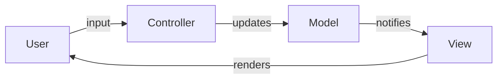

## Model-View-Controller (MVC)

Separates an application into three concerns: the Model (data and business logic), the View (presentation and UI), and the Controller (input handling and coordination). Each component has a single responsibility, and changes to one — say, switching from HTML to JSON output — don't require rewriting the business logic.



MVC is the most widely taught architectural pattern for interactive applications and forms the basis of web frameworks like Spring MVC and ASP.NET MVC.

## Layered architecture

Organizes code into horizontal layers — typically presentation, business logic, and data access — where each layer depends only on the one below it. This enforces separation of concerns at the architectural level and makes it possible to swap one layer (e.g., change the database) without rippling changes through the entire system.

```text
┌─────────────────────────┐
│   Presentation Layer    │   Controllers, views, serializers
├─────────────────────────┤
│   Business Logic Layer  │   Services, domain rules, validation
├─────────────────────────┤
│   Data Access Layer     │   Repositories, SQL, ORM mappings
└─────────────────────────┘
```

The rule of thumb: a layer may call down but never up. If the data access layer needs to trigger a UI update, something is wrong.

## Repository pattern

Abstracts data access behind a collection-like interface, decoupling business logic from the specifics of storage. The service layer asks the repository for objects and saves them back — it never writes SQL or knows whether the data lives in Postgres, a file, or an in-memory map.

```java
public interface OrderRepository {
    Order findById(int id);
    List<Order> findByStatus(String status);
    void save(Order order);
    void delete(int id);
}

public class JpaOrderRepository implements OrderRepository {
    // Uses JPA/Hibernate under the hood
    public Order findById(int id) { return em.find(Order.class, id); }
    // ...
}
```

In tests, you can substitute the real repository with an in-memory implementation — no database needed.
