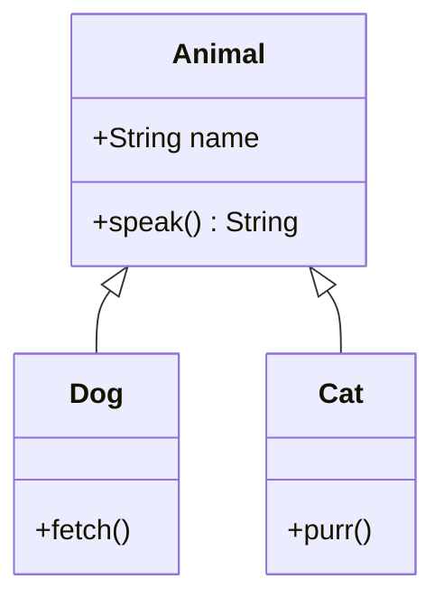
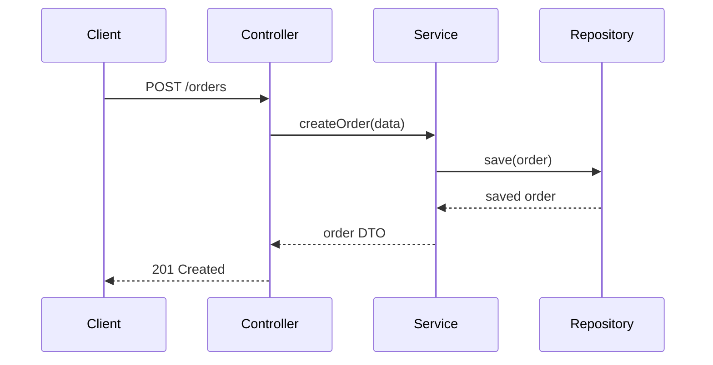
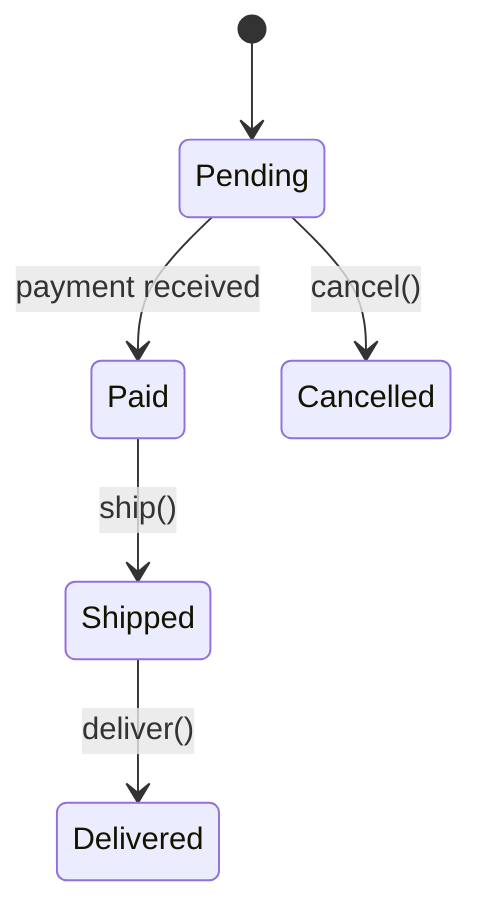

## UML class diagram

Shows classes, their fields and methods, and the relationships between them — inheritance (solid arrow with hollow triangle), composition (filled diamond), aggregation (open diamond), association (plain line), and dependency (dashed arrow). The primary visual tool for communicating OOP design.



A class diagram is a static view — it shows structure, not behavior. For behavior over time, use a sequence diagram.

## UML sequence diagram

Shows how objects interact over time by depicting the order of method calls between them as vertical lifelines and horizontal arrows. Useful for understanding the dynamic behavior of a specific use case or workflow.



Reading top to bottom gives the chronological flow. Dashed arrows represent return values.

## UML state diagram

Models the states an object can be in and the transitions between states triggered by events. Useful for objects with complex lifecycle behavior — orders, connections, workflows — where the valid set of operations depends on the current state.



State diagrams make it easy to spot missing transitions (what happens if a shipped order is cancelled?) and illegal states.

## UML use case diagram

Captures the functional requirements of a system at a high level by showing actors (users, external systems) and the use cases they interact with. A starting point before diving into class design — it answers "who does what" without specifying how.

```text
Actor: Customer
  - Browse catalog
  - Place order
  - Track shipment

Actor: Admin
  - Manage inventory
  - Process refunds
```

Use case diagrams are intentionally vague about implementation. Their value is in scoping and communicating scope with non-technical stakeholders.

## Model checking

Verifying that a UML model satisfies certain properties or constraints before translating it into code. For example, checking that every state has at least one outgoing transition, or that every abstract method is implemented by at least one concrete class.

Model checking catches design errors early — before any code exists — and is especially valuable for complex state machines or concurrent workflows where manual inspection is error-prone.
