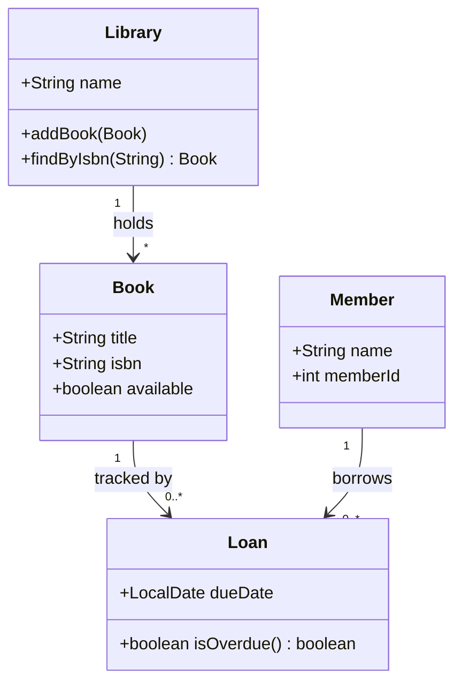

# UML and Visual Modeling

UML (Unified Modeling Language) provides a standardized visual vocabulary for communicating OOP designs. The most useful diagrams are class diagrams (static structure), sequence diagrams (dynamic interaction), and state diagrams (lifecycle behavior).

## Key Points

- **Class diagram** — Shows classes, their members, and relationships (inheritance, composition, association, dependency). The primary structural view.
- **Sequence diagram** — Shows method calls between objects over time. The primary behavioral view for understanding a single use case.
- **State diagram** — Models the states an object can be in and the events that trigger transitions. Essential for lifecycle-heavy objects.
- **Use case diagram** — High-level scope: actors and what they can do. Useful for stakeholder communication, not implementation detail.
- **Model checking** — Verifying model properties (reachability, completeness) before writing code to catch design errors early.

## Example

A simple library system modeled with class relationships:

This diagram communicates the structure at a glance: a Library holds many Books, Members borrow them through Loans, and you can read the field types and key methods without opening any source files.
