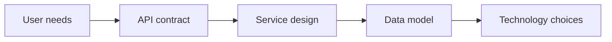

## The Four-Step Framework

The standard structure for a 45-minute system design interview. Interviewers expect you to drive the conversation through these phases without prompting.

1. **Clarify requirements and scope** (3–5 min) — ask questions, narrow the problem, agree on what's in and out of scope.
2. **Propose a high-level design** (10–15 min) — draw the major components and data flows, get buy-in before going deeper.
3. **Deep dive** (15–20 min) — zoom into the hardest parts (data model, scaling bottleneck, consistency trade-off).
4. **Wrap up** (3–5 min) — discuss bottlenecks, failure modes, monitoring, and future extensions.

Skipping step 1 and jumping to boxes on a whiteboard is the most common mistake. Interviewers want to see you scope before you solve.

## Functional vs. Non-Functional Requirements

Functional requirements describe *what* the system does — the features and user-visible behavior. Non-functional requirements describe *how well* it does it — latency, throughput, availability, durability, security, cost.

Both must be explicitly gathered before designing anything. A chat system with 100 users and a chat system with 100 million users share functional requirements but have completely different architectures.

```text
Functional:
  - Users can send messages to other users
  - Users can create group chats
  - Messages are persisted and retrievable

Non-functional:
  - Message delivery latency < 200ms
  - 99.99% availability
  - Support 50M daily active users
  - Messages stored for 5 years
```

## Back-of-the-Envelope Estimation

Quick capacity math that grounds your design in realistic numbers. Interviewers use it to test whether you can reason about scale before committing to an architecture.

Key numbers to memorize:

```text
QPS:
  1M daily users × 10 actions/day = ~120 QPS avg
  Peak ≈ 2–5× average

Storage:
  1M users × 1 KB profile = 1 GB
  1B messages/day × 200 bytes = 200 GB/day ≈ 73 TB/year

Latency (order of magnitude):
  L1 cache ref:        1 ns
  RAM ref:            100 ns
  SSD random read:    100 μs
  HDD seek:           10 ms
  Cross-continent RT: 150 ms
```

The goal is not precision — it's demonstrating that you can tell the difference between a system that fits on one machine and one that needs a hundred.

## Trade-Off Articulation

Interviewers value explicit reasoning about competing constraints more than picking the "right" answer. Every design decision is a trade-off; naming it earns more credit than hiding it.

```text
Common trade-offs to call out:

  Consistency vs. Availability     (CAP)
  Latency vs. Throughput           (batch vs. stream)
  Cost vs. Durability              (replication factor)
  Read latency vs. Write latency   (fan-out on write vs. read)
  Simplicity vs. Scalability       (monolith vs. microservices)
  Accuracy vs. Freshness           (cache TTL, eventual consistency)
```

A strong answer sounds like: "We could use fan-out on write for the news feed, which gives fast reads but makes writes expensive for users with millions of followers. For those celebrity accounts, we'd switch to fan-out on read."

## Working Backwards from Requirements

Start from what the user needs, derive the API contract, then work inward to services and storage. This is the opposite of picking a database first and fitting the problem to it.



Amazon's "working backwards" method is a useful analogy: write the press release (what does the customer see?) before writing the code. In an interview, this means: define the API endpoints before drawing the architecture diagram.

## Defining the API Contract

After scoping requirements, sketch the key API endpoints. This forces you to think about the user-facing interface before internal implementation and gives the interviewer something concrete to react to.

```text
POST /messages
  Body: { "to": "user_id", "text": "hello" }
  Response: 201 { "message_id": "abc123", "timestamp": "..." }

GET /messages?chat_id=xyz&before=timestamp&limit=50
  Response: 200 { "messages": [...], "has_more": true }

GET /chats
  Response: 200 { "chats": [{ "id": "xyz", "last_message": "..." }] }
```

The contract reveals hidden requirements: pagination strategy, sort order, what metadata to return, whether the API is RESTful or event-driven. These details matter more than box diagrams early in the interview.

## Scope Management During the Interview

You cannot design every component in 45 minutes. Explicitly calling out what you're deferring — and why — shows maturity.

Good scope signals:

- "Let's assume authentication is handled by an existing service — I'll focus on the core messaging flow."
- "I'll design the write path first since that's the harder scaling problem, then we can discuss reads."
- "We could add encryption at rest later — for now I'll focus on the delivery guarantees."

Interviewers want depth on one or two hard problems, not a shallow tour of every box.

## The Wrap-Up Checklist

The last few minutes of the interview are where many candidates go silent. Use a mental checklist to identify gaps and show operational awareness.

```text
Wrap-up checklist:
  □ Single points of failure — what happens if this component goes down?
  □ Bottlenecks — where does the system break first under 10× load?
  □ Monitoring — what metrics would you alert on?
  □ Security — authentication, authorization, data encryption?
  □ Cost — is anything unnecessarily expensive at scale?
  □ Extensions — how would you add feature X without redesigning?
```

Proactively identifying a weakness in your own design is stronger than having the interviewer find it.
