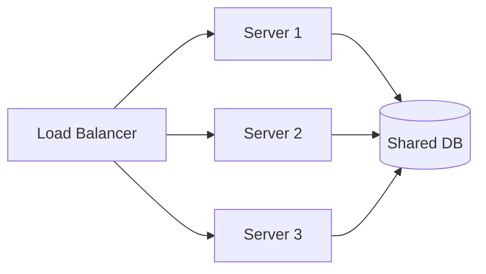

## Vertical Scaling

Adding more CPU, memory, or storage to a single machine. Simple to implement — no code changes needed — but limited by hardware ceilings and creates a single point of failure.

```text
Before:  1 server, 8 GB RAM, 4 cores  →  handles 1,000 QPS
After:   1 server, 64 GB RAM, 32 cores →  handles 8,000 QPS
Ceiling: Can't buy a machine with 10 TB RAM
```

Vertical scaling is the right first move for most early-stage systems. Switch to horizontal scaling when you hit the ceiling, need fault tolerance, or need to scale different components independently.

## Horizontal Scaling

Adding more machines to distribute load. Enables near-linear throughput growth but introduces coordination complexity: state must be shared or partitioned, requests must be routed, and failures are partial rather than total.



The prerequisite for horizontal scaling is that the application tier is stateless — any server can handle any request. If servers hold session state in memory, you need sticky sessions or external session storage first.

## Stateless vs. Stateful Services

A stateless service stores no per-request state on the server itself. Every request carries all the information needed to process it. This makes the service trivially horizontally scalable — add servers, point the load balancer, done.

A stateful service maintains state between requests — caches, WebSocket connections, in-memory sessions. Scaling it requires sticky sessions, state replication, or moving the state to an external store.

```text
Stateless (easy to scale):
  Web API servers, compute workers, API gateways

Stateful (harder to scale):
  Databases, in-memory caches, WebSocket servers,
  stream processors with local state
```

The standard pattern is: keep the application tier stateless, push all state to dedicated stateful services (database, cache, message queue) that are designed for replication and partitioning.

## Describing Load

Quantifying a system's workload using concrete parameters so that scaling decisions are grounded in numbers, not intuition. Without load parameters, "we need to scale" is meaningless.

Key parameters to identify for any system:

```text
  QPS (queries per second)     — average and peak
  Read/write ratio             — 100:1 is very different from 1:1
  Peak-to-average ratio        — spiky traffic needs different strategies
  Data volume                  — total storage, growth rate per day/month
  Concurrent connections       — especially for real-time systems
  Payload size                 — average request/response size
```

In an interview, always ask: "What's the expected number of users? What's the read/write ratio?" These two questions alone determine whether you're designing for one server or a hundred.

## Describing Performance

Measuring how well a system responds under a given load. The two primary metrics are throughput and latency, and they have different optimization strategies.

```text
Throughput:
  Requests per second the system can handle.
  Improve with: horizontal scaling, batching, async processing.

Latency:
  Time from request sent to response received.
  p50  = median (half of requests are faster)
  p95  = 95th percentile (the slow tail)
  p99  = 99th percentile (the worst common case)

  Improve with: caching, CDN, read replicas, connection pooling.
```

Tail latency (p99, p99.9) matters more than the median in large-scale systems. A service with 100ms p50 and 5s p99 feels fast for most users but terrible for 1 in 100 — and at scale that's thousands of users per minute.

## The Scale Cube

A model for thinking about three independent dimensions of scaling. Most interview designs use one or two of these.

```text
  X-axis: Horizontal duplication
    Clone the entire service behind a load balancer.
    Each instance is identical.

  Y-axis: Functional decomposition
    Split by function — separate services for auth, payments, search.
    Each service scales independently.

  Z-axis: Data partitioning (sharding)
    Split by data — user IDs 1–1M on shard A, 1M–2M on shard B.
    Same code, different data subsets.
```

In practice, most systems combine all three: microservices (Y) with multiple instances per service (X) and sharded databases (Z).

## Scaling from Zero to Millions

The standard evolutionary path that appears in almost every system design interview. Understanding which layer becomes the bottleneck at each stage tells you when to introduce each technique.

```text
Stage 1: Single server
  App + DB on one machine. Works for thousands of users.

Stage 2: Separate DB server
  App server and DB server split. DB is no longer competing for CPU.

Stage 3: Add a cache layer
  Redis/Memcached for hot reads. Reduces DB load by 80%+.

Stage 4: Multiple app servers + load balancer
  Horizontal scaling of stateless app tier. App must be stateless.

Stage 5: Database replication
  Leader-follower setup. Reads go to replicas, writes to leader.

Stage 6: CDN for static assets
  Images, CSS, JS served from edge locations.

Stage 7: Database sharding
  Partition data across multiple DB instances when a single
  leader can't handle write volume or storage.

Stage 8: Message queues for async work
  Decouple heavy processing from the request path.
```

You don't need to jump to stage 8 on day one. The interview answer should match the scale described in the requirements.
