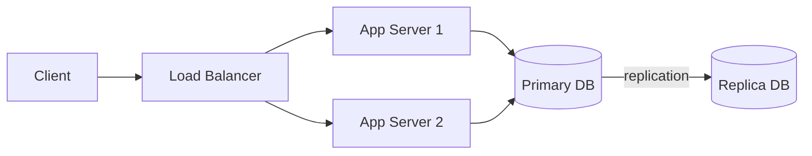
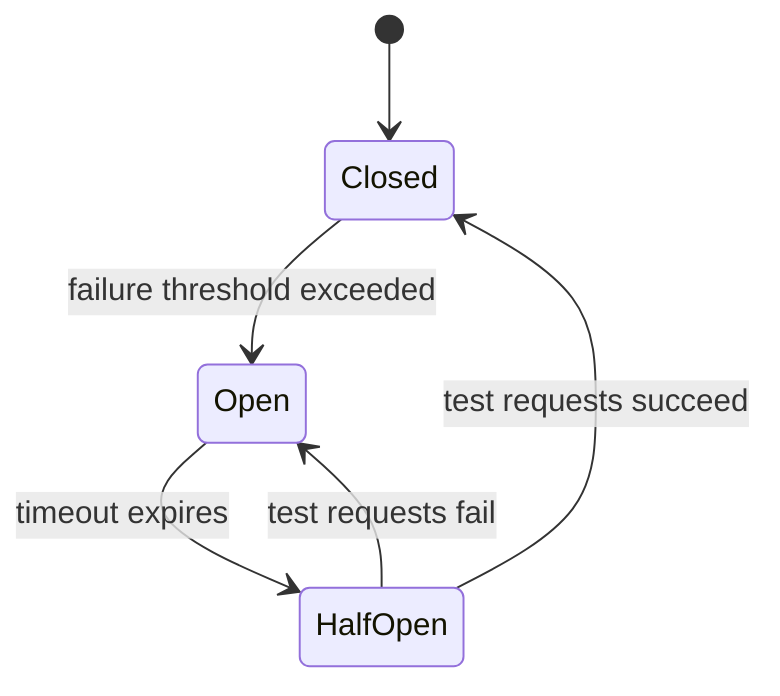

## Availability and the Nines

Availability is the fraction of time a system is operational, expressed as "nines." Each additional nine represents a 10× reduction in allowed downtime.

```text
Availability    Downtime/year    Downtime/month
99%     (2 9s)  3.65 days        7.3 hours
99.9%   (3 9s)  8.77 hours       43.8 minutes
99.99%  (4 9s)  52.6 minutes     4.38 minutes
99.999% (5 9s)  5.26 minutes     26.3 seconds
```

Composite availability for components in series is the product: two services at 99.9% in series give 99.9% × 99.9% = 99.8%. Adding components in parallel (redundancy) improves availability: 1 - (1 - 0.999)² = 99.9999%.

In an interview, always clarify the availability requirement — it determines how much redundancy and failover complexity the design needs.

## MTBF and MTTR

Mean Time Between Failures (MTBF) measures how often a component fails. Mean Time To Repair (MTTR) measures how quickly it's restored. Together they define availability:

```text
Availability = MTBF / (MTBF + MTTR)
```

Reducing MTTR is almost always more practical than increasing MTBF. You can't prevent all hardware failures, but you can detect them in seconds (health checks), fail over automatically (hot standby), and recover state quickly (replication).

```text
Strategy              Reduces
─────────────────────────────────
Better hardware       MTBF
Redundant components  MTBF (system-level)
Automated failover    MTTR
Fast deploys/rollback MTTR
Health check alerts   MTTR
Chaos engineering     Both (finds weak spots)
```

## Redundancy and Replication

Running multiple copies of a component so that failure of one does not bring down the system. This is the foundational technique for all high-availability designs.



Redundancy applies at every layer: multiple app servers, database replicas, redundant network paths, and multi-region deployments. The cost of redundancy scales linearly — 3× replicas means roughly 3× the infrastructure cost — so the availability target determines how much redundancy to invest in.

## Failover Strategies

How a system switches to a backup component when the primary fails. The choice of strategy is a trade-off between recovery speed, cost, and data loss risk.

```text
Cold standby:
  Backup is off. Spin it up on failure.
  Recovery: minutes to hours.
  Cost: low (no idle resources).
  Risk: slow recovery, possible data loss.

Warm standby:
  Backup is running but not serving traffic.
  Receives replicated data.
  Recovery: seconds to minutes.
  Cost: moderate (idle but running).

Hot standby:
  Backup is running AND serving traffic.
  Identical state to primary.
  Recovery: near-instant (already active).
  Cost: high (full duplicate infrastructure).
```

For most interview designs, warm standby with automated failover is the sweet spot. Hot standby (active-active) is justified for systems requiring 99.99%+ availability.

## Active-Active vs. Active-Passive

Two deployment models for redundant components, each with different trade-offs.

```text
Active-Passive:
  One instance serves traffic (active).
  One instance waits (passive/standby).
  + Simpler — no split-brain risk, no conflict resolution.
  - Wasted capacity on the standby.
  - Failover takes nonzero time.

Active-Active:
  All instances serve traffic simultaneously.
  + Better resource utilization.
  + No failover delay — traffic is already distributed.
  - Must handle concurrent writes and conflict resolution.
  - More complex operational model.
```

Active-passive is the default for databases (leader-follower). Active-active is the default for stateless application servers. For multi-region databases, active-active provides lower latency for global users but requires conflict resolution (e.g., CRDTs or last-write-wins).

## SLA, SLO, and SLI

Three related but distinct concepts that translate reliability into measurable commitments.

```text
SLI (Service Level Indicator):
  The measured metric.
  Example: "Request latency p99 over 5 minutes."

SLO (Service Level Objective):
  The internal target for the SLI.
  Example: "p99 latency < 200ms for 99.9% of 5-minute windows."

SLA (Service Level Agreement):
  The contractual commitment to customers, with consequences.
  Example: "If availability drops below 99.95% in a month,
  customer receives a 10% service credit."
```

SLOs drive architecture decisions. If your SLO is 99.99% availability, you need automated failover, multi-region redundancy, and no single points of failure. If it's 99.9%, a single-region warm standby may be enough.

In interviews, tie your design decisions back to the SLO: "Given the 99.99% availability requirement, we need at least two replicas in separate availability zones with automated failover."

## Graceful Degradation

Designing a system to continue operating at reduced capability rather than failing completely when a component is overloaded or unavailable.

```text
Examples:
  Netflix: if the recommendation engine is down, show trending
           content instead of personalized picks.

  Twitter: if the real-time search index lags, show slightly
           stale results rather than an error page.

  E-commerce: if the review service is down, show the product
              page without reviews rather than a 500 error.
```

Graceful degradation requires identifying which features are critical (must work) vs. nice-to-have (can be skipped), and coding fallback paths for non-critical dependencies. Circuit breakers are the standard implementation pattern.

## Circuit Breaker Pattern

A resilience pattern that prevents a failing service from taking down its callers. It works like an electrical circuit breaker: when failures cross a threshold, the circuit "opens" and short-circuits requests instead of waiting for timeouts.

```text
States:
  CLOSED  → requests flow normally; failures are counted.
  OPEN    → requests are immediately rejected (or return fallback).
            After a timeout, transition to half-open.
  HALF-OPEN → a limited number of requests are allowed through
              to test recovery. Success → CLOSED. Failure → OPEN.
```



Without a circuit breaker, a slow downstream service causes cascading timeouts that exhaust thread pools and take down the entire call chain.
