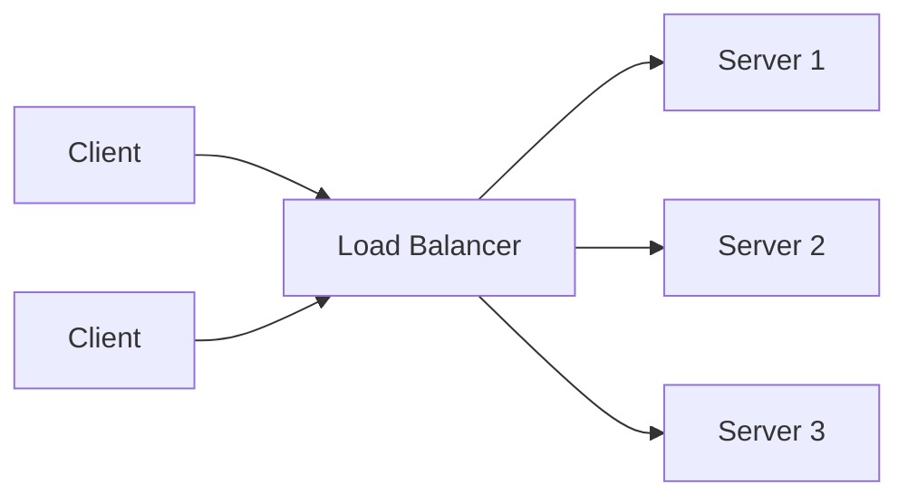
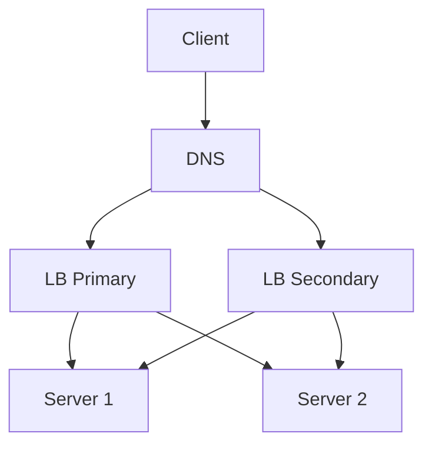

## What a Load Balancer Does

A load balancer sits between clients and a pool of backend servers, distributing incoming requests to spread load and provide failover. It is the enabler of horizontal scaling — without it, adding more servers doesn't help because clients don't know about them.



Load balancers appear at multiple points in a typical architecture: between clients and web servers, between web servers and application servers, and between application servers and databases.

## DNS-Level Load Balancing

The simplest form: the DNS server returns different IP addresses for the same domain name, rotating through a list of backend IPs.

```text
$ dig api.example.com
;; ANSWER SECTION:
api.example.com.  60  IN  A  10.0.1.1
api.example.com.  60  IN  A  10.0.1.2
api.example.com.  60  IN  A  10.0.1.3
```

Advantages: no special hardware, works globally. Disadvantages: DNS responses are cached by clients and resolvers (the TTL controls how long), so changes propagate slowly. Cannot do health checks — a dead server's IP stays in the rotation until the DNS record is updated. Best used for coarse-grained, multi-region routing rather than per-request balancing.

## Layer 4 vs. Layer 7 Load Balancing

The two main categories, named after OSI model layers:

```text
Layer 4 (Transport):
  Routes based on IP address and TCP/UDP port.
  Does NOT inspect packet contents.
  Fast — operates at the connection level.
  Cannot route by URL path, HTTP header, or cookie.
  Example: AWS NLB, HAProxy in TCP mode.

Layer 7 (Application):
  Routes based on HTTP content: URL path, headers, cookies, body.
  Can make smart routing decisions (e.g., /api → app servers,
  /static → CDN origin, /admin → admin cluster).
  Slower than L4 due to content inspection.
  Can terminate SSL, compress responses, cache.
  Example: AWS ALB, NGINX, HAProxy in HTTP mode.
```

In most system design interviews, assume Layer 7 load balancing because it enables content-aware routing and is the default for HTTP services.

## Load Balancing Algorithms

The algorithm determines which backend receives each incoming request.

```text
Round Robin:
  Each request goes to the next server in order.
  Simple, fair when requests are uniform.

Weighted Round Robin:
  Servers with higher weight get more requests.
  Useful when backends have different capacities.

Least Connections:
  Send to the server with the fewest active connections.
  Adapts to servers with different processing speeds.

IP Hash:
  Hash the client IP to pick a server.
  Same client always hits the same server (sticky).
  Useful for session affinity without cookies.

Consistent Hashing:
  Hash-ring approach where adding/removing a server
  only redistributes a fraction of traffic.
  Used in caching layers and distributed storage.

Random:
  Pick a server at random. Surprisingly effective
  at scale due to the law of large numbers.
```

Least connections is the best general-purpose default. Round robin is fine when all backends are identical and requests have similar cost.

## Health Checks

Load balancers must detect unhealthy backends and stop routing traffic to them. Health checks are the mechanism.

```text
Active health check:
  LB periodically sends a probe (HTTP GET /health, TCP connect).
  If a server fails N consecutive checks, mark it unhealthy.
  When it passes M consecutive checks, mark it healthy again.

Passive health check:
  LB monitors actual request success/failure rates.
  If error rate exceeds a threshold, mark the server unhealthy.
  No extra probe traffic, but slower to detect issues.
```

A good health endpoint checks real dependencies:

```json
GET /health
{
  "status": "healthy",
  "db": "connected",
  "cache": "connected",
  "uptime_seconds": 84321
}
```

Returning 200 with `"status": "healthy"` only when the server can actually serve traffic prevents routing requests to a server that's running but broken (e.g., lost its database connection).

## Sticky Sessions (Session Affinity)

Ensuring that all requests from the same client go to the same backend server. Needed when the backend stores session state in memory.

```text
Implementation options:
  Cookie-based: LB sets a cookie with the backend server ID.
  IP-based:     Hash client IP → consistent backend.
  Header-based: Custom header identifies the session.
```

Sticky sessions break horizontal scaling because load becomes uneven and failover loses the session. The better long-term solution is to make the app tier stateless and store session state externally (Redis, database). Use sticky sessions only as a short-term workaround.

## Load Balancer as a Single Point of Failure

The load balancer itself can become a SPOF if there's only one. Production deployments use redundant load balancers.



Common approaches: active-passive LB pair with a floating IP (VRRP), or DNS-based failover between two LB endpoints. Cloud load balancers (ALB, NLB, GCP LB) handle this transparently — they're already redundant behind the scenes.

In an interview, if you draw a single load balancer, briefly note: "In production this would be a redundant pair" — it shows you know it's a SPOF without spending time on the implementation.
