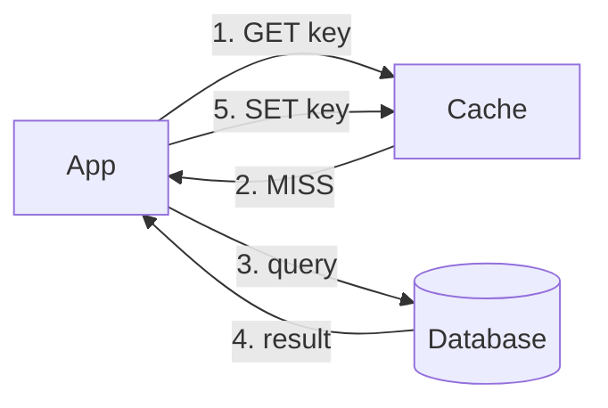
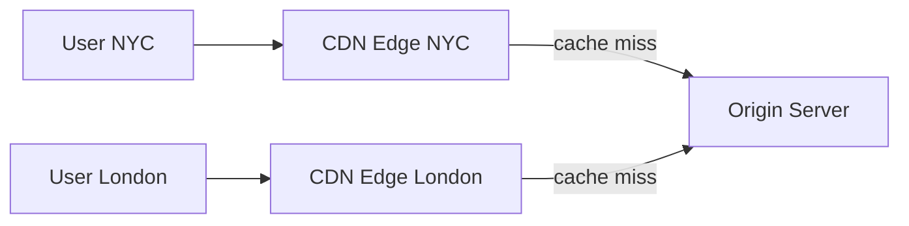

## When Caching Helps

A cache is a fast-access storage layer that holds frequently or recently accessed data. It reduces latency and backend load by serving repeated reads from memory instead of hitting the database or computing the result again.

Caching is effective when:

```text
✓ Reads dominate writes (high read:write ratio)
✓ Access follows a power-law distribution (hot keys)
✓ Data can tolerate being slightly stale
✓ The same data is requested repeatedly

✗ Less effective when every request is unique
✗ Risky when data must be perfectly fresh (financial balances)
```

In system design interviews, adding a cache layer is one of the highest-leverage moves — it typically reduces database load by 80–95% for read-heavy workloads.

## Cache-Aside (Lazy Loading)

The most common caching pattern. The application manages both the cache and the database explicitly.

```text
Read path:
  1. App checks cache for key.
  2. Cache HIT  → return cached value.
  3. Cache MISS → read from DB, write to cache, return value.

Write path:
  1. App writes to DB.
  2. App invalidates (deletes) the cache key.
  3. Next read will miss and repopulate the cache.
```



Advantages: only caches data that's actually requested; cache failure doesn't break the system (just slower reads). Disadvantage: first request after a miss or invalidation is slow.

## Read-Through and Write-Through

The cache sits inline — the application talks only to the cache, and the cache manages the database interaction.

```text
Read-through:
  App reads from cache. On miss, the cache itself loads
  from DB and stores the result before returning it.

Write-through:
  App writes to cache. The cache synchronously writes
  to DB before confirming the write.
  + Cache and DB are always in sync.
  - Every write has the latency of both cache and DB.
```

Write-through is good for systems where consistency between cache and database matters more than write latency. Combine with read-through for a simple, consistent model — but accept that you're caching data even if it's rarely read.

## Write-Behind (Write-Back)

Writes go to the cache immediately and are asynchronously flushed to the database in batches. The cache acts as a write buffer.

```text
Write path:
  1. App writes to cache → returns immediately.
  2. Cache batches writes and flushes to DB periodically.

  + Very low write latency (cache is in-memory).
  + Batching reduces DB write load.
  - Risk of data loss if cache crashes before flush.
  - Harder to debug (DB state lags behind cache state).
```

Used in write-heavy systems where some data loss is acceptable (metrics, analytics, activity feeds). Not appropriate for financial data or anything requiring strict durability.

## Eviction Policies

When the cache is full, something must be removed to make room. The eviction policy determines what gets dropped.

```text
LRU (Least Recently Used):
  Evict the item accessed longest ago.
  Default choice — works well for most workloads.

LFU (Least Frequently Used):
  Evict the item accessed fewest times.
  Better when popular items stay popular over time.

FIFO (First In, First Out):
  Evict the oldest item regardless of access pattern.
  Simple but often suboptimal.

TTL (Time To Live):
  Items expire after a fixed duration.
  Not an eviction policy per se, but limits staleness.
  Often combined with LRU.

Random:
  Evict a random item. Surprisingly close to LRU
  in practice and much simpler to implement.
```

In interviews, say "LRU with a TTL" as the default and move on unless the access pattern clearly calls for something else.

## Cache Invalidation

The hardest problem in caching: ensuring cached data stays consistent with the source of truth. Phil Karlton famously said there are only two hard problems in computer science — cache invalidation and naming things.

```text
Strategies:

TTL-based expiration:
  Set a TTL (e.g., 60 seconds) on every cached entry.
  Simple, but data can be stale for up to the TTL duration.

Event-driven invalidation:
  When data changes, publish an event that triggers
  cache deletion. More complex, but data is fresher.

Versioned keys:
  Include a version number in the cache key (user:42:v3).
  When data changes, increment the version.
  Old versions expire naturally via TTL.

Write-through invalidation:
  Delete/update cache on every write.
  Most consistent, but every write path must know about the cache.
```

In practice, most systems use TTL as the baseline safety net plus event-driven invalidation for critical data. The TTL ensures that even if an invalidation event is missed, stale data eventually expires.

## CDN (Content Delivery Network)

A globally distributed cache for static and dynamic content. CDN edge servers are placed in data centers close to end users, reducing latency by serving content without hitting the origin server.



```text
What CDNs cache well:
  Static assets: images, CSS, JS, fonts, videos
  API responses with Cache-Control headers
  Pre-rendered HTML pages

Pull CDN: Edge fetches from origin on first request, caches for TTL.
Push CDN: Origin proactively pushes content to edges before it's requested.
```

CDNs reduce origin load, improve latency for global users, and absorb traffic spikes. In a system design interview, adding "static assets served via CDN" is a quick win that shows you understand the read path.

## Distributed Cache Architecture

For large-scale systems, a single cache server isn't enough. Distributed caches partition data across multiple nodes using consistent hashing.

```text
Single cache server:
  Simple, but limited by one machine's memory.
  SPOF — if it dies, all requests hit the DB.

Distributed cache (Redis Cluster, Memcached):
  Data is partitioned across N nodes via consistent hashing.
  Each key lives on one node.
  Nodes can be added/removed with minimal key redistribution.
  Replication (Redis Cluster) provides fault tolerance.

  Typical setup: 3–6 Redis nodes, each with a replica,
  behind a cluster-aware client library.
```

When discussing caching in an interview, note whether the cache is a single node or a cluster. At high scale (millions of keys, high QPS), a cluster is implied.
