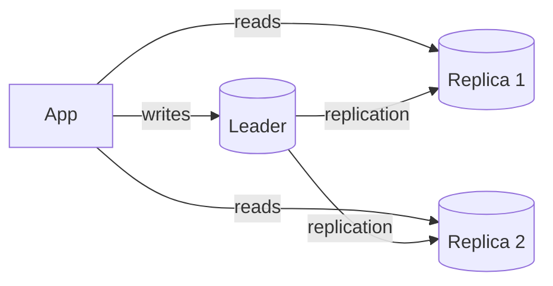

## Relational Database

Stores data in tables with fixed schemas, enforces relationships via foreign keys, and supports SQL for complex queries. The default choice for system design interviews when data is structured, relationships matter, and you need transactional guarantees.

```text
When to choose relational:
  ✓ Structured data with known schema
  ✓ Complex queries with joins, aggregations, filters
  ✓ Transactional guarantees (ACID) required
  ✓ Data integrity and referential constraints matter

When to consider alternatives:
  ✗ Schema changes frequently or varies per record
  ✗ Write volume exceeds what a single leader can handle
  ✗ Data is naturally hierarchical or graph-shaped
```

Examples: PostgreSQL, MySQL, Amazon Aurora, Google Cloud Spanner.

## ACID Properties

The four guarantees that define transactional behavior in relational databases. In interviews, know what each letter means and when you'd sacrifice one.

```text
Atomicity:    All operations in a transaction succeed, or none do.
              Transfer $100: debit AND credit both happen, or neither.

Consistency:  A transaction moves the database from one valid state
              to another. Constraints (foreign keys, check constraints)
              are never violated.

Isolation:    Concurrent transactions don't interfere with each other.
              The degree of isolation varies by isolation level.

Durability:   Once a transaction is committed, the data survives
              crashes, power loss, and restarts. Typically achieved
              with write-ahead logs (WAL) flushed to disk.
```

NoSQL databases typically trade some ACID properties for scalability. DynamoDB, Cassandra, and MongoDB offer weaker consistency models (BASE) in exchange for horizontal scalability.

## Normalization vs. Denormalization

Normalization eliminates data redundancy by splitting data into related tables. Denormalization intentionally reintroduces redundancy to speed up reads.

```text
Normalized (3NF):
  users:    id, name, email
  orders:   id, user_id, total
  items:    id, order_id, product_id, quantity

  + No duplicate data, easy to update
  + Referential integrity enforced
  - Reads require joins across multiple tables

Denormalized:
  orders:   id, user_name, user_email, total, items_json

  + Single-table reads, no joins, faster queries
  - Duplicate data (user_name stored in every order)
  - Updates must touch multiple rows
  - Risk of data inconsistency
```

In system design interviews, start normalized and denormalize specific read paths when the join cost becomes a bottleneck. Denormalization is a caching strategy at the storage level.

## Indexing

An index is a data structure that speeds up read queries at the cost of write overhead and storage. Choosing the right indexes is the single highest-leverage database optimization.

```text
B-tree index (default):
  Balanced tree structure. O(log N) lookups.
  Supports equality, range queries, and sorting.
  Used by default in PostgreSQL, MySQL.

Hash index:
  O(1) equality lookups, but no range queries.
  Used for in-memory caches and some key-value stores.

Composite index:
  Index on multiple columns: (user_id, created_at).
  Supports queries that filter on the leftmost prefix.

Covering index:
  Includes all columns needed by a query.
  The query is answered entirely from the index,
  never touching the table itself.
```

```text
CREATE INDEX idx_orders_user_date ON orders(user_id, created_at DESC);

-- This query uses the composite index efficiently:
SELECT * FROM orders WHERE user_id = 42 ORDER BY created_at DESC LIMIT 20;

-- This query cannot use it (missing leftmost column):
SELECT * FROM orders WHERE created_at > '2024-01-01';
```

Rule of thumb: index columns that appear in WHERE, JOIN, and ORDER BY clauses. But every index slows down writes (INSERT, UPDATE, DELETE) because the index must be updated too.

## Database Replication

Maintaining copies of data across multiple servers to improve read throughput, availability, and durability.

```text
Leader-Follower (Primary-Replica):
  One leader handles all writes.
  Followers replicate the leader's write log.
  Read traffic can go to any follower.
  If the leader fails, a follower is promoted.

  + Simple, well understood
  + Read scaling via replicas
  - Single leader is a write bottleneck
  - Replication lag (followers may be slightly behind)

Multi-Leader:
  Multiple nodes accept writes.
  Each leader replicates to the others.
  + Write scaling, multi-region low-latency writes
  - Conflict resolution required for concurrent writes

Leaderless:
  Any node can accept reads and writes.
  Uses quorum (W + R > N) for consistency.
  + No single point of failure for writes
  - More complex client logic
  Example: Amazon DynamoDB, Apache Cassandra
```



## Database Sharding

Splitting data across multiple database instances by a shard key. Each shard holds a subset of the data. This is how you scale writes and storage beyond what a single server can handle.

```text
Choosing a shard key:
  Good key: user_id (even distribution, queries are per-user)
  Bad key:  country (uneven — US shard gets 10× the traffic)
  Bad key:  created_at (recent shard gets all writes)

Sharding strategies:
  Range-based: user_id 1–1M → shard A, 1M–2M → shard B
    + Range queries within a shard are efficient
    - Hotspots if data is not uniformly distributed

  Hash-based: hash(user_id) % N → shard index
    + Even distribution
    - Range queries span all shards

Challenges:
  - Cross-shard joins are expensive or impossible
  - Resharding (adding/removing shards) requires data migration
  - Transactions across shards need distributed coordination
```

Sharding is a last resort — try read replicas, caching, and query optimization first. When you do shard, consistent hashing minimizes data movement during rebalancing.

## Read Replicas

Follower nodes that serve read traffic, scaling read throughput while the leader handles writes. The simplest form of database scaling for read-heavy workloads.

```text
Typical setup:
  1 leader (handles all writes)
  2–5 read replicas (handle read traffic)

Read replica routing:
  Application routes writes → leader
  Application routes reads  → replicas (round robin or least-lag)

Replication lag:
  Replicas may be milliseconds to seconds behind the leader.
  A user who writes and immediately reads may not see their
  own write if routed to a lagging replica.

Mitigations:
  - Read-after-write from leader for the user's own data
  - Monitor replication lag and route away from laggy replicas
  - Use synchronous replication for critical replicas (at the
    cost of write latency)
```

Read replicas are almost always the right first scaling step for a read-heavy relational database before considering sharding.
