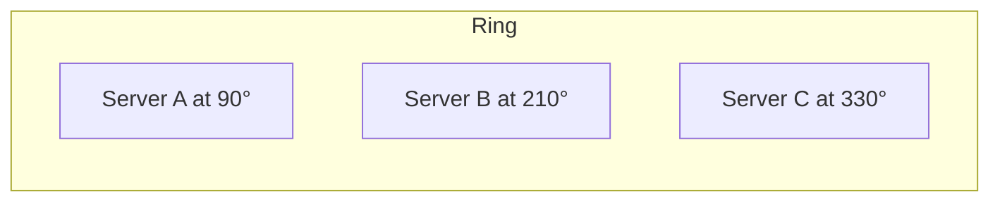
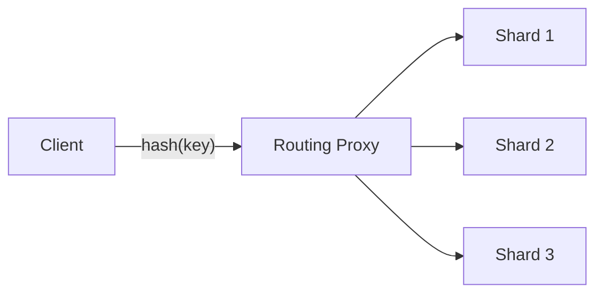

## Horizontal Partitioning (Sharding)

Distributing rows across multiple database instances by a partition key. Each shard holds a subset of the data. Sharding is how you scale writes and storage beyond what a single server can handle.

```text
Before sharding:
  1 DB server holds all 1B rows → disk full, writes slow

After sharding (by user_id):
  Shard A: user_id 1–250M
  Shard B: user_id 250M–500M
  Shard C: user_id 500M–750M
  Shard D: user_id 750M–1B
  → Each shard holds 250M rows, 4× write capacity
```

The shard key choice is the most critical decision. A good key distributes data evenly and keeps related queries on the same shard. A bad key creates hotspots or forces cross-shard queries.

## Choosing a Shard Key

The shard key determines which shard holds each row. The right choice depends on the query patterns.

```text
Good shard keys:
  user_id     — queries are per-user, even distribution
  order_id    — even distribution, one order lives on one shard
  tenant_id   — multi-tenant SaaS, each tenant's data is co-located

Bad shard keys:
  country     — US shard gets 50% of traffic (hotspot)
  created_at  — latest shard gets all writes (hotspot)
  status      — only a few values, massive imbalance

Questions to ask:
  1. Does the key distribute data evenly?
  2. Do most queries include this key in the WHERE clause?
  3. Can I avoid cross-shard joins for the critical queries?
```

If no single column works well, consider a composite shard key (e.g., `tenant_id + user_id`) that balances distribution with query locality.

## Range Partitioning

Assigns contiguous key ranges to shards. Each shard owns a range like `[A–F]`, `[G–M]`, `[N–Z]`.

```text
Example — sharding by username first letter:
  Shard 1: A–F
  Shard 2: G–M
  Shard 3: N–Z

Advantages:
  ✓ Range queries within a shard are efficient
    (e.g., "all users from A to C")
  ✓ Simple to understand and implement

Disadvantages:
  ✗ Hotspots if data is not uniformly distributed
    (more names start with S than X)
  ✗ One shard may grow much larger than others
```

Range partitioning works well when the key is uniformly distributed (auto-increment IDs, timestamps with even write rates) and range queries are common.

## Hash Partitioning

Hashes the key and maps it to a shard: `shard = hash(key) % N`. Distributes data more uniformly than range partitioning.

```text
hash("user_42")  = 738291  →  738291 % 4  = shard 3
hash("user_43")  = 192847  →  192847 % 4  = shard 3
hash("user_100") = 456123  →  456123 % 4  = shard 3 → wait, that's unlucky

Advantages:
  ✓ Even distribution regardless of key patterns
  ✓ No hotspots from sequential keys

Disadvantages:
  ✗ Range queries become scatter-gather (must hit all shards)
  ✗ Adding/removing a shard (changing N) rehashes everything
    → consistent hashing solves this
```

## Consistent Hashing

A ring-based scheme where adding or removing a node only reassigns a fraction of keys, unlike modular hashing where changing N rehashes everything.

```text
Modular hashing: hash(key) % N
  Add 1 server: N changes from 4 to 5
  → Nearly ALL keys remap to different servers
  → Massive cache miss storm

Consistent hashing: keys and servers map to positions on a ring
  Add 1 server: only keys between the new server and its
  predecessor are reassigned
  → Only ~1/N of keys move
```



```text
How it works:
  1. Hash each server to a position on a circle (0–2^32).
  2. Hash each key to a position on the same circle.
  3. Walk clockwise from the key's position.
  4. The first server encountered owns that key.
  5. Adding server D between A and B only steals keys
     from B that now fall between A and D.
```

Consistent hashing is used in DynamoDB, Cassandra, Memcached, and CDN routing.

## Virtual Nodes (Vnodes)

Each physical node maps to multiple positions on the hash ring rather than just one. This solves the uneven distribution problem that occurs when nodes are spaced non-uniformly on the ring.

```text
Without vnodes (3 physical nodes):
  Node A at position 100   → owns 40% of the ring
  Node B at position 200   → owns 20% of the ring
  Node C at position 300   → owns 40% of the ring
  → Uneven load!

With vnodes (3 physical nodes, 100 vnodes each):
  Node A at positions 5, 42, 87, 103, 156, ...
  Node B at positions 12, 58, 91, 134, 178, ...
  Node C at positions 23, 67, 95, 147, 189, ...
  → Each node owns ~33% of the ring
```

When a node is added, it picks new vnode positions and takes a proportional share from all existing nodes. When a node is removed, its vnodes are distributed among the remaining nodes. This makes rebalancing much smoother.

## Rebalancing

Redistributing data when the cluster grows or shrinks. Must happen without downtime or significant performance degradation.

```text
Triggers:
  - A node is added (scale up)
  - A node is removed (scale down or failure)
  - Data distribution becomes skewed (hotspot mitigation)

Approaches:
  Fixed partitions:
    Create more partitions than nodes at the start (e.g., 256 partitions
    across 4 nodes = 64 per node). When a 5th node joins, move some
    partitions to it. No data re-hashing, just partition reassignment.

  Dynamic partitions:
    Split a partition when it exceeds a size threshold.
    Merge partitions when they shrink below a threshold.
    Used by HBase and some DynamoDB configurations.

  Consistent hashing with vnodes:
    Add vnodes for the new node; only affected key ranges migrate.
```

Rebalancing should be automatic in production but may need manual approval for safety. Never let rebalancing block incoming traffic.

## Request Routing

How a client finds the right shard for a given key. Three common approaches.

```text
1. Client-side routing:
   Client knows the partition map and routes directly.
   + No extra hop
   - Client must keep the map up to date

2. Routing tier (proxy):
   A stateless proxy (e.g., ZooKeeper-aware proxy) routes
   requests to the correct shard.
   + Clients are simple
   - Extra network hop and potential bottleneck

3. Gossip-based discovery:
   Any node can receive any request and forwards to the
   correct owner. Nodes share partition maps via gossip.
   + No central coordinator
   - Eventually consistent routing during rebalancing
   Used by: Cassandra
```


