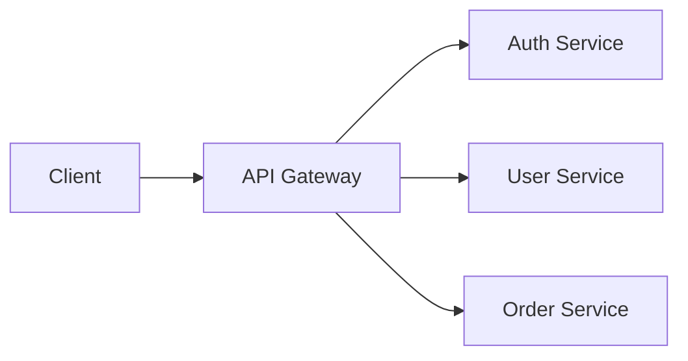

## REST

A resource-oriented API style over HTTP. REST treats everything as a resource identified by a URL and uses standard HTTP methods to operate on it.

```text
GET    /users/42        → Read user 42
POST   /users           → Create a new user
PUT    /users/42        → Replace user 42
PATCH  /users/42        → Partially update user 42
DELETE /users/42        → Delete user 42
```

```text
Principles:
  Stateless   — each request carries all needed context (no server-side sessions)
  Cacheable   — responses indicate cacheability via headers (Cache-Control, ETag)
  Uniform     — consistent URL structure and HTTP semantics
  Layered     — intermediaries (proxies, CDNs) can operate without special knowledge
```

REST is the default for public-facing APIs in system design interviews. It's simple, well-understood, and cacheable. Use it unless the problem specifically needs something else.

## RPC (Remote Procedure Call)

Calling a remote function as if it were local. The client calls a stub function, the framework serializes the arguments, sends them over the network, and deserializes the response.

```text
gRPC example:

  // Protocol Buffer definition
  service UserService {
    rpc GetUser(GetUserRequest) returns (User);
    rpc CreateUser(CreateUserRequest) returns (User);
  }

  // Client code (looks like a local call)
  user = user_service.GetUser(GetUserRequest(id=42))
```

```text
gRPC advantages over REST:
  Binary serialization (Protocol Buffers) — smaller, faster
  Strict schema with code generation — type-safe clients
  Bidirectional streaming — real-time data flows
  HTTP/2 multiplexing — multiple requests on one connection

gRPC disadvantages:
  Not browser-friendly (needs gRPC-Web proxy)
  Harder to debug (binary payloads, not curl-friendly)
  Less ecosystem support for public APIs
```

## REST vs. RPC — When to Use Which

The choice depends on who the consumer is and what the communication pattern looks like.

```text
Choose REST when:
  ✓ Public-facing API (external developers consume it)
  ✓ CRUD operations on resources
  ✓ Cacheability matters (HTTP caching, CDN)
  ✓ You want broad tooling support (curl, Postman, browsers)

Choose RPC (gRPC) when:
  ✓ Internal service-to-service communication
  ✓ Low latency and high throughput required
  ✓ Strict contracts with code generation
  ✓ Streaming data (chat, real-time updates, file transfer)
  ✓ Polyglot environment (generate clients in any language)
```

Many systems use both: REST for the public API gateway, gRPC for internal microservice communication.

## API Gateway

A single entry point that sits between clients and backend services, handling cross-cutting concerns so individual services don't have to.



```text
Responsibilities:
  Request routing      — /users → User Service, /orders → Order Service
  Authentication       — validate JWT/API key before forwarding
  Rate limiting        — throttle per-client request rates
  SSL termination      — handle HTTPS, forward plain HTTP internally
  Response aggregation — combine results from multiple services
  Logging/monitoring   — centralized request logging and metrics

Examples: AWS API Gateway, Kong, NGINX, Envoy
```

In interviews, drawing an API gateway between clients and your microservices shows you've thought about the public interface and cross-cutting concerns.

## Proxy vs. Reverse Proxy

Two types of intermediary that sit between clients and servers, but they face in opposite directions.

```text
Forward Proxy (client-side):
  Client → Proxy → Internet → Server
  Acts on behalf of the CLIENT.
  Hides client identity from the server.
  Use: corporate firewalls, content filtering, anonymity.

Reverse Proxy (server-side):
  Client → Internet → Reverse Proxy → Server
  Acts on behalf of the SERVER.
  Hides server identity/topology from the client.
  Use: load balancing, SSL termination, caching, DDoS protection.

Examples of reverse proxies: NGINX, HAProxy, Cloudflare, AWS ALB
```

In system design, reverse proxies are far more common. Any time you draw a load balancer or API gateway, it's functioning as a reverse proxy.

## Long-Polling, WebSockets, and SSE

Three approaches for real-time or near-real-time server-to-client communication, each with different trade-offs.

```text
Long-Polling:
  Client sends HTTP request. Server holds it open until
  new data is available (or timeout). Client immediately
  sends a new request after receiving a response.
  + Works through all HTTP infrastructure
  - High overhead (new HTTP request per message)
  - Not truly real-time (small gaps between requests)

WebSockets:
  Persistent, bidirectional TCP connection after an HTTP upgrade.
  Both client and server can send messages at any time.
  + Low latency, true bidirectional
  + Low overhead after connection established
  - Stateful — harder to load-balance
  - Some proxies/firewalls don't support it

Server-Sent Events (SSE):
  Server pushes events to client over a single HTTP connection.
  Unidirectional: server → client only.
  + Simple, works with standard HTTP
  + Built-in reconnection and event IDs
  - Client → server communication needs separate HTTP requests
```

```text
Decision guide:
  Need bidirectional?        → WebSockets (chat, gaming)
  Server → client only?      → SSE (live scores, notifications)
  Legacy/firewall concerns?  → Long-polling (fallback)
```

## Idempotency

An operation that produces the same result when called multiple times. Critical for API design in distributed systems where network failures cause retries.

```text
Idempotent:
  GET  /users/42          — reading is always idempotent
  PUT  /users/42 {name:X} — replacing with same data is idempotent
  DELETE /users/42        — deleting twice has same effect (gone)

NOT idempotent:
  POST /orders            — creates a new order each time!

Making POST idempotent:
  Client sends an idempotency key with each request.
  Server stores the key → response mapping.
  If the same key arrives again, return the stored response
  without executing the operation again.

  POST /payments
  Idempotency-Key: abc-123-def
  { "amount": 100, "to": "merchant_42" }

  First call:  processes payment, stores result for key abc-123-def
  Retry call:  returns stored result, no duplicate payment
```

In interviews, mention idempotency whenever you design a write API, especially for payments, orders, or any operation where duplicates cause real harm.
