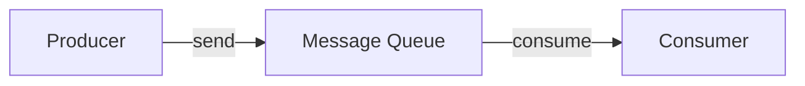

## Message Queue

A buffer that decouples producers from consumers, enabling asynchronous processing. The producer sends a message to the queue and continues immediately; the consumer processes it later.



```text
Why use a message queue:
  Decoupling    — producer and consumer don't need to know about each other
  Load leveling — absorbs traffic spikes; consumers process at their own pace
  Fault isolation — if the consumer is down, messages queue up and are
                    processed when it recovers (no lost work)
  Async work    — move slow operations (email, image processing, analytics)
                  off the request path

Examples: Apache Kafka, RabbitMQ, Amazon SQS, Redis Streams
```

In system design interviews, adding a message queue is the standard answer for "how do you handle slow operations without blocking the user?"

## Point-to-Point vs. Pub/Sub

Two messaging models that serve different communication patterns.

```text
Point-to-Point (Queue):
  Each message is consumed by exactly ONE consumer.
  Once consumed, the message is removed from the queue.
  Use when: work must be done exactly once (order processing,
            task dispatch, job scheduling).
  Example: SQS, RabbitMQ queue

  Producer → [Queue] → Consumer A gets msg 1
                     → Consumer B gets msg 2
                     → Consumer A gets msg 3

Pub/Sub (Topic):
  Each message is delivered to ALL subscribers.
  Subscribers independently receive their own copy.
  Use when: multiple systems need to react to the same event
            (new order → notify warehouse, update analytics,
             send confirmation email).
  Example: Kafka topic, SNS, Redis pub/sub

  Producer → [Topic] → Subscriber A gets ALL messages
                     → Subscriber B gets ALL messages
                     → Subscriber C gets ALL messages
```

Kafka blurs the line: it's a persistent pub/sub log where consumer groups enable point-to-point semantics within a group while multiple groups each get all messages.

## Message Delivery Guarantees

How the system handles failures during message production, transmission, and consumption.

```text
At-most-once:
  Send and forget. If delivery fails, the message is lost.
  + Simplest, fastest.
  - Acceptable only when losing messages is OK (metrics, logs).

At-least-once:
  Retry until acknowledged. May produce duplicates if the ack
  is lost after the consumer processes the message.
  + No data loss.
  - Consumer must handle duplicates (idempotent processing).
  Most common default (Kafka, SQS, RabbitMQ with acks).

Exactly-once:
  Each message is processed exactly once. The hardest guarantee.
  Usually achieved by combining at-least-once delivery with
  idempotent consumers or transactional processing.
  + Ideal semantics.
  - Complex, higher latency.
  Kafka supports exactly-once within a Kafka-to-Kafka pipeline.
```

In interviews, say "at-least-once with idempotent consumers" — it's the practical sweet spot for most systems.

## Consumer Groups

Multiple consumers sharing a topic's partitions so that each message is processed by one consumer in the group. This scales consumption horizontally.

```text
Topic with 4 partitions:

  Consumer Group A (3 consumers):
    Consumer 1 → Partition 0, Partition 1
    Consumer 2 → Partition 2
    Consumer 3 → Partition 3
    → Each message processed by exactly one consumer in Group A

  Consumer Group B (2 consumers):
    Consumer 1 → Partition 0, Partition 1
    Consumer 2 → Partition 2, Partition 3
    → Each message ALSO processed by exactly one consumer in Group B

  Result: both groups see all messages (pub/sub between groups),
          but within each group it's point-to-point (parallel processing).
```

Key constraint: the number of consumers in a group cannot exceed the number of partitions. If you have 4 partitions and 6 consumers, 2 consumers sit idle. Plan partition count based on expected parallelism.

## Backpressure

When a consumer can't keep up with the producer's rate, the system must handle the imbalance explicitly. Without backpressure, queues grow unboundedly, memory fills up, and the system crashes.

```text
Strategies:

  Buffer and absorb:
    Let the queue grow (if persistent). Consumer catches up
    during low-traffic periods. Works for spiky traffic.
    Risk: queue grows indefinitely under sustained overload.

  Drop messages:
    Discard messages when the queue exceeds a threshold.
    Acceptable for metrics/logs, not for orders.

  Slow the producer:
    Return HTTP 429 or apply flow control at the producer.
    The producer retries with exponential backoff.
    Protects the system but may affect user experience.

  Scale consumers:
    Auto-scale consumer instances based on queue depth.
    Best long-term solution but takes time to spin up.
```

In interviews, mention backpressure when designing any queue-based system: "If the email consumer falls behind, we auto-scale consumers and alert if queue depth exceeds 10,000."

## Dead Letter Queue (DLQ)

Messages that repeatedly fail processing are moved to a separate queue for investigation rather than blocking the main pipeline or being silently dropped.

```text
Flow:
  1. Consumer attempts to process message.
  2. Processing fails (bad format, downstream error, bug).
  3. Message is retried N times (e.g., 3 retries with backoff).
  4. After N failures, message is moved to the DLQ.
  5. Main queue continues processing other messages.
  6. Engineers inspect and fix DLQ messages manually or via
     automated remediation.

Benefits:
  - Prevents one bad message from blocking the entire queue
  - Preserves the failed message for debugging
  - Provides a metric: DLQ depth indicates processing health
```

```text
Example (SQS):
  Main queue: order-processing
  DLQ:        order-processing-dlq (max receives: 3)

  An order with an invalid address fails 3 times,
  then appears in the DLQ for manual review.
  The 10,000 other orders continue processing normally.
```

Always include a DLQ in queue-based designs. It's a one-line addition that shows operational maturity.
