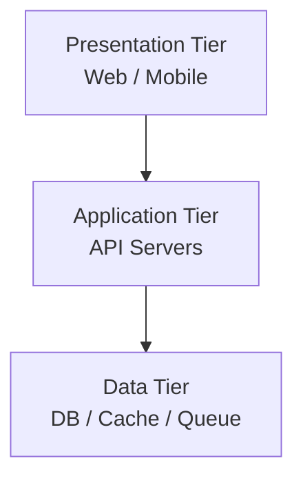
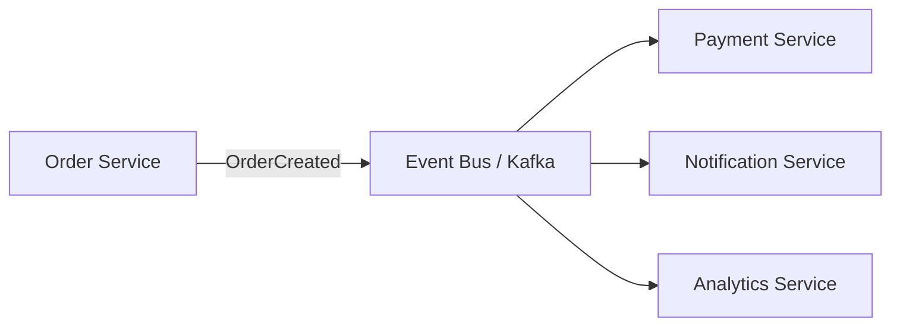

## Monolith vs. Microservices

Two approaches to structuring an application, with different trade-offs for development speed, operational complexity, and scaling flexibility.

```text
Monolith:
  Single deployable unit. All code in one process.
  + Simple to develop, test, deploy, and debug.
  + No network calls between components.
  + One database, one deployment pipeline.
  - Entire app must scale together (even if only one part is hot).
  - Large codebase becomes hard to change safely.
  - One bad deployment takes down everything.

Microservices:
  Each feature is an independently deployable service.
  + Scale each service independently based on its load.
  + Teams own their services end-to-end.
  + Deploy and roll back individual services.
  - Network calls between services add latency and failure modes.
  - Operational complexity: service discovery, distributed tracing,
    config management, N deployment pipelines.
  - Data consistency across services is hard (no shared DB transactions).
```

In interviews, don't default to microservices. Start with a monolith-friendly design and decompose only when specific scaling or organizational pressures justify it.

## Service Boundaries

Deciding what gets its own service is the hardest part of microservice design. The goal is high cohesion within services and loose coupling between them.

```text
Good boundaries (aligned with business domains):
  User Service       — registration, profiles, authentication
  Order Service      — cart, checkout, order lifecycle
  Payment Service    — payment processing, refunds, invoicing
  Notification Service — email, push, SMS delivery

Bad boundaries (technical layers):
  Database Service   — all DB access goes through one service
  Validation Service — all input validation in one place
  → Creates a bottleneck, every change touches the shared service

Boundary signals:
  ✓ The service owns its own data (separate database or schema)
  ✓ Changes to one service rarely require changes to another
  ✓ The service can be developed and deployed independently
  ✗ Two services always deploy together → they should be one service
  ✗ Services share a database table → coupling, not independence
```

Domain-Driven Design (DDD) calls these "bounded contexts" — each microservice maps to a bounded context where the domain model is internally consistent.

## Multi-Tier Architecture

Separating a system into logical layers, each with a distinct responsibility. The foundation for most web architectures.

```text
Three-tier architecture:

  Presentation Tier:
    What the user sees. Web app, mobile app, or API client.
    Stateless. Talks to the application tier via HTTP/gRPC.

  Application Tier:
    Business logic, request handling, orchestration.
    Stateless (ideally). Horizontally scalable.
    Talks to the data tier for persistence.

  Data Tier:
    Databases, caches, message queues, object storage.
    Stateful. Scaling strategies: replication, sharding, caching.
```



Multi-tier is not the same as microservices. You can have a monolith with three tiers, or microservices where each service internally has its own tiers.

## Event-Driven Architecture

Services communicate through events rather than direct synchronous calls. A service emits an event when something happens; other services react to it independently.

```text
Synchronous (request-driven):
  Order Service → calls Payment Service → calls Notification Service
  → Tight coupling, cascading failures, high latency.

Event-driven:
  Order Service emits "OrderCreated" event.
  Payment Service listens and processes payment.
  Notification Service listens and sends confirmation.
  Analytics Service listens and updates metrics.
  → Loose coupling, independent scaling, easy to add new consumers.
```



```text
Trade-offs:
  + Services are decoupled — adding a new consumer doesn't change the producer
  + Better fault isolation — one slow consumer doesn't block others
  + Natural audit log — events are the history of what happened
  - Harder to trace end-to-end flows (distributed tracing helps)
  - Eventual consistency between services (no shared transactions)
  - Debugging is harder — "why didn't this happen?" requires log correlation
```

## Service Discovery

How services find each other's network locations in a dynamic environment where instances are created, moved, and destroyed frequently.

```text
Client-Side Discovery:
  The calling service queries a service registry (e.g., Consul, etcd)
  to get the list of available instances, then picks one.
  + No extra hop (client routes directly)
  - Client must include discovery logic and handle stale entries

Server-Side Discovery:
  The calling service sends requests to a load balancer or proxy.
  The LB queries the registry and routes to a healthy instance.
  + Simple clients (just call one endpoint)
  - Extra network hop through the LB
  Example: Kubernetes Services (kube-proxy routes to pods)

Service Mesh (Sidecar Proxy):
  Each service instance has a sidecar proxy (e.g., Envoy via Istio).
  The proxy handles discovery, routing, retries, and mTLS.
  + Service code is unaware of the mesh
  + Uniform observability and security
  - Operational complexity of managing the mesh
```

In Kubernetes-based designs, service discovery is handled automatically. Mention it in interviews to show you know that "call the other service" isn't as simple as it sounds.

## Saga Pattern

A way to manage distributed transactions across microservices without a shared database. Each step has a compensating action that undoes it if a later step fails.

```text
Example: Place an order (3 services, no shared DB)

  Step 1: Order Service → create order (status: pending)
  Step 2: Payment Service → charge customer
  Step 3: Inventory Service → reserve stock

  If Step 3 fails:
    Compensate Step 2: refund customer
    Compensate Step 1: cancel order

Orchestration saga:
  A central orchestrator service coordinates the steps.
  + Clear control flow, easy to understand.
  - Orchestrator is a potential SPOF and coupling point.

Choreography saga:
  Each service emits events; the next service reacts.
  + No central coordinator, fully decoupled.
  - Harder to trace and debug the overall flow.
```

Sagas trade strong consistency (ACID across services) for eventual consistency with compensating actions. In interviews, mention sagas when the interviewer asks "how do you handle a failure partway through a multi-service operation?"
