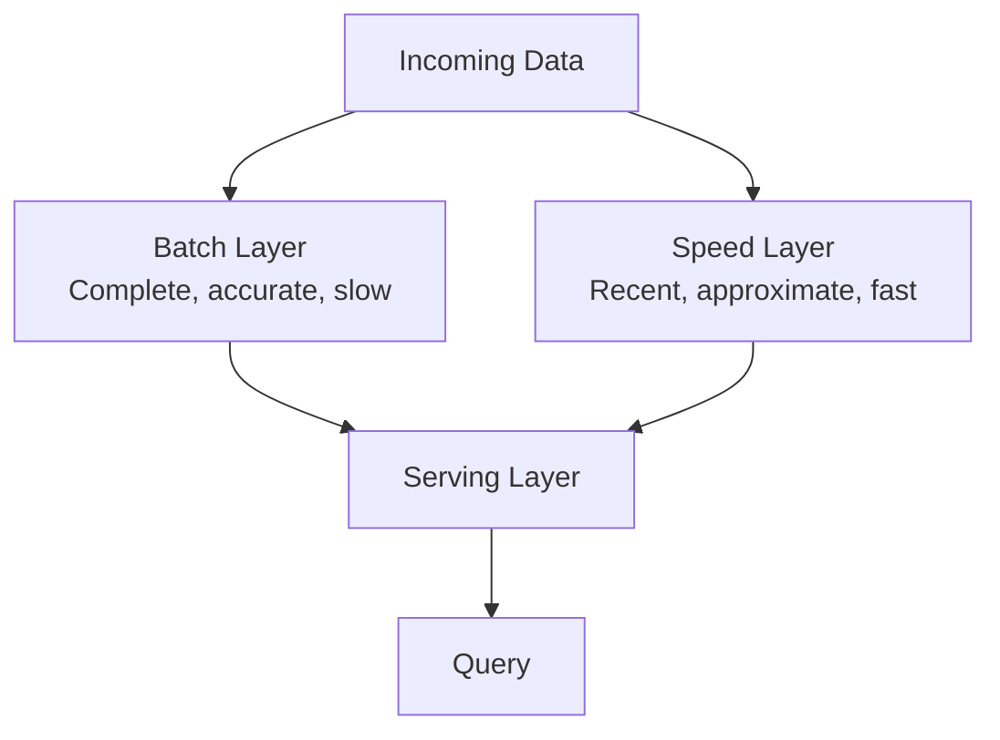

## Object Storage

Stores data as objects (key → blob + metadata) rather than files in a hierarchy or blocks on a disk. Designed for massive durability and scale at low cost.

```text
API:
  PUT    bucket/photos/user42/profile.jpg  → upload object
  GET    bucket/photos/user42/profile.jpg  → download object
  DELETE bucket/photos/user42/profile.jpg  → remove object
  LIST   bucket/photos/user42/             → list objects by prefix

Properties:
  Flat namespace (prefix-based, not true directories)
  11 nines durability (99.999999999% — S3)
  Unlimited storage (no provisioning needed)
  High latency for first byte vs. block storage
  Not mountable as a filesystem

Use for: images, videos, backups, logs, data lake files,
         static website assets, ML training data
```

Examples: Amazon S3, Google Cloud Storage, Azure Blob Storage, MinIO (self-hosted). In interviews, use object storage for any media or large-blob storage requirement.

## Distributed File System

A file system spanning multiple machines, optimized for large sequential reads and batch processing. Unlike object storage, it supports hierarchical directories and append operations.

```text
HDFS (Hadoop Distributed File System):
  Files split into 128 MB blocks, replicated 3× across nodes.
  NameNode: stores file metadata (directory tree, block locations).
  DataNodes: store actual blocks.

  Optimized for:
    ✓ Large files (GB to TB)
    ✓ Sequential reads (full scans for MapReduce)
    ✓ Write-once, read-many patterns

  Not designed for:
    ✗ Low-latency random reads
    ✗ Many small files (NameNode memory bottleneck)
    ✗ Concurrent writers to the same file
```

In modern architectures, object storage (S3) has largely replaced HDFS for data lake storage because it's cheaper, more durable, and doesn't require cluster management. Spark and Flink read from S3 natively.

## Batch Processing

Processing large datasets in scheduled jobs. High throughput, high latency — results are available minutes to hours after the data arrives.

```text
Pattern:
  Input:  a large dataset (log files, database dump, event archive)
  Process: transform, aggregate, join, filter
  Output:  derived dataset, report, index, ML model

MapReduce (original model):
  Map:    process input records in parallel, emit key-value pairs
  Shuffle: group by key across nodes
  Reduce: aggregate values for each key

Modern frameworks:
  Apache Spark — in-memory processing, 10–100× faster than MapReduce
  Apache Flink — streaming-first but supports batch
  dbt          — SQL-based transformations in the warehouse

Use cases:
  ETL pipelines, data warehouse loading, training ML models,
  generating search indexes, daily analytics reports
```

## Stream Processing

Processing events in real time as they arrive. Low latency per event, continuous operation — results are available in seconds.

```text
Pattern:
  Input:  continuous stream of events (Kafka topic, event bus)
  Process: filter, aggregate, enrich, join with lookup data
  Output:  real-time dashboard, alert, derived stream, database update

Frameworks:
  Kafka Streams — lightweight, runs as a Kafka consumer
  Apache Flink  — powerful, supports event-time processing and exactly-once
  Spark Structured Streaming — micro-batches, good for near-real-time

Use cases:
  Real-time fraud detection, live dashboards, alerting,
  real-time recommendations, log monitoring
```

```text
Batch vs. Stream:
                    Batch               Stream
  Latency          Minutes–hours       Milliseconds–seconds
  Throughput       Very high            Moderate per event
  Completeness     Full dataset         Incomplete (windowed)
  Complexity       Simpler              Windowing, late data, ordering
  When to use      Reports, ETL, ML    Alerts, live dashboards, fraud
```

## Lambda Architecture

Combines a batch layer and a speed layer to get both accuracy and freshness. The batch layer processes the complete dataset for correct results; the speed layer processes recent data for low-latency approximate results.



```text
Advantages:
  + Accurate batch results + real-time speed results
  + Batch layer can reprocess and correct errors

Disadvantages:
  - Maintaining two codebases (batch + stream) for the same logic
  - Complexity of merging batch and speed layer results
  - The Kappa Architecture alternative: use stream processing
    for everything, replay the stream for reprocessing
```

## Change Data Capture (CDC)

Streaming database changes as events to downstream consumers. Every INSERT, UPDATE, and DELETE becomes an event, enabling derived systems to stay in sync without polling.

```text
Source DB → CDC → Event Stream → Downstream consumers

Implementation:
  Log-based CDC: read the database's write-ahead log (WAL/binlog).
    + No impact on source DB performance.
    + Captures all changes, including deletes.
    Tool: Debezium (reads MySQL binlog, Postgres WAL, etc.)

  Trigger-based CDC: database triggers write changes to an outbox table.
    + Works with any database.
    - Adds write overhead to the source DB.

Use cases:
  Populating a search index (Postgres → CDC → Elasticsearch)
  Syncing a cache (DB → CDC → Redis invalidation)
  Feeding a data warehouse (OLTP → CDC → analytics pipeline)
  Cross-service data sync without shared databases
```

## Event Sourcing

Storing every state change as an immutable event rather than overwriting current state. The current state is derived by replaying the event log.

```text
Traditional (state-based):
  UPDATE accounts SET balance = 950 WHERE id = 42;
  → Only the current balance is stored. History is lost.

Event sourcing:
  Event 1: AccountCreated { id: 42, balance: 1000 }
  Event 2: Withdrawal     { id: 42, amount: 50 }
  Event 3: Deposit        { id: 42, amount: 200 }
  → Current balance = replay(events) = 1000 - 50 + 200 = 1150

Advantages:
  ✓ Complete audit trail (every change is recorded)
  ✓ Temporal queries ("what was the balance on March 1?")
  ✓ Easy to add new projections (materialized views from events)
  ✓ Debugging: replay events to reproduce any state

Disadvantages:
  ✗ Event log grows forever (snapshotting mitigates this)
  ✗ Querying current state requires replay or a materialized view
  ✗ Schema evolution of events is tricky
```

Event sourcing often pairs with CQRS (Command Query Responsibility Segregation): writes go to the event store, reads come from a materialized view optimized for the query pattern.
