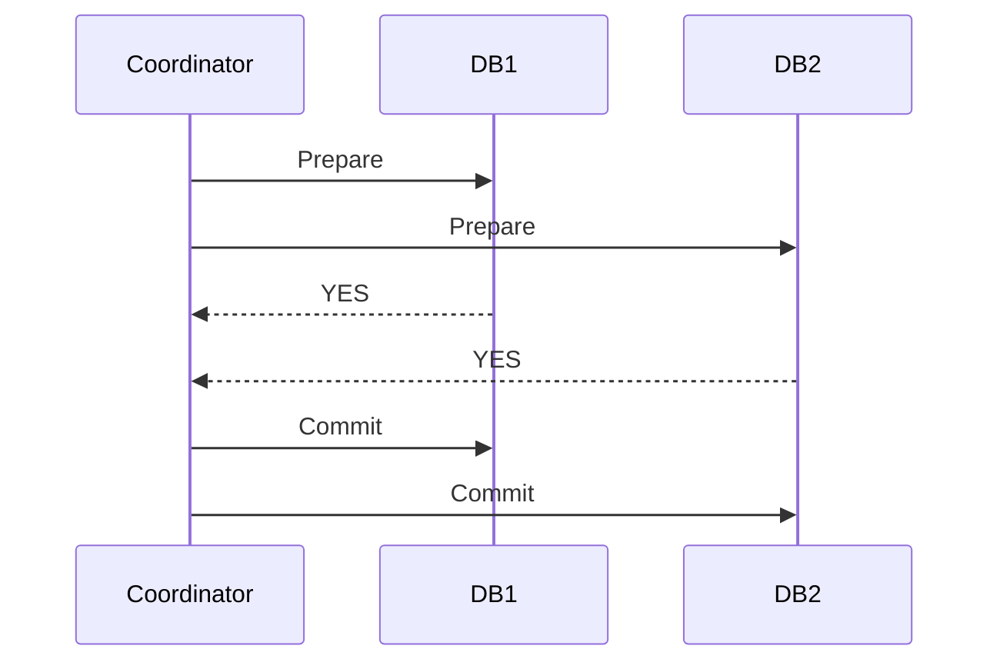

## Transaction

A unit of work that either fully completes or fully aborts. Transactions shield application developers from the complexity of concurrent access and partial failure.

```text
Without transactions:
  1. Debit $100 from account A.      ← succeeds
  2. Credit $100 to account B.       ← system crashes!
  Result: $100 disappeared.

With a transaction:
  BEGIN;
    UPDATE accounts SET balance = balance - 100 WHERE id = 'A';
    UPDATE accounts SET balance = balance + 100 WHERE id = 'B';
  COMMIT;
  → Both succeed, or both are rolled back. Money is never lost.
```

In system design interviews, transactions matter when multiple writes must be atomic (transfers, inventory reservation, order placement) or when concurrent users might conflict (booking the same seat, claiming the same username).

## Isolation Levels

The degree to which concurrent transactions are shielded from each other. Higher isolation prevents more anomalies but costs more in performance and concurrency.

```text
Read Committed:
  No dirty reads (can't see uncommitted writes).
  No dirty writes (can't overwrite uncommitted writes).
  May see non-repeatable reads (same query, different results).
  Default in PostgreSQL, Oracle.

Repeatable Read / Snapshot Isolation:
  Transaction sees a consistent snapshot from its start time.
  Prevents non-repeatable reads.
  May still allow write skew (two transactions read, then both write
  based on the now-stale read, creating an invalid state).
  Default in MySQL InnoDB.

Serializable:
  Transactions behave as if they ran one at a time.
  Prevents all anomalies including write skew and phantoms.
  Slowest — uses locking or serialization conflict detection.
```

In interviews, know the default isolation level (Read Committed for Postgres, Repeatable Read for MySQL) and when you'd upgrade to Serializable (financial transactions, seat booking, username uniqueness).

## Optimistic vs. Pessimistic Concurrency

Two strategies for handling concurrent access to the same data.

```text
Pessimistic (lock first, then operate):
  Acquire a lock before reading/writing.
  Other transactions wait until the lock is released.
  + Guarantees no conflicts.
  - Blocks other transactions → reduced throughput.
  - Risk of deadlocks.
  Best when: conflicts are frequent (popular concert tickets).

  SELECT * FROM seats WHERE id = 42 FOR UPDATE;
  -- Locks row 42 until transaction commits

Optimistic (operate, then check):
  Read data, do work, check for conflicts at commit time.
  If another transaction modified the data, abort and retry.
  + No locking → high throughput when conflicts are rare.
  - Wasted work on abort (must retry the entire transaction).
  Best when: conflicts are rare (most users editing different data).

  UPDATE seats SET booked_by = 'user_A'
  WHERE id = 42 AND version = 3;
  -- If version changed, 0 rows updated → conflict detected → retry
```

## Two-Phase Locking (2PL)

A pessimistic concurrency protocol that guarantees serializability. Transactions go through two phases: a growing phase (acquire locks) and a shrinking phase (release locks).

```text
Growing phase:
  Transaction acquires locks as needed (shared for reads, exclusive for writes).
  No locks are released during this phase.

Shrinking phase:
  Transaction releases all locks (typically at commit/abort).
  No new locks are acquired.

Result:
  Equivalent to serial execution of transactions.
  But: can deadlock when two transactions each hold a lock the other needs.

Deadlock handling:
  Timeout: abort the transaction if it waits too long for a lock.
  Detection: build a wait-for graph, find cycles, abort one transaction.
  Prevention: acquire all locks upfront in a predefined order.
```

2PL is used internally by databases when running at Serializable isolation. You rarely interact with it directly but should understand why Serializable is slower.

## Two-Phase Commit (2PC)

A protocol for atomic commits across multiple nodes (databases, services). Ensures that either all nodes commit or all abort — even across different databases.

```text
Phase 1 — Prepare:
  Coordinator asks all participants: "Can you commit?"
  Each participant writes to its WAL and responds YES or NO.

Phase 2 — Commit or Abort:
  If ALL say YES → Coordinator sends COMMIT to all.
  If ANY says NO → Coordinator sends ABORT to all.
```



```text
Problem: blocking
  If the coordinator crashes after sending PREPARE but before
  sending COMMIT/ABORT, participants are stuck — they've promised
  to commit but don't know whether to actually do it.
  They hold locks and wait for the coordinator to recover.

Alternatives:
  Saga pattern: compensating transactions instead of distributed locks.
  Three-phase commit: adds a pre-commit phase, but rarely used in practice.
```

## Consensus Algorithms

Protocols that allow distributed nodes to agree on a value despite failures. The foundation for leader election, distributed locking, and coordination services.

```text
Raft (most commonly discussed in interviews):
  Elects a leader via majority vote.
  Leader replicates log entries to followers.
  Committed when majority acknowledges.
  If leader fails, followers elect a new one.
  Understandable by design — explicitly built to be easier than Paxos.

Paxos:
  The original consensus algorithm. Correct but notoriously hard
  to understand and implement. Variants: Multi-Paxos, Fast Paxos.

Zab (ZooKeeper Atomic Broadcast):
  Used by Apache ZooKeeper. Similar to Raft in practice.

Practical systems:
  ZooKeeper — distributed coordination, config management, leader election
  etcd       — Kubernetes' key-value store for cluster state (uses Raft)
  Consul     — service discovery and configuration (uses Raft)
```

In interviews, say "we'd use ZooKeeper (or etcd) for leader election and distributed locking" rather than implementing consensus from scratch. Know that it requires a majority of nodes to be available (3 nodes tolerates 1 failure, 5 nodes tolerates 2).
