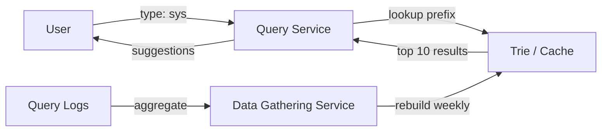

## Inverted Index

The core data structure behind full-text search. Maps terms to the list of documents containing them — the reverse of a normal index that maps documents to terms.

```text
Documents:
  doc1: "the quick brown fox"
  doc2: "the lazy brown dog"
  doc3: "quick fox jumps"

Inverted index:
  "brown" → [doc1, doc2]
  "dog"   → [doc2]
  "fox"   → [doc1, doc3]
  "jumps" → [doc3]
  "lazy"  → [doc2]
  "quick" → [doc1, doc3]
  "the"   → [doc1, doc2]

Query: "quick brown" → intersection of [doc1, doc3] ∩ [doc1, doc2] = [doc1]
```

Elasticsearch and Solr (both built on Apache Lucene) maintain inverted indexes with additional metadata: term frequency, document positions, and field-level boosting. In interviews, mention an inverted index whenever the requirements include full-text search.

## Trie (Prefix Tree)

A tree where each path from root to node represents a character sequence. Used as the foundation for autocomplete and typeahead suggestion systems because prefix lookups are O(length of prefix), not O(number of entries).

```text
Trie for: ["app", "apple", "api", "bat", "ball"]

          (root)
         /      \
        a        b
       / \        \
      p   p        a
     /     \      / \
    p*      i*   t*   l
   /                   \
  l                     l*
   \
    e*

  * = end of a valid word

  Search "ap" → traverse a → p → return all descendants:
    ["app", "apple", "api"]
```

In practice, autocomplete systems use a trie (or similar prefix structure) combined with frequency/ranking data. The top-K most popular completions for each prefix are precomputed and cached.

## Search Autocomplete System

A complete design for typeahead suggestions, combining data collection, index building, and low-latency serving.



```text
Data gathering (offline):
  Collect query logs → count frequency per query.
  Build/rebuild the trie weekly or daily.
  For each prefix node, store the top K queries by frequency.

Query service (online):
  User types "sys" → lookup in trie → return precomputed top 10.
  Latency target: < 50ms (users expect instant results).

Optimizations:
  Cache top results for popular prefixes (Redis or in-memory).
  Limit trie depth (e.g., max 50 characters).
  Filter offensive or low-quality suggestions.
  Personalize by weighting recent user queries.

Storage:
  Compact trie in memory (~1 GB for 100M unique queries).
  Distributed across multiple nodes for availability.
```

## Relevance Ranking

Ordering search results so that the most useful ones appear first. The ranking function combines multiple signals to score each document.

```text
Core signals:

  TF-IDF (Term Frequency–Inverse Document Frequency):
    TF:  how often the term appears in THIS document (local relevance)
    IDF: how rare the term is across ALL documents (discriminating power)
    Score = TF × IDF
    "the" has high TF but low IDF (appears everywhere → low score).
    "kubernetes" has moderate TF and high IDF → high score.

  BM25:
    An improved version of TF-IDF used by Elasticsearch.
    Accounts for document length and has saturation on term frequency.

  Additional signals:
    Click-through rate    — users voted with their clicks
    Recency               — newer documents rank higher
    Popularity            — more views/shares = more relevant
    Personalization       — user's past behavior and preferences
    Page authority        — backlinks, domain reputation (web search)
```

In interviews, mention TF-IDF or BM25 as the baseline text relevance model, then layer on behavioral signals (CTR, recency) for a production ranking function.

## Full-Text Search Architecture

How a search system is built and scaled in a system design interview.

```text
Write path:
  Application DB → CDC → Indexing Pipeline → Elasticsearch
  (Keep the search index as a derived data store, not the source of truth.)

Read path:
  User query → Search API → Elasticsearch → ranked results

Elasticsearch cluster:
  Index sharded across N nodes (by document ID hash).
  Each shard has replicas for availability and read scaling.
  Query hits all shards (scatter) → coordinator merges (gather).

Scaling:
  Index size grows → add more shards (reindex).
  Query QPS grows → add more replicas.
  Complex queries slow → precompute or cache popular queries.

When NOT to use full-text search:
  Simple exact-match lookups → database index is enough.
  Primary key lookups → key-value store.
  Only use Elasticsearch when the requirements include fuzzy matching,
  relevance ranking, faceted search, or free-text queries.
```
