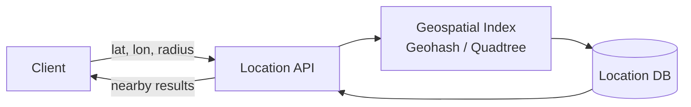

## Geohash

Encodes a latitude/longitude pair into a string where shared prefixes indicate proximity. The longer the shared prefix, the closer the two points.

```text
Example:
  (37.7749, -122.4194) → "9q8yyk"  (San Francisco)
  (37.7750, -122.4180) → "9q8yym"  (nearby)
  (40.7128, -74.0060)  → "dr5ru7"  (New York — different prefix)

Properties:
  Each character adds precision (~5 km → ~1 m at 12 characters).
  Prefix search finds all points in a region:
    WHERE geohash LIKE '9q8yy%'  → all points in that grid cell.

  Works with standard B-tree indexes — no special geospatial index.
  Caveat: points near geohash cell boundaries may have different
  prefixes even if very close. Query the cell AND its 8 neighbors.
```

Geohash is the simplest geospatial index to implement and explain in an interview. Use it for proximity services with relatively static data (restaurants, gas stations).

## Quadtree

Recursively subdivides 2D space into four quadrants. Adapts resolution to data density — dense areas get finer subdivisions, sparse areas stay coarse.

```text
     ┌───────┬───────┐
     │       │ NE    │
     │  NW   ├──┬──┤ │
     │       │  │  │ │
     ├───────┼──┴──┤ │
     │       │     │ │
     │  SW   │ SE  │ │
     │       │     │ │
     └───────┴─────┘

  Split a quadrant when it contains more than K points.
  Stop splitting below a minimum cell size.

Properties:
  In-memory tree structure.
  Query: traverse from root, pruning quadrants outside the search radius.
  Insert: find the leaf, insert the point, split if over capacity.
  Build time: O(N log N) for N points.
  Lookup: O(log N) for a point query.
```

Quadtrees work well for in-memory geospatial indexing with non-uniform data distributions (many restaurants in Manhattan, few in the desert).

## Google S2

Maps the Earth's sphere to a Hilbert curve, producing 64-bit cell IDs with locality-preserving properties. Points that are close on the sphere have numerically similar cell IDs.

```text
How it works:
  1. Project the sphere onto 6 cube faces.
  2. Subdivide each face into a hierarchy of cells (up to level 30).
  3. Map cells to a 1D Hilbert curve → 64-bit cell ID.

Properties:
  Unlike geohash, S2 cells are roughly equal in area at each level.
  Range queries: "all cells in a circle of radius R" → a set of
  cell ID ranges that can be looked up in a standard B-tree.
  Used by Google Maps, Uber H3 (similar concept), Foursquare.

vs. Geohash:
  S2 cells have more uniform area (geohash cells vary by latitude).
  S2 is more complex to implement but more precise for global services.
```

In interviews, mention S2 if the problem involves global-scale location services. For simpler cases, geohash is sufficient.

## Proximity Service Design

A service that answers "what's near me?" — returning nearby points of interest within a radius. Read-heavy with relatively static data.



```text
Design:
  1. Store locations in a database with geohash or geospatial index.
  2. Client sends (latitude, longitude, radius, category).
  3. Service computes geohash of the client's location.
  4. Query: all locations matching the geohash prefix ± neighbors.
  5. Filter by exact distance (geohash gives a bounding box, not a circle).
  6. Return top results ranked by distance, rating, or relevance.

Scaling:
  Read-heavy (100:1 read:write) → cache aggressively.
  Locations rarely change → rebuild geospatial index periodically.
  Shard by geohash prefix for geographic distribution.

When data is dynamic (Uber driver locations):
  Real-time updates via WebSocket or pub/sub.
  In-memory geospatial index (Redis GEOADD) updated on every location ping.
  Query: GEORADIUS key longitude latitude radius_km COUNT 20
```

## Geofencing

Detecting when a device enters or exits a predefined geographic boundary. Used for location-triggered notifications, delivery zones, and compliance.

```text
Use cases:
  "Notify the restaurant when the driver is 2 minutes away."
  "Send a promotion when a user enters the mall."
  "Block the service outside the operating region."

Implementation:
  Predefine zones as polygons (or circles).
  On each location update, check: is the point inside any polygon?

  Point-in-polygon test: ray casting algorithm (O(edges per polygon)).
  Optimize with a spatial index: only test polygons near the point.

  For millions of zones: store zones in a quadtree or R-tree.
  For simple circular zones: distance < radius is cheaper than polygon test.
```
