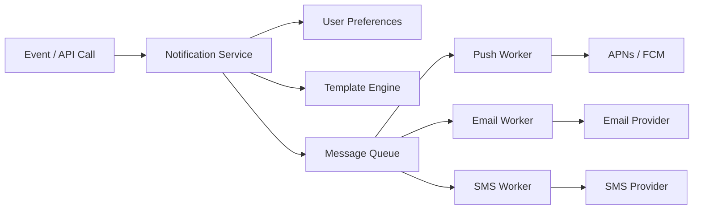
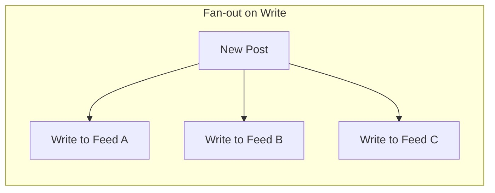

## Push Notification System

Delivers messages to mobile and web clients via platform-specific channels. The system doesn't send push notifications directly — it delegates to platform services that maintain the connection to each device.

```text
Channels:
  iOS:     Apple Push Notification Service (APNs)
  Android: Firebase Cloud Messaging (FCM)
  Web:     Web Push Protocol (via service workers)
  SMS:     Twilio, AWS SNS
  Email:   SendGrid, SES

Flow:
  1. App server sends notification to Push Service.
  2. Push Service looks up device tokens for the user.
  3. Push Service sends to APNs/FCM/Web Push.
  4. Platform delivers to the device.
```

```text
Key design decisions:
  Device token storage:  user_id → [device_tokens] (a user can have multiple devices)
  Rate limiting:         don't spam — limit notifications per user per hour
  User preferences:      opt-in/out per channel and notification type
  Retry and failure:     exponential backoff; remove invalid device tokens
```

## Notification Service Architecture

A centralized system that dispatches notifications across multiple channels with templates, user preferences, and delivery tracking.



```text
Components:
  Notification Service:  receives trigger, checks preferences, renders template
  Message Queue:         decouples sending from triggering (async, retryable)
  Channel Workers:       one per channel, each handles its delivery protocol
  Delivery Tracker:      records sent, delivered, opened, failed status
  Template Engine:       "Hi {{name}}, your order {{order_id}} has shipped"

Analytics:
  Track delivery rates, open rates, and click-through rates per channel.
  Feed into A/B testing for notification content and timing.
```

## Presence / Online Status

Tracking which users are currently online. Sounds simple, but at scale it requires careful handling of flapping connections and efficient fan-out.

```text
Implementation options:

  Heartbeat-based:
    Client sends a heartbeat every 30 seconds.
    Server marks user as "online" and sets a TTL.
    If no heartbeat for 60 seconds → mark offline.
    + Works with any transport.
    - 30-second granularity (user appears online after disconnect).

  Connection-based:
    WebSocket connection open → online.
    Connection closes → offline.
    + Instant status changes.
    - Must handle brief disconnects (network switch, elevator).
    - Reconnect within 10 seconds? Don't flip to offline.

Storing presence:
  Redis: SET user:42:online EX 60  (heartbeat resets TTL)
  Or: Redis pub/sub channel per user for real-time updates.

Fan-out:
  When user A comes online, who needs to know?
  → Only users who have A in their friend list AND are currently online.
  Don't fan out to offline users (they'll check on login).
  For users with 1M followers, don't fan out at all — use pull.
```

## Fan-Out Strategies

Distributing an event to many recipients. The core trade-off in feed and notification systems.

```text
Fan-out on write (push model):
  When User A posts, immediately write the post to every follower's feed.
  + Read is fast (feed is precomputed).
  - Write is expensive for users with many followers.
  - A celebrity with 10M followers → 10M writes per post.
  Good for: most users with < 10K followers.

Fan-out on read (pull model):
  When User B opens their feed, fetch recent posts from all followed users.
  + Write is fast (just store the post once).
  - Read is slow (must query N followed users and merge/sort).
  Good for: celebrity accounts with millions of followers.

Hybrid approach (Twitter/Instagram):
  Fan-out on write for normal users (< 10K followers).
  Fan-out on read for celebrities (> 10K followers).
  When rendering a user's feed:
    Start with precomputed feed (fan-out on write results).
    Merge in recent posts from celebrity accounts (fan-out on read).
```



## Real-Time Delivery Patterns

Choosing how to deliver real-time updates based on the feature's requirements.

```text
Chat messages:
  WebSocket per conversation or per user.
  Server pushes messages instantly.
  If user is offline → store and deliver on reconnect.

Live scores / stock prices:
  SSE (Server-Sent Events) — server pushes, no client-to-server needed.
  Or WebSocket if the client also sends data (trading).

Notifications:
  Push notification for offline users (APNs/FCM).
  WebSocket or SSE for users currently in the app.
  Fallback to polling if WebSocket isn't available.

Collaborative editing:
  WebSocket with operational transforms (OT) or CRDTs.
  Every keystroke is broadcast to all collaborators.
  Conflict resolution handled by the OT/CRDT algorithm.

Location tracking:
  Driver sends location via WebSocket every 2 seconds.
  Server broadcasts to the rider watching the trip.
  Redis pub/sub for the fan-out (one driver → one or few riders).
```

## Delivery Guarantees for Notifications

Ensuring notifications actually reach the user without duplicates or lost messages.

```text
At-least-once delivery:
  Retry until the platform (APNs/FCM) acknowledges.
  If the ack is lost, the notification may be sent twice.
  → The device deduplicates using a notification ID.

Ordered delivery:
  Notifications may arrive out of order (network, retry timing).
  Include a sequence number or timestamp.
  Client displays in order, even if received out of order.

Offline users:
  Queue notifications while user is offline.
  On reconnect, deliver the backlog.
  Limit: don't deliver 500 stale notifications — summarize.
  "You have 47 new messages from 5 conversations."

Failure handling:
  Invalid device token → remove from user's device list.
  Platform rate limit → backoff and retry.
  DLQ for notifications that fail after N retries.
```
