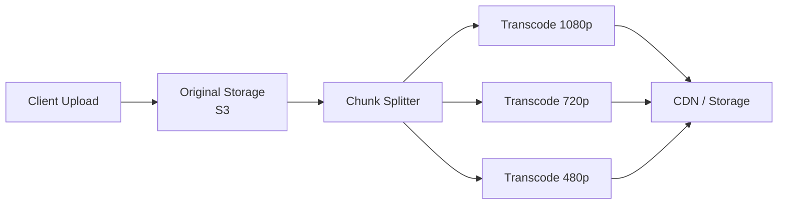

## Video Uploading and Transcoding

Uploaded videos must be split into chunks, transcoded into multiple resolutions and formats, and stored for streaming. This is the heaviest processing pipeline in most media systems.



```text
Processing pipeline:
  1. Client uploads video (resumable upload for large files).
  2. Store original in object storage (S3).
  3. Enqueue transcoding job (message queue).
  4. DAG scheduler breaks the job into stages:
     Split → Transcode (parallel per resolution) → Merge → Thumbnail → Metadata.
  5. Each variant stored in S3, registered in metadata DB.
  6. CDN pulls the variant on first viewer request.

Resumable upload:
  Large videos (>1 GB) use chunked upload protocols (tus, GCS resumable).
  Client uploads in chunks; server tracks progress.
  If upload fails, resume from the last successful chunk.
```

## Adaptive Bitrate Streaming

The video player switches between quality levels based on network conditions, providing the best possible experience without buffering.

```text
How it works:
  1. Video is pre-transcoded into multiple bitrate variants:
     4K (15 Mbps), 1080p (5 Mbps), 720p (2.5 Mbps), 480p (1 Mbps).
  2. Each variant is split into small segments (2–10 seconds).
  3. A manifest file lists all segments and their URLs.
  4. Player downloads segments, measures throughput, and switches
     variant mid-stream based on available bandwidth.

Protocols:
  HLS (HTTP Live Streaming):  Apple's standard. .m3u8 manifest.
  DASH (Dynamic Adaptive Streaming over HTTP): industry standard. .mpd manifest.
  Both use HTTP — works with standard CDNs and caches.

Manifest example (simplified HLS):
  #EXTM3U
  #EXT-X-STREAM-INF:BANDWIDTH=5000000,RESOLUTION=1920x1080
  1080p/playlist.m3u8
  #EXT-X-STREAM-INF:BANDWIDTH=2500000,RESOLUTION=1280x720
  720p/playlist.m3u8
  #EXT-X-STREAM-INF:BANDWIDTH=1000000,RESOLUTION=854x480
  480p/playlist.m3u8
```

## CDN Cost Optimization

CDN bandwidth is one of the largest costs for media-heavy platforms. Strategic use of CDN tiers and serving patterns can significantly reduce the bill.

```text
Strategies:

  Popular content → CDN:
    Top 10% of videos get 90% of views.
    Serve these from CDN edge servers worldwide.
    Minimal origin hits.

  Long-tail content → origin:
    Rarely watched videos served directly from origin or a regional CDN.
    Don't pay for edge caching of content that's accessed once per month.

  Multi-tier CDN:
    Edge → Regional cache → Origin.
    Regional cache reduces origin load without full edge distribution.

  Time-shifted caching:
    Pre-warm CDN for scheduled events (live streams, premieres).
    Evict cold content after views drop.

  Codec optimization:
    Newer codecs (H.265/HEVC, AV1) deliver same quality at 30–50%
    lower bitrate. Trades encoding CPU cost for bandwidth savings.
```

## File Sync and Conflict Resolution

Cloud storage systems (Google Drive, Dropbox) keep files synchronized across devices. The hard part is handling concurrent edits to the same file from different devices.

```text
Sync architecture:
  1. Block-level storage:
     Files are split into chunks (4 MB blocks).
     Only changed blocks are uploaded/downloaded.
     Deduplication: identical blocks stored once.

  2. Metadata database:
     Tracks: file_id, version, block_list, modified_by, modified_at.
     Each edit creates a new version.

  3. Notification service:
     When a file changes, notify other devices via long-polling or WebSocket.
     "File X version 5 is available."

Conflict resolution:
  Same file edited on two devices while offline:
    Device A saves version 5a.
    Device B saves version 5b.
    On sync: conflict detected (both branched from version 4).

  Resolution strategies:
    Last-write-wins: keep the later timestamp. Simple but loses edits.
    Keep both: save as "file.txt" and "file (conflict).txt".
    Merge: for structured files (text), attempt automatic three-way merge.

  Most consumer products (Dropbox, Google Drive) keep both versions
  and let the user resolve manually.
```

## Image Processing and Optimization

Handling images at scale requires resizing, format conversion, and efficient serving — often on-the-fly.

```text
On-upload processing:
  Generate thumbnails (150px, 300px, 600px).
  Strip EXIF metadata (privacy, file size).
  Convert to WebP or AVIF for smaller file sizes.
  Store all variants in object storage.

On-the-fly processing:
  URL-based transformations:
    /images/photo.jpg?w=300&h=300&fit=crop&format=webp
  Image CDN (Cloudflare Images, imgix, Cloudinary) handles
  resizing at the edge. Caches the result.
  + No pre-generation of every size combination.
  - First request for each variant is slower.

Storage optimization:
  Progressive JPEG: renders low-quality first, then refines.
  Lazy loading: browser loads images only when scrolled into view.
  Responsive images:  serves the right size per device.
```
