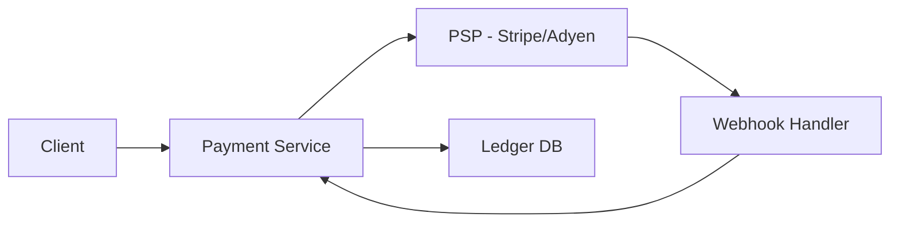

## Idempotency in Payments

Every payment operation must be safe to retry without charging the user twice. Network failures, timeouts, and client retries are inevitable — idempotency is the defense.

```text
How it works:
  1. Client generates a unique idempotency key (UUID) before the request.
  2. Client sends: POST /payments { amount: 50.00, idempotency_key: "abc-123" }
  3. Server checks: has "abc-123" been processed?
     Yes → return the stored result (no new charge).
     No  → process payment, store result keyed by "abc-123", return result.

Storage:
  Redis or database table: idempotency_key → { status, response, created_at }
  TTL: 24–72 hours (long enough to cover retry windows).

Common mistakes:
  Using order_id as the key — a user retrying a failed payment on the same
  order must generate a new key, or the retry will return the failed result.
  Checking idempotency after starting the charge — the check must happen
  before any side effects.
```

## Payment Service Provider (PSP) Integration

The system doesn't move money directly — it delegates to a PSP (Stripe, Adyen, Square) and orchestrates the flow around it. The design challenge is handling the async, webhook-driven nature of payment processing.



```text
Typical flow:
  1. User clicks "Pay" → Payment Service creates a payment intent.
  2. Payment Service calls PSP API to initiate the charge.
  3. PSP processes the charge asynchronously.
  4. PSP sends a webhook: payment.succeeded or payment.failed.
  5. Webhook handler updates internal payment status and triggers fulfillment.

Design considerations:
  Webhook reliability:
    PSP will retry webhooks on failure (exponential backoff).
    Handler must be idempotent — same webhook may arrive multiple times.
    Verify webhook signatures to prevent spoofing.

  Timeout handling:
    If no webhook arrives within N minutes, poll the PSP for status.
    Never assume success without confirmation.

  Multi-PSP:
    Large platforms integrate multiple PSPs for redundancy and cost.
    Route by region, card type, or failover priority.
```

## Double-Entry Bookkeeping

Every financial transaction creates two entries: a debit and a credit. This guarantees the ledger always balances and provides a complete audit trail that accountants and regulators expect.

```text
Principle:
  For every transaction, total debits = total credits.
  If money leaves one account, it must enter another.

Example — user pays $50 for an order:

  Entry 1 (debit):   User Wallet     -$50.00
  Entry 2 (credit):  Platform Revenue +$50.00

  If the platform takes a 10% fee:
  Entry 1 (debit):   User Wallet     -$50.00
  Entry 2 (credit):  Merchant Payout +$45.00
  Entry 3 (credit):  Platform Fee    +$5.00

Schema:
  ledger_entries table:
    id, transaction_id, account_id, amount, type (DEBIT/CREDIT), created_at

  Invariant: SELECT SUM(amount) FROM ledger_entries
             GROUP BY transaction_id → must equal 0 for every transaction
             (debits are negative, credits are positive).

Why it matters:
  Enables auditing: every dollar can be traced through the system.
  Enables reconciliation: compare internal ledger against PSP and bank records.
  Prevents silent money loss: an unbalanced entry is immediately detectable.
```

## Reconciliation

Periodic comparison of internal records against external sources (PSP reports, bank statements) to detect and resolve discrepancies. No payment system is complete without it.

```text
Why discrepancies happen:
  - Webhook lost or delayed → internal status is "pending" but PSP charged.
  - PSP charge succeeded but refund was issued externally.
  - Currency conversion rounding differences.
  - Duplicate charges from retry bugs.

Reconciliation process:
  1. Daily: export internal ledger entries for the period.
  2. Daily: fetch settlement reports from PSP (Stripe dashboard CSV, API).
  3. Match on transaction_id or PSP reference.
  4. Flag mismatches:
     - Present in PSP, missing internally → "orphan charge" → investigate.
     - Present internally, missing in PSP → "phantom payment" → mark failed.
     - Amount mismatch → flag for manual review.
  5. Auto-resolve known patterns (rounding, timing delays).
  6. Escalate unresolved items to finance team.

At scale:
  Millions of transactions/day → batch processing (Spark, Airflow).
  Alert if mismatch rate exceeds threshold (e.g., > 0.01%).
  Monthly: reconcile against bank statements (not just PSP).
```

## Payment State Machine

A payment moves through well-defined states. Modeling this explicitly prevents invalid transitions and makes the system easier to reason about under failure.

```text
State transitions:

  CREATED → PROCESSING → SUCCEEDED → (done)
                       → FAILED → (retry?) → PROCESSING
                       → CANCELLED

  SUCCEEDED → REFUND_PENDING → REFUNDED
                              → REFUND_FAILED

Rules:
  SUCCEEDED → CREATED is invalid (can't restart a completed payment).
  FAILED → SUCCEEDED is invalid (must go through PROCESSING again).
  Only SUCCEEDED payments can be refunded.

Implementation:
  Store current state in payments table.
  Every state change is an event → append to payment_events table.
  State machine enforced in code: transition(current, event) → new_state or error.

Benefits:
  Debugging: full history of every payment in the events table.
  Retry safety: only retry from FAILED or PROCESSING states.
  Reporting: count payments by state for dashboards and alerts.
```

## Handling Refunds and Chargebacks

Returning money to users and responding to bank-initiated disputes are critical paths that must be modeled explicitly.

```text
Refunds:
  Initiated by the platform (e.g., user requests cancellation).
  Flow: API call to PSP → PSP reverses the charge → webhook confirms.
  Partial refunds: refund $20 of a $50 charge.
  Ledger: reverse the original entries (debit revenue, credit user).
  Timing: refunds can take 5–10 business days to appear on the user's card.

Chargebacks:
  Initiated by the user's bank (user disputes the charge).
  The platform must respond with evidence within a deadline (usually 7–21 days).
  Flow: PSP notifies via webhook → platform gathers evidence
        (receipts, delivery proof) → submits via PSP API → bank decides.

  Outcome:
    Won:  funds returned to platform.
    Lost: funds stay with user; platform may also pay a chargeback fee ($15–25).

Design impact:
  Track chargeback rate — card networks penalize merchants above 1%.
  Store delivery confirmations, user agreements, and communication logs
  as evidence for disputes.
  Automated evidence assembly reduces response time and win rate.
```
