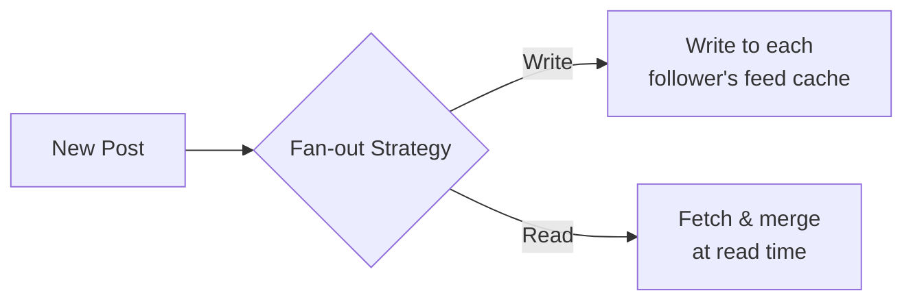

## URL Shortener

A deceptively simple problem that exercises hashing, storage trade-offs, and read-heavy scaling. The core question: how do you generate a short, unique code for every URL?

```text
Short code generation:

  Counter-based:
    Auto-increment ID → Base62 encode → short code.
    ID 1000000 → "4c92" (Base62).
    + Guaranteed unique. No collisions.
    - Sequential codes are predictable. Single point of failure for counter.
    Mitigation: use a distributed ID generator (Snowflake-style).

  Hash-based:
    MD5/SHA256(long_url) → take first 7 characters.
    + Stateless — same URL always maps to the same code.
    - Collisions possible. Must check and regenerate on collision.

Read vs. write ratio:
  Reads dominate: 100:1 or higher (many clicks per shortened link).
  Cache hot URLs in Redis: short_code → long_url.
  Database: short_code (PK), long_url, user_id, created_at, click_count.

Redirect:
  301 (permanent) — browser caches, fewer server hits, less analytics.
  302 (temporary) — every click hits the server, better for tracking.
  Most services use 302 for analytics, then upgrade to 301 for old links.
```

## Chat System

Real-time messaging exercises WebSocket management, message storage, delivery guarantees, and presence — all at scale.

```text
Connection management:
  Each online user holds a WebSocket connection to a chat server.
  Gateway layer routes connections across a fleet of servers.
  When User A sends to User B:
    Look up which server holds B's connection → route the message.
    If B is offline → store message, deliver on reconnect.

Message storage:
  Recent messages: key-value store (Redis) for fast retrieval.
  History: append-only log or wide-column store (Cassandra).
  Schema: channel_id + message_id (time-ordered) → sender, body, timestamp.

Group chat fan-out:
  Small groups (< 100 members): fan out on write to each member.
  Large groups (channels): fan out on read — fetch on open.

Delivery guarantees:
  At-least-once: server retries until client ACKs.
  Client deduplicates by message_id.
  Ordering: sequence numbers per conversation.

Presence:
  Heartbeat every 30s → Redis TTL.
  "User is typing..." → ephemeral WebSocket event, no persistence.
```

## News Feed / Timeline

The classic fan-out problem from social networks. When a user posts, how do their followers see it?



```text
Fan-out on write (push):
  When User A posts → write the post to the feed of every follower.
  + Reads are instant (feed is precomputed).
  - Writes are expensive for popular users.
  - A celebrity with 10M followers → 10M writes per post.

Fan-out on read (pull):
  When User B opens their feed → fetch recent posts from all followed users.
  + Writes are cheap (store post once).
  - Reads are slow (query N users, merge, sort).

Hybrid (Twitter/Instagram):
  Push for normal users (< 10K followers).
  Pull for celebrities (> 10K followers).
  At read time: merge precomputed feed + recent celebrity posts.

Ranking:
  Chronological is simplest but engagement-based ranking dominates.
  ML model scores posts by predicted engagement → sort by score.
  Cache the ranked feed; invalidate on new post or score refresh.
```

## Web Crawler

Systematically downloading the web exercises distributed coordination, politeness, deduplication, and priority scheduling.

```text
Architecture:
  URL Frontier → Fetcher → Parser → Content Store
       ↑                      |
       └── extracted URLs ────┘

URL Frontier:
  Priority queue: important domains first (PageRank, freshness).
  Politeness queue: one queue per domain, rate-limited.
  Don't hit the same domain more than once per second (or per robots.txt).

Fetcher:
  Distributed across many machines.
  DNS resolver cache (DNS lookups are slow).
  Respect robots.txt — fetch and cache per domain.
  Handle redirects, timeouts, and retries.

Deduplication:
  URL dedup: normalize URLs, then check a Bloom filter or hash set.
  Content dedup: fingerprint page content (SimHash, MinHash).
  Same content at different URLs → store once.

Scale:
  Billions of pages. Petabytes of storage.
  Recrawl schedule: popular pages daily, others weekly/monthly.
  Checkpoint the frontier state for crash recovery.
```

## Distributed Key-Value Store

Designing a key-value store like DynamoDB or Cassandra exercises partitioning, replication, consistency, and failure handling end-to-end.

```text
Core operations: get(key) → value, put(key, value)

Partitioning:
  Consistent hashing: keys map to a hash ring, each node owns a range.
  Virtual nodes: each physical node owns multiple ranges for balance.
  Replication: write to N nodes (e.g., N=3) for durability.

Consistency:
  Quorum: W + R > N guarantees strong consistency.
  W=2, R=2, N=3 → every read sees the latest write.
  W=1, R=1 → fast but eventually consistent (may read stale).

  Tunable: Dynamo/Cassandra let the client choose per request.

Conflict resolution:
  Last-write-wins (LWW): use timestamps. Simple but lossy.
  Vector clocks: detect concurrent writes, let the application merge.
  CRDTs: conflict-free data types that merge automatically.

Failure detection:
  Gossip protocol: nodes periodically exchange state.
  If a node hasn't responded in N heartbeats → mark suspect → confirm failure.
  Hinted handoff: temporarily store writes destined for a down node
  on a neighbor; replay when the node recovers.
```

## Metrics Monitoring System

Collecting, storing, and alerting on system metrics exercises write-heavy ingestion, time-series storage, and aggregation.

```text
Collection:
  Push model: agents on each server send metrics to a collector (StatsD, Telegraf).
  Pull model: central server scrapes /metrics endpoints (Prometheus).
  Push is simpler to deploy; pull gives the server control over scrape interval.

Time-series storage:
  Data shape: (metric_name, labels, timestamp, value).
  Write pattern: append-only, very high throughput.
  Storage engines: purpose-built TSDBs (InfluxDB, TimescaleDB, Prometheus TSDB).
  Compression: delta-of-delta for timestamps, XOR for values (Gorilla paper).

Aggregation:
  Raw data retained for hours/days.
  Roll up to 1-minute, 5-minute, 1-hour granularity for long-term storage.
  Pre-aggregate common queries (p99 latency, error rate by service).

Alerting:
  Rules: "if p99 latency > 500ms for 5 minutes → page oncall."
  Evaluation: periodic rule check against recent data.
  Alert routing: PagerDuty, Slack, email — based on severity and team.
  Deduplication: don't fire the same alert every evaluation cycle.
```

## Ticket Booking System

Selling a limited number of seats exercises concurrency control under contention — the core challenge when many users compete for the same inventory.

```text
The problem:
  1000 seats, 10,000 users clicking "Book" at the same time.
  Must not sell seat 42 to two different users (double-booking).

Approaches:

  Pessimistic locking:
    SELECT ... FOR UPDATE on the seat row.
    Only one transaction can hold the lock at a time.
    + Prevents all conflicts.
    - High contention → long wait times → timeouts.

  Optimistic locking:
    Read seat version, attempt update with WHERE version = N.
    If another transaction updated first → version mismatch → retry.
    + Low contention for most seats.
    - Hot seats (front row) still see many retries.

  Reservation with TTL:
    User clicks "Book" → reserve seat for 10 minutes (status = HELD).
    User completes payment → status = CONFIRMED.
    Timer expires → status = AVAILABLE (release back to pool).
    + Clean user experience (seat is "yours" while you pay).
    - Must handle TTL expiration reliably (Redis TTL or scheduled job).

Overbooking:
  Airlines intentionally oversell by ~5% based on no-show statistics.
  Implementation: allow bookings up to 105% capacity.
  Resolve at check-in: bump lowest-priority passengers.
```

## Stock Exchange / Matching Engine

The most performance-sensitive system design problem. A matching engine pairs buy and sell orders with microsecond-level latency.

```text
Order book:
  Buy side (bids):  sorted by price descending, then time ascending.
  Sell side (asks): sorted by price ascending, then time ascending.

  Example:
    Bids: $100.05 (500 shares), $100.04 (300 shares), $100.03 (1000 shares)
    Asks: $100.06 (200 shares), $100.07 (400 shares), $100.08 (800 shares)
    Spread: $100.06 - $100.05 = $0.01

Matching rules (price-time priority):
  New buy order at $100.06 → matches against best ask ($100.06, 200 shares).
  If order is for 500 shares → fill 200 from first ask, then 300 from next ask.

Architecture:
  Sequencer:
    All incoming orders pass through a single sequencer.
    Assigns a monotonically increasing sequence number.
    Guarantees deterministic ordering — critical for fairness.

  Matching engine:
    Single-threaded per symbol (avoids locking overhead).
    In-memory order book (sorted map or array).
    Target: < 10 microseconds per match.

  Post-trade:
    Trade events → message queue → clearing, settlement, reporting.
    These can be async — only matching is latency-critical.

Performance:
  No disk I/O on the critical path — log asynchronously.
  No garbage collection pauses — use C/C++/Rust, or pre-allocate in Java.
  Kernel bypass networking (DPDK) for lowest latency.
  Co-location: exchange servers in the same data center as trading firms.
```
