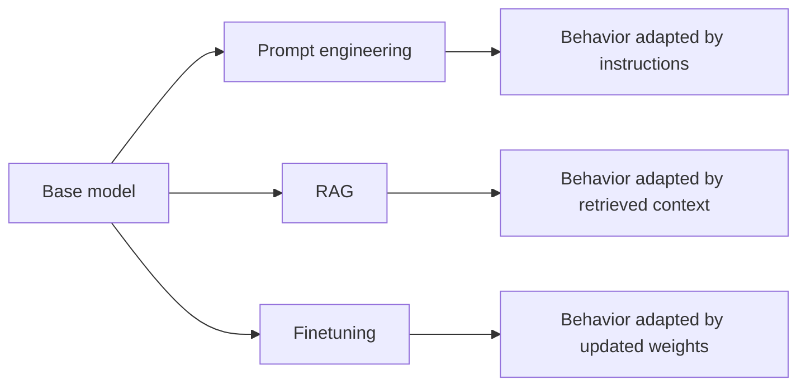
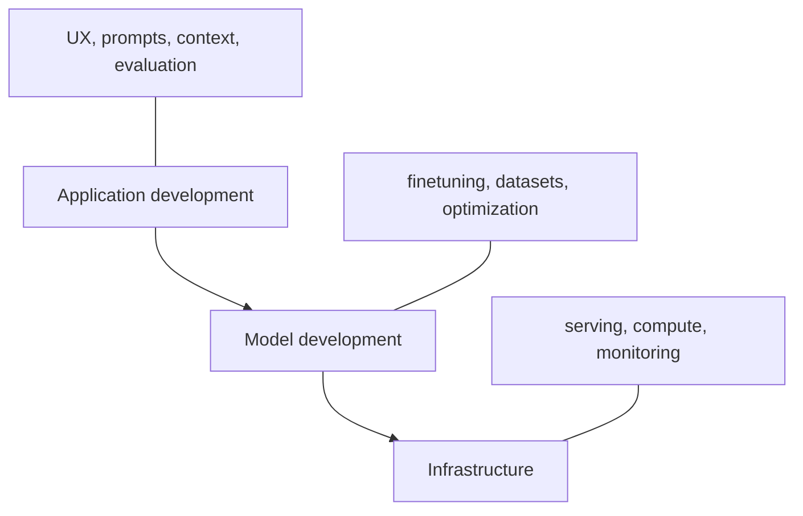

## AI engineering

AI engineering is the discipline of building applications on top of already-available foundation models instead of training every model from scratch. The chapter frames it as the convergence of rising model capability and falling barriers to using those models through APIs and developer tooling.

What makes the term useful is the shift in emphasis. Traditional ML engineering spends much more effort on collecting labeled data, training task-specific models, and operating those models. AI engineering shifts more of the work toward model adaptation, application design, evaluation, and product iteration.

```text
Traditional ML flow:
  data -> model training -> model serving -> product

AI engineering flow:
  model API -> prompting / RAG / finetuning -> product -> evaluation -> iteration
```

## Language models as completion systems

A language model predicts likely tokens from context. In practical product terms, the chapter treats a language model as a completion machine: give it a prompt, and it predicts what should come next based on patterns learned from training data.

That framing matters because many seemingly different tasks can be reduced to completion. Translation, summarization, classification, and code generation all become special cases of "continue this text in the right way." It also explains why model outputs are probabilistic rather than guaranteed to be correct.

```text
Prompt:
  Question: Is this email likely spam?
  Email: "Claim your free prize now..."
  Answer:

Possible completion:
  Likely spam
```

## Tokens and tokenization

Foundation-model interfaces work on tokens, not raw words. A token may be a character, a word, or a word fragment, and tokenization is the process that breaks text into those pieces before a model processes it.

This matters operationally because token counts affect context limits, latency, and cost. It also matters conceptually because tokenization explains why models can generalize to unfamiliar words by composing them out of known subparts instead of requiring every whole word to exist in the vocabulary.

```text
"I can't wait to build AI applications"
-> ["I", "can", "'t", "wait", "to", "build", "AI", "application", "s"]
```

## Self-supervision and scaling to LLMs

The chapter’s core explanation for the rise of LLMs is self-supervision. Instead of requiring humans to label every example, language modeling can derive its own labels from the text stream itself by predicting the next token from prior context.

That is what makes internet-scale training possible. If the model can learn from books, articles, comments, and documentation without expensive manual labeling, then the bottleneck shifts from annotation to compute, data curation, and architecture. That shift is one of the main reasons language models scaled so much faster than many older supervised systems.

```text
Training sample from "I love street food."

Input:  <BOS>, I, love, street
Output: food
```

## Foundation models and multimodality

A foundation model is broader than a text-only large language model. The chapter uses the term for large general-purpose models that can serve as a base for many downstream applications, including multimodal systems that work with text plus images or other modalities.

The important transition is from narrow, task-specific models to reusable general-purpose models. A team can now start with a strong base model and adapt it, rather than building a separate model family for every task such as translation, image classification, or retrieval.

## Model adaptation: prompt engineering, RAG, and finetuning

The chapter introduces three recurring ways to adapt a foundation model to an application: prompt engineering, retrieval-augmented generation (RAG), and finetuning. These are not random techniques; they are the main levers for changing model behavior without always creating a new model.

Prompting changes instructions, RAG changes the context available at generation time, and finetuning changes the model weights themselves. This is a useful mental model for the rest of the course because many downstream architecture decisions reduce to deciding which of these levers to pull first.



## Why AI engineering emerged now

The chapter argues that AI engineering took off because three forces aligned: foundation models gained broad capabilities, investment surged after visible product successes like ChatGPT, and model-as-a-service lowered the implementation barrier for developers.

This is a better explanation than "AI suddenly got popular." It ties the field’s growth to concrete engineering conditions: stronger base models, cheaper experimentation, and the ability to ship useful products through APIs instead of owning the full model-training stack.

## Use case fit and exposure to AI

Not every task benefits equally from foundation models. The chapter surveys categories such as coding, writing, education, conversational bots, information aggregation, data organization, and workflow automation, while also noting that some occupations are much more exposed to AI than others.

The practical lesson is that use-case selection should start with task shape, not hype. Tasks that involve language, transformation, summarization, structured extraction, or pattern-heavy assistance are often a better fit than tasks that require physical interaction, tight guarantees, or low tolerance for probabilistic mistakes.

## Planning an AI application

The chapter treats planning as part of the engineering work, not just product management overhead. Before building, you need to ask whether the use case is necessary, whether AI is the right mechanism, what performance level is actually required, and how the project should be staged.

This is especially important in AI because the demo quality of a system can be very different from its production quality. Good planning turns "the model did something impressive once" into milestones around evaluation, failure modes, maintenance, cost, and user expectations.

```python
def should_build_ai_app(task_is_language_heavy: bool, error_tolerance: str, roi_clear: bool) -> str:
    if not roi_clear:
        return "Do more scoping before building."
    if not task_is_language_heavy:
        return "AI may not be the first tool to reach for."
    if error_tolerance == "low":
        return "Use AI carefully with strong evaluation and guardrails."
    return "Good candidate for an AI-assisted application."


print(should_build_ai_app(True, "medium", True))
```

## The three-layer AI stack

The chapter organizes AI systems into three layers: application development, model development, and infrastructure. This is a useful abstraction because it separates product behavior, model adaptation, and platform concerns instead of flattening everything into "just call the API."

Application development is where prompts, context, interfaces, and evaluation meet users. Model development covers tuning, datasets, and inference optimization. Infrastructure handles serving, compute, monitoring, and the systems needed to keep the application operational.



## AI engineering versus ML engineering and full-stack engineering

The chapter positions AI engineering between two familiar worlds. Compared with traditional ML engineering, it is less centered on training task-specific models and more centered on adapting, evaluating, and productizing large general-purpose ones. Compared with classic full-stack engineering, it inherits more probabilistic behavior, model latency, and evaluation complexity.

This is why strong AI engineers often need a hybrid mindset. They need enough ML understanding to reason about model behavior and enough product and software engineering skill to build interfaces, iterate quickly, and decide when a system should rely on prompting, retrieval, weight updates, or non-AI code.
