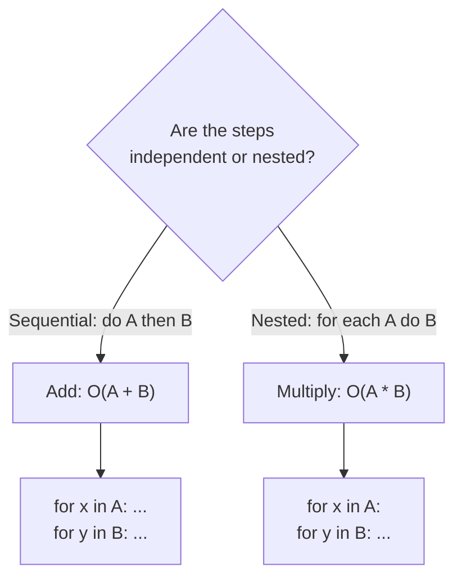
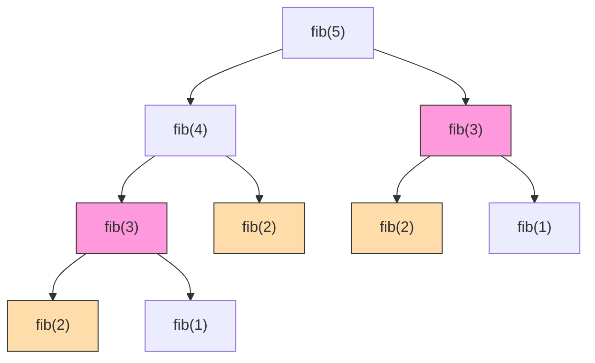
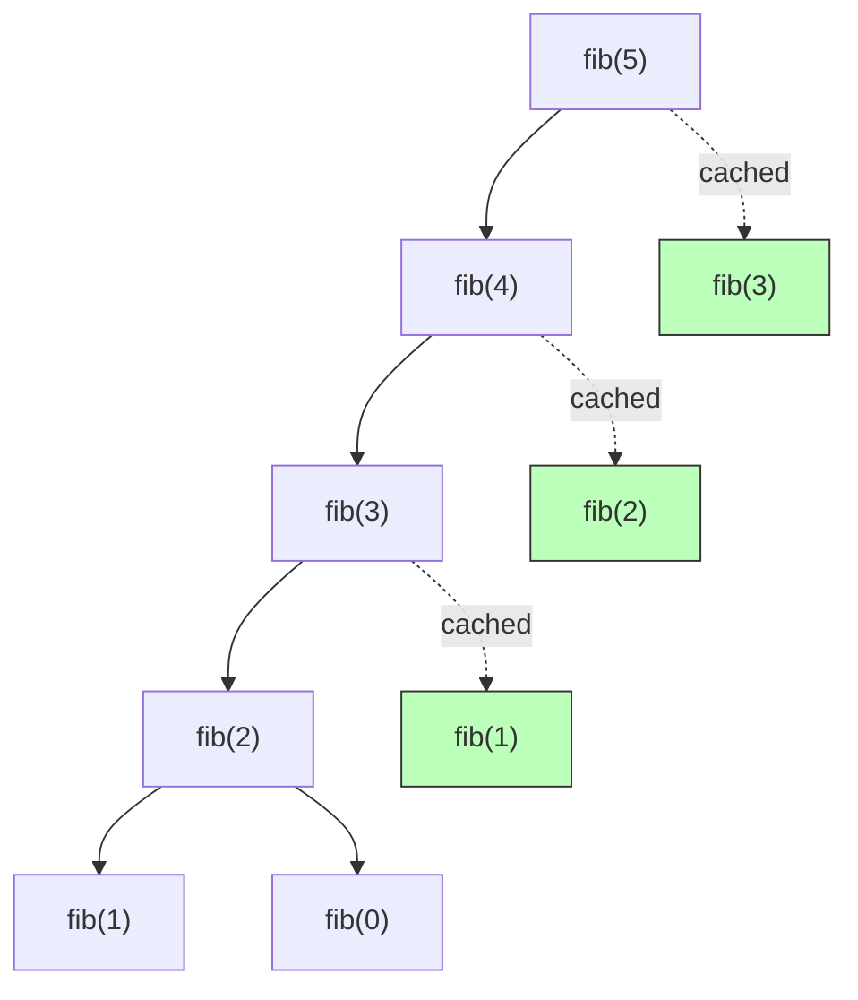

## Big O notation

Big O describes how an algorithm's runtime or memory usage grows relative to the size of its input. It answers the question "if I double the input, how much more work does the algorithm do?" rather than giving a wall-clock time.

In industry practice, Big O almost always means the tightest practical upper bound. When someone says "binary search is O(log N)," they mean that is the dominant growth rate, not that it could also technically be called O(N^2) because O is an upper bound. Academic definitions are looser, but interviews and code reviews expect the tightest description.

```python
# O(N) -- linear scan
def find_max(items: list[int]) -> int:
    result = items[0]
    for x in items:       # one pass through N items
        if x > result:
            result = x
    return result
```

## Big Theta and Big Omega

Big O is an upper bound: it says the algorithm grows "at most this fast." Big Omega is the lower bound: "at least this fast." Big Theta is the tight bound, meaning the algorithm grows at exactly that rate asymptotically.

These distinctions matter when precision is needed. Saying merge sort is Theta(N log N) is stronger than saying it is O(N log N) because the Theta version guarantees the algorithm also cannot do better than N log N in the worst case. In everyday engineering conversation people use Big O to mean the tight bound, but in formal analysis the difference matters.

```text
O(N)     -->  grows at most proportional to N   (upper bound)
Omega(N) -->  grows at least proportional to N  (lower bound)
Theta(N) -->  grows exactly proportional to N   (tight bound)

If O and Omega match, Theta = that rate.
```

## Best, worst, and expected case

The same algorithm can perform very differently depending on the input it receives. Best case is the most favorable input, worst case is the most adversarial, and expected case is the average over likely inputs.

QuickSort illustrates this clearly. With a good pivot the array splits roughly in half each time, yielding O(N log N) expected-case performance. With the worst pivot every time (e.g., already sorted input with naive pivot selection), one partition is always empty and the algorithm degrades to O(N^2). The best case is also O(N log N). This is why production implementations use randomized or median-of-three pivots: they make the worst case astronomically unlikely.

```python
import random

def quicksort(arr: list[int]) -> list[int]:
    if len(arr) <= 1:
        return arr
    pivot = arr[random.randint(0, len(arr) - 1)]   # randomized pivot
    left  = [x for x in arr if x < pivot]
    mid   = [x for x in arr if x == pivot]
    right = [x for x in arr if x > pivot]
    return quicksort(left) + mid + quicksort(right)

# Best / expected case:  O(N log N)
# Worst case (bad pivots): O(N^2)
```

## Space complexity

Space complexity measures how much additional memory an algorithm needs beyond the input itself. It is tracked separately from time complexity because an algorithm can be fast but memory-hungry, or slow but lean.

Recursion is a common source of hidden space cost. Each recursive call adds a frame to the call stack. An algorithm that recurses N levels deep uses O(N) stack space even if it allocates no explicit data structures. Merge sort, for example, is O(N log N) time but O(N) space for the temporary arrays plus O(log N) for the call stack.

```python
# O(N) time, O(N) space -- new list allocated
def double_values(items: list[int]) -> list[int]:
    return [x * 2 for x in items]

# O(N) time, O(1) space -- modifies in place
def double_values_inplace(items: list[int]) -> None:
    for i in range(len(items)):
        items[i] *= 2
```

## Dropping constants and non-dominant terms

Asymptotic notation discards constants and lower-order terms because they become irrelevant at scale. O(2N) simplifies to O(N), and O(N^2 + N) becomes O(N^2). The largest term dominates growth as N approaches infinity.

This does not mean constants are irrelevant in practice. An O(N) algorithm with a constant factor of 1000 will be slower than an O(N^2) algorithm for small inputs. But Big O is about scaling behavior, not absolute speed. When you see O(3N^2 + 5N + 12), the answer is O(N^2).

```python
def example(items: list[int]) -> int:
    total = 0

    # First loop: O(N)
    for x in items:
        total += x

    # Second loop: O(N)
    for x in items:
        total += x * 2

    # Combined: O(N) + O(N) = O(2N) --> simplifies to O(N)
    return total
```

## Multi-part algorithms: add vs. multiply

When an algorithm performs two independent steps in sequence, you add their complexities. When one step is nested inside another, you multiply. Confusing the two is a common source of wrong complexity estimates.

The rule: "do this, then do that" means add. "For each time you do this, do that" means multiply.



```python
# ADD: O(A + B) -- two independent loops
def print_both(a: list[int], b: list[int]) -> None:
    for x in a:   # O(A)
        print(x)
    for y in b:   # O(B)
        print(y)

# MULTIPLY: O(A * B) -- nested loops
def print_pairs(a: list[int], b: list[int]) -> None:
    for x in a:        # O(A)
        for y in b:    #   O(B) for each element of A
            print(x, y)
```

## Amortized time

Amortized analysis spreads the cost of expensive operations across a sequence of cheap ones. The key insight is that an occasionally costly operation can still be cheap on average if it happens infrequently enough.

The textbook example is a dynamic array (Python's `list`). Appending to a list is usually O(1), but when the internal buffer is full, the array allocates a new buffer (typically 2x the size) and copies everything over, which is O(N). Because the doubling happens after N insertions, the total cost of N appends is O(N), making each append O(1) amortized.

```python
# Simulating dynamic array growth to show amortized O(1) append
class DynamicArray:
    def __init__(self):
        self._capacity = 1
        self._size = 0
        self._data = [None] * self._capacity

    def append(self, value):
        if self._size == self._capacity:
            # Expensive: O(N) copy, but happens only after N appends
            self._capacity *= 2
            new_data = [None] * self._capacity
            for i in range(self._size):
                new_data[i] = self._data[i]
            self._data = new_data
            print(f"  Resized to {self._capacity}")

        self._data[self._size] = value
        self._size += 1

arr = DynamicArray()
for i in range(17):
    arr.append(i)
# Output shows resizes at 1, 2, 4, 8, 16 -- exponentially rarer
```

## Log N runtimes

O(log N) appears whenever an algorithm halves the remaining problem space on each step. Binary search is the canonical example: each comparison eliminates half the candidates, so searching a sorted array of one million elements takes at most about 20 steps.

The base of the logarithm does not matter in Big O because changing bases is just a constant factor (log base 2 of N = log base 10 of N / log base 10 of 2). Any algorithm that repeatedly divides the problem by a constant factor is O(log N).

```python
def binary_search(arr: list[int], target: int) -> int:
    """Return index of target in sorted arr, or -1 if absent. O(log N)."""
    lo, hi = 0, len(arr) - 1
    while lo <= hi:
        mid = (lo + hi) // 2
        if arr[mid] == target:
            return mid
        elif arr[mid] < target:
            lo = mid + 1        # discard left half
        else:
            hi = mid - 1        # discard right half
    return -1

# 1,000,000 elements --> ~20 comparisons max
print(binary_search(list(range(1_000_000)), 742_831))
```

## Recursive runtimes

The runtime of a recursive algorithm is often O(branches^depth), where branches is the number of recursive calls each invocation makes and depth is how deep the recursion goes before hitting a base case.

A naive recursive Fibonacci implementation makes 2 calls per invocation and recurses to depth N, producing O(2^N) time. But the space complexity is only O(N) because at any moment only one branch is on the call stack; the other branches have already returned. This mismatch between time and space is a common interview topic.



The tree above shows the redundant work: `fib(3)` is computed twice, `fib(2)` three times. This explosion is what drives the exponential runtime.

```python
def fib(n: int) -> int:
    """Naive recursive Fibonacci. O(2^N) time, O(N) space."""
    if n <= 1:
        return n
    return fib(n - 1) + fib(n - 2)

# fib(40) makes over a billion calls
```

## Memoization reducing complexity

Memoization caches the results of expensive function calls so they are computed only once. Applied to the Fibonacci example, it collapses the exponential call tree into a linear chain because each `fib(k)` is solved at most once and then looked up in O(1) for every subsequent request.

This reduces Fibonacci from O(2^N) time to O(N) time and O(N) space. The technique generalizes to any recursive problem with overlapping subproblems, which is the foundation of dynamic programming.



Each green node is a cache hit that returns in O(1) instead of spawning a full subtree.

```python
from functools import lru_cache

@lru_cache(maxsize=None)
def fib(n: int) -> int:
    """Memoized Fibonacci. O(N) time, O(N) space."""
    if n <= 1:
        return n
    return fib(n - 1) + fib(n - 2)

# fib(100) returns instantly
print(fib(100))  # 354224848179261915075
```

## Common runtime classes

The table below ranks the standard complexity classes from fastest to slowest growth. Knowing where an algorithm falls in this list gives you an immediate sense of whether it will scale.

| Class | Name | Example |
|-------|------|---------|
| O(1) | Constant | Hash table lookup |
| O(log N) | Logarithmic | Binary search |
| O(N) | Linear | Single-pass scan |
| O(N log N) | Linearithmic | Merge sort, heap sort |
| O(N^2) | Quadratic | Nested loops, bubble sort |
| O(2^N) | Exponential | Naive recursive subsets |
| O(N!) | Factorial | Brute-force permutations |

```text
How these growth rates diverge — actual operation counts:

              N=10       N=100       N=1,000        N=10,000
  O(1)           1           1             1               1
  O(log N)       3           7            10              13
  O(N)          10         100         1,000          10,000
  O(N log N)    33         664         9,966         132,877
  O(N²)        100      10,000     1,000,000     100,000,000
  O(2^N)     1,024      10^30         ──── impossibly large ────
  O(N!)      3.6 M      10^157        ──── impossibly large ────

Visualized at N = 16 (each █ ≈ 16 operations):

  O(1)        ▏ 1
  O(log N)    ▎ 4
  O(N)        █ 16
  O(N log N)  ████ 64
  O(N²)       ████████████████ 256
  O(2^N)      ██████████████████████████████████████▸ 65,536 (off scale)
```

Anything above O(N log N) starts to become impractical as input grows. Quadratic algorithms struggle past tens of thousands of elements, and exponential algorithms become unusable past about 30 elements. Choosing the right algorithm class is often the single highest-leverage performance decision you can make.

```python
# O(N^2) -- nested loops, all pairs
def all_pairs(items: list[int]) -> list[tuple[int, int]]:
    pairs = []
    for i in range(len(items)):
        for j in range(i + 1, len(items)):
            pairs.append((items[i], items[j]))
    return pairs

print(all_pairs([1, 2, 3, 4]))
# [(1,2), (1,3), (1,4), (2,3), (2,4), (3,4)]
```
